---
demo:
    title: 'Demo: Create a Web App by using the Azure Portal'
    module: 'Module 1: Creating Azure App Service Web Apps'
---

Create a Web App by using the Azure Portal
=================================

1. Sign in to the [Azure portal](http://portal.azure.com/).

2. Select the **Create a resource** link at the top of the left-hand navigation.

3. Select **Web > Web App** to display the web app creation wizard.

4. Fill out the following fields in each of the sections on the wizard:

   - Project Details
     - **Subscription**: Select the Azure subscription you are using for this class.
     - **Resource Group**: Create a new resource group to make it easier to clean up the resources later.
   - Instance Details
     - **Name**: The name you choose must be unique among all Azure web apps. This name will be part of the app's URL: *appname*.azurewebsites.net.
     - **Publish**: Select **Code** for this demo.
     - **Runtime Stack**: Select **.NET Core 3.1 LTS**. Your choice here may affect whether you have a choice of operating system - for some runtime stacks, App Service supports only one operating system.
     - **Operating System**: Keep **Windows** selected here, it's the default when you selected **.NET Core 3.1 LTS** above.
     - **Region**: Keep the default selection.
   - App Service Plan
     - **Windows Service Plan**: Leave the default selection. By default, the wizard will create a new plan in the same region as the web app.
     - **SKU and size**: Select **F1**. To select the **F1** tier, select **Change size** to open the Spec Picker wizard. On the **Dev / Test** tab, select **F1** from the list, then select **Apply**.

5. Navigate to the **Monitoring** tab at the top of the page and toggle **Enable Application Insights** to **No**.

6. Select **Review and Create** to navigate to the review page, then select **Create** to create the app. The portal will display the deployment page, where you can view the status of your deployment.

7. Once the app is ready you can select the **Go to resource** button and the portal will display the web app overview page. To preview your new web app's default content, select its URL at the top right. The placeholder page that loads indicates that your web app is up and running and ready to receive deployment of your app's code.

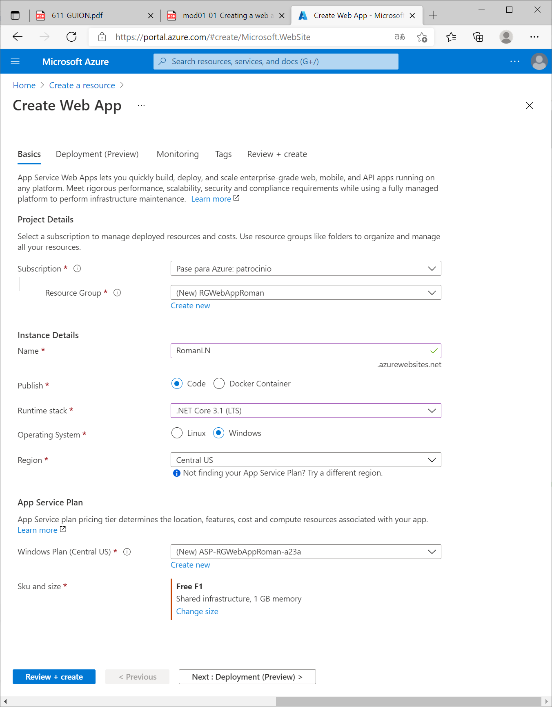

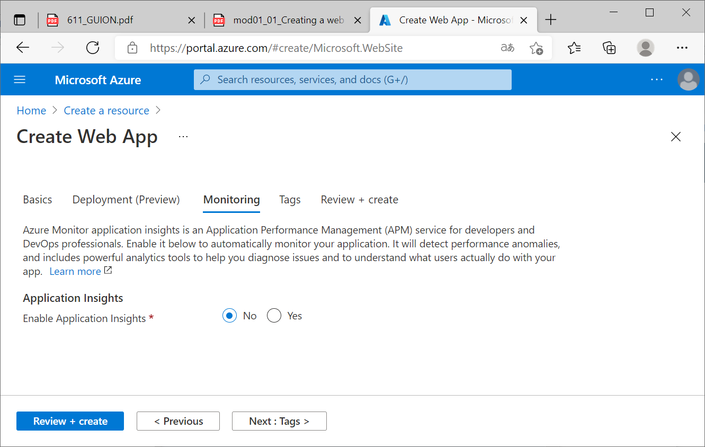

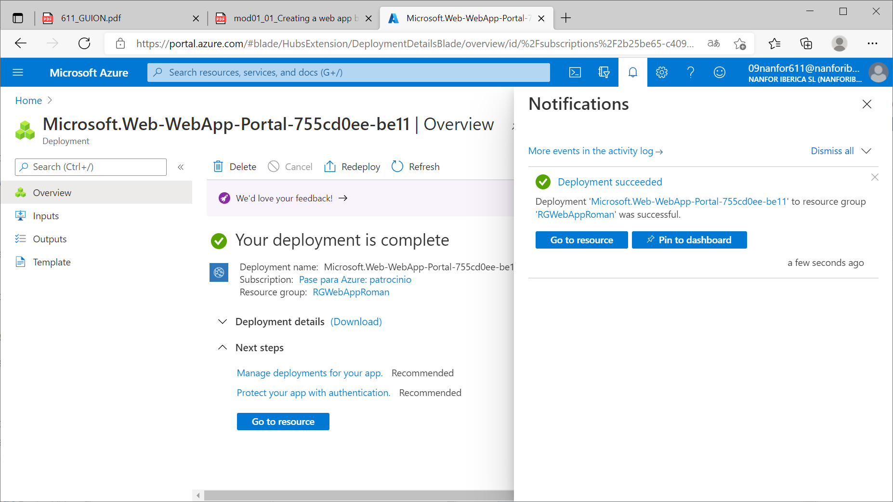

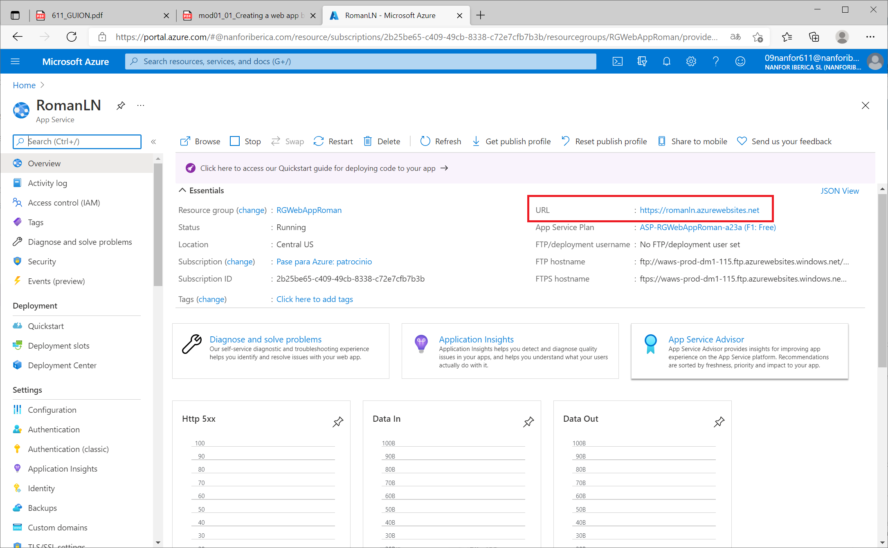

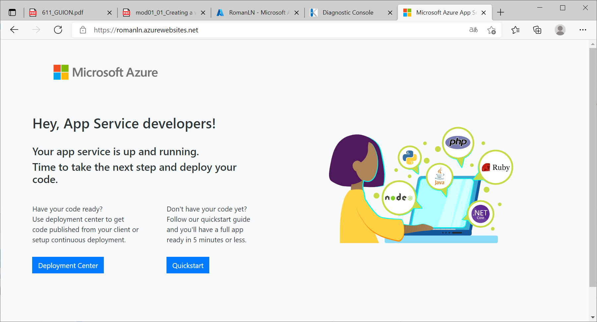

### Modificar la página de bienvenida de la *webapp*

Ahora editaré el *html* que se muestra en la *landing page*.

Dentro de la *webapp* ir a *Development Tools/ Console* y hacer un **dir** para ver el contenido de la carpeta de la *webapp*. El fichero **hostingstart.html** es la página de bienvenida que muestra la *webapp*, y se aloja en la carpeta *D:\home\site\wwwroot*.

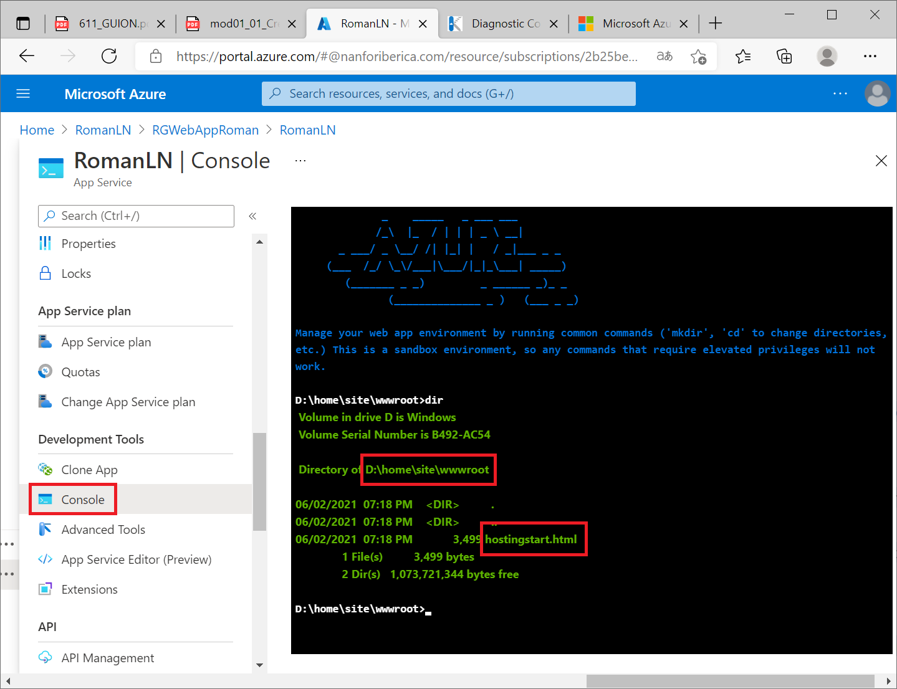

Para editar el fichero *html* anterior voy a *Advanced Tools/Go* y se abre **Kudu**.

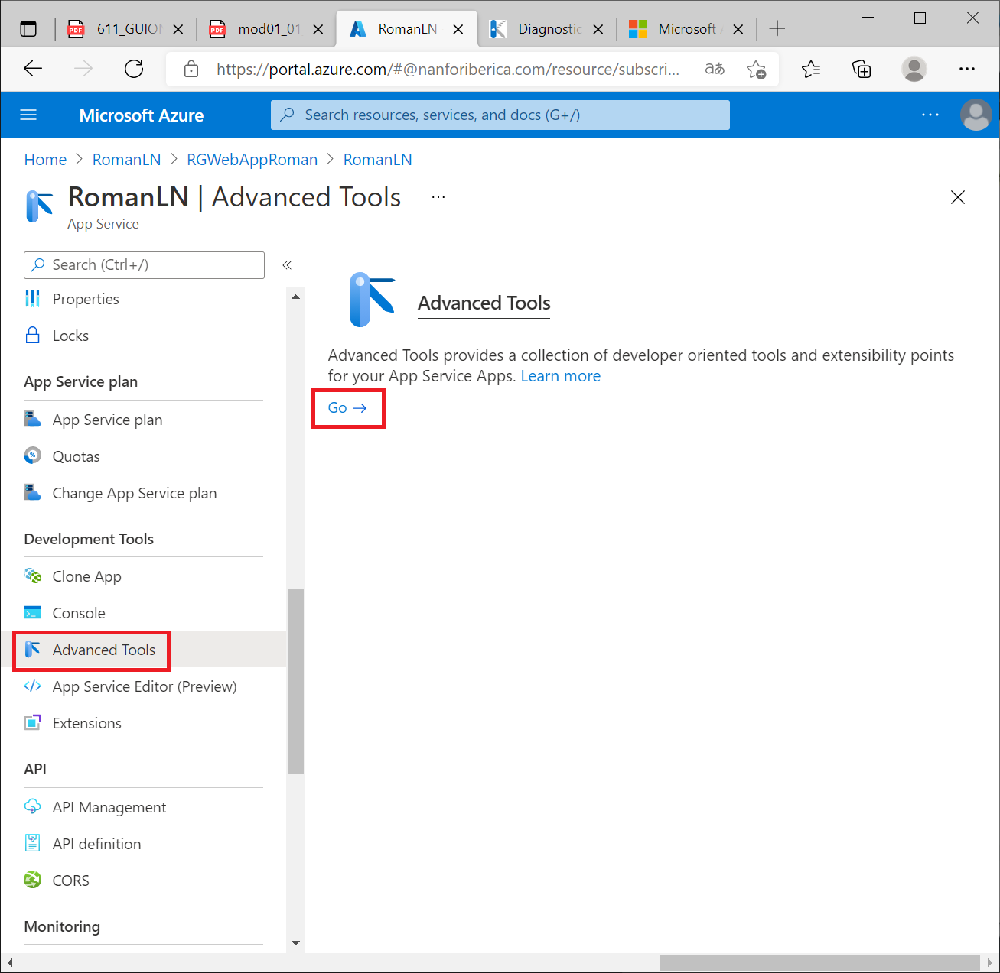

En Kudu desplegar *Debug console* y seleccionar *PowerShell*. Y navegar hasta el directorio que aloja al fichero html. También se puede navegar a través de los hipervínculos de los elementos de la tabla superior.

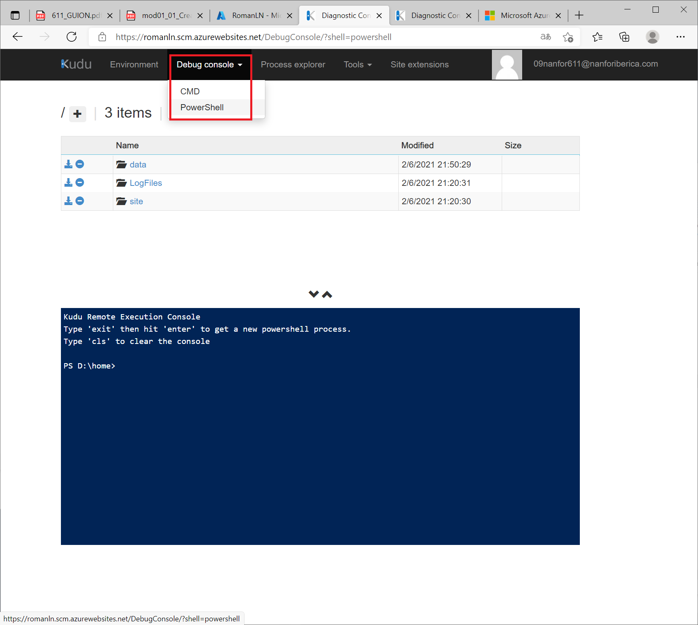

Una vez localizado el fichero hacer clic en el botón **Edit**.

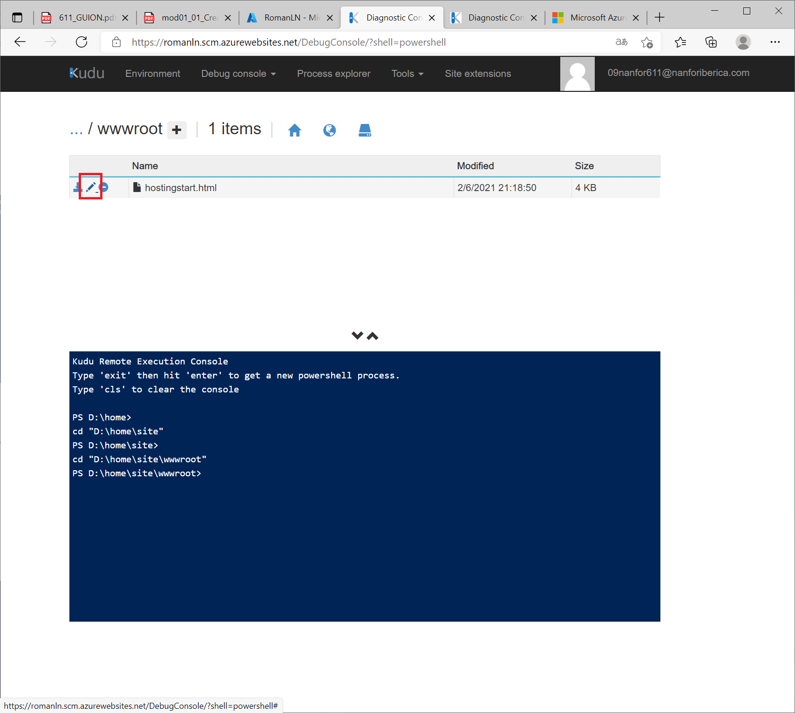

Y se abre un editor para modificar el fichero *html*.

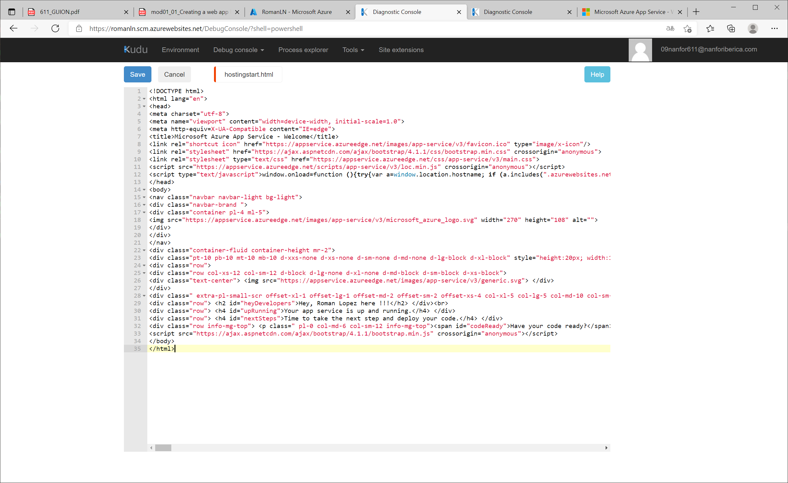

Grabar los cambios y revisitar la *url* de la *webapp* para comprobar los cambios.

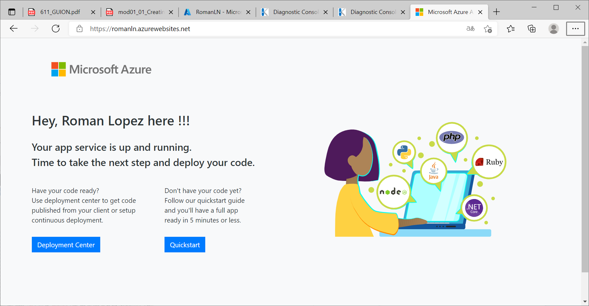
