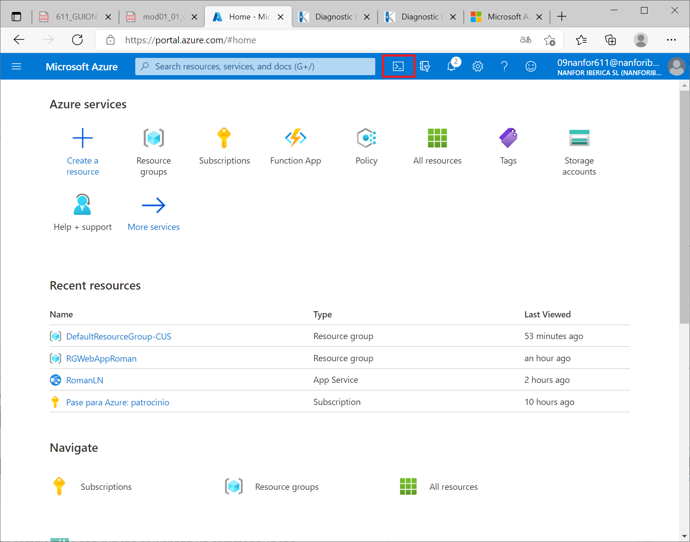
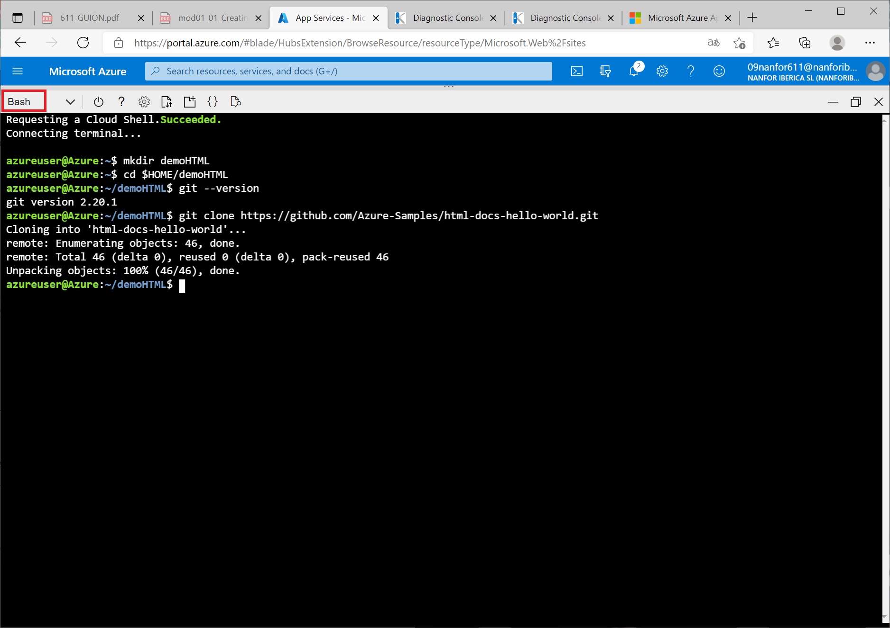
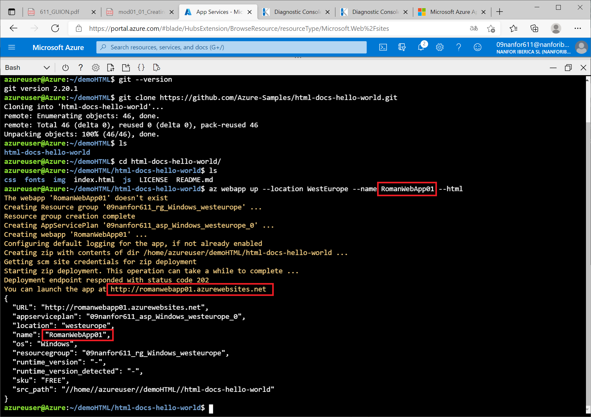
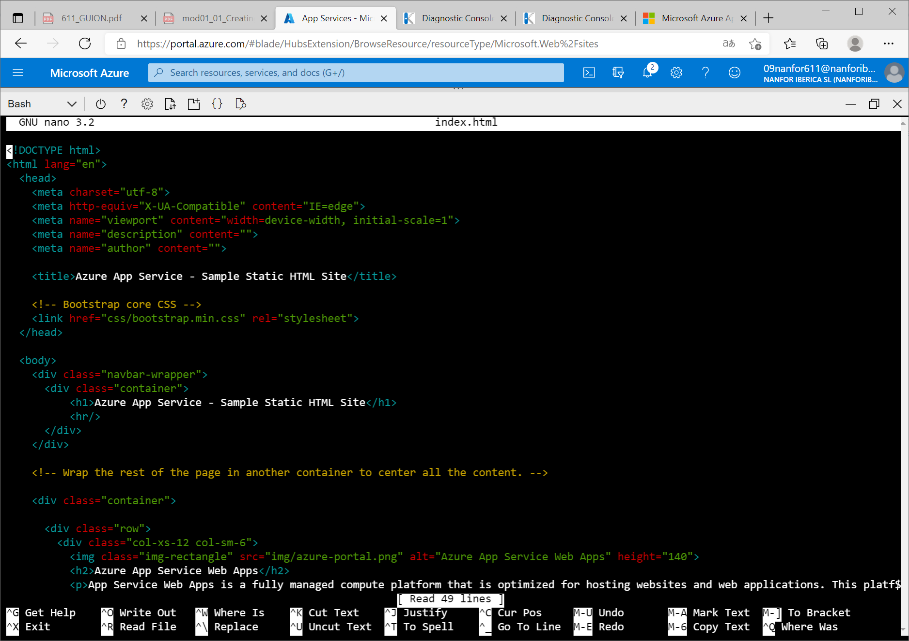
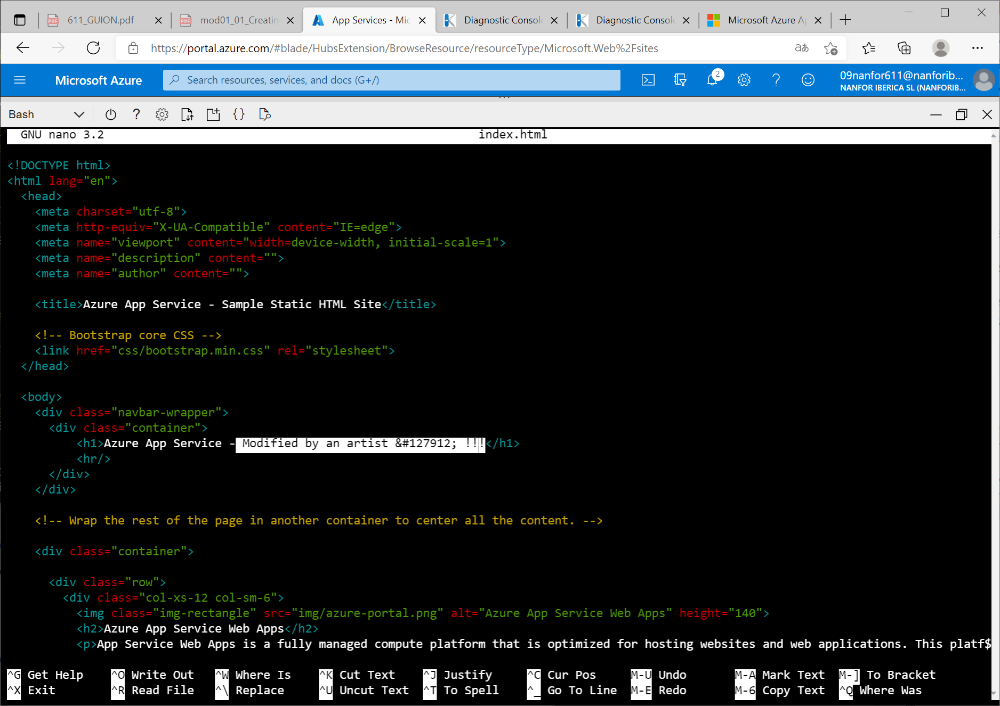
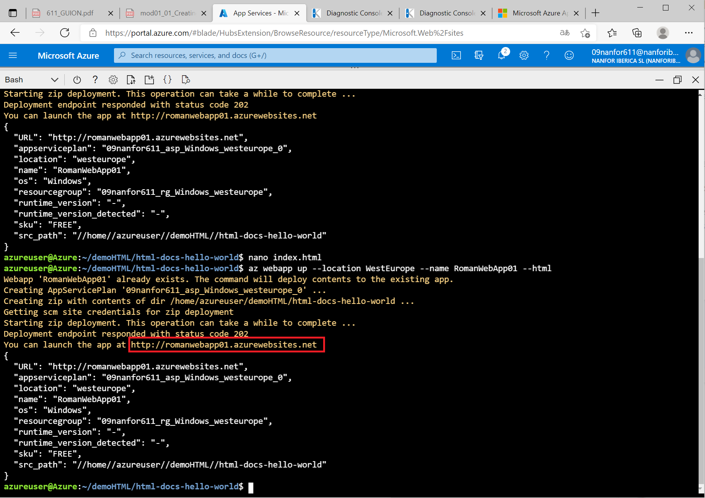
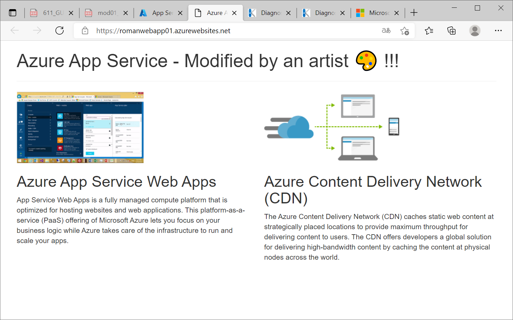
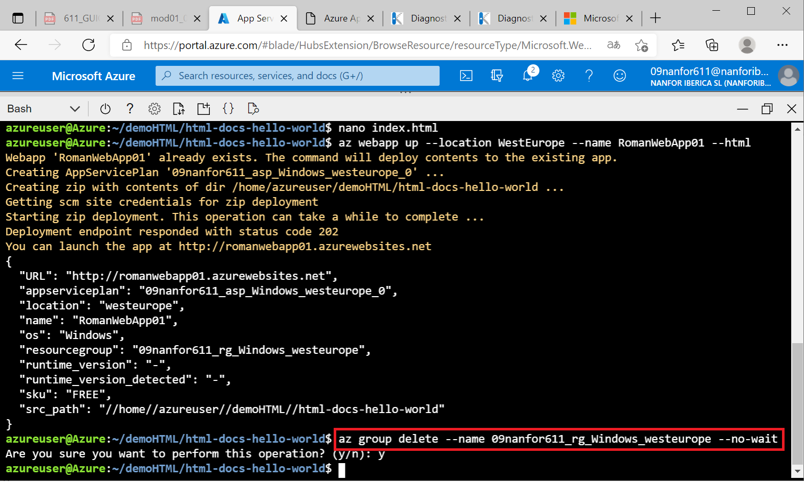

---
lab:
    title: 'Lab: Validate lab environment'
    module: 'Module 0: Course introduction'
---

Create a static HTML web app by using Azure Cloud Shell
=================================

1. In this demo you'll learn how to perform the following actions:

   - Deploy a basic HTML+CSS site to Azure App Service by using the az webapp up command
   - Update and redeploy the app

   The az webapp up command does the following actions:

   - Create a default resource group.
   - Create a default app service plan.
   - Create an app with the specified name.
   - Zip deploy files from the current working directory to the web app.

   #### Prerequisites

   This demo is performed in the Cloud Shell using the Bash environment.

   ##### Login to Azure

   1. Login to the [Azure portal](https://portal.azure.com/) and open open the cloud shell.

      

      

   2. Be sure to select the **Bash** environment.

   

   #### Download the sample

   1. In the Cloud Shell, create a *demo* directory and then change to it.

      ```
      mkdir demoHTML
      
      cd $HOME/demoHTML
      ```

      Run the following command to clone the sample app repository to your *demoHTML* directory.

      ```
      git clone https://github.com/Azure-Samples/html-docs-hello-world.git
      ```


   #### Create the web app

   1. Change to the directory that contains the sample code and run the az webapp up command. In the following example, replace <app_name> with a unique app name, and <region> with a region near you.

      ```
      cd html-docs-hello-world
      
      az webapp up --location <region> --name <app_name> --html
      ```

      This command may take a few minutes to run. While running, it displays information similar to the example below. Make a note of the resourceGroup value. You need it for the clean up resources section.

      ```
      {
      "app_url": "https://<app_name>.azurewebsites.net",
      "location": "westeurope",
      "name": "<app_name>",
      "os": "Windows",
      "resourcegroup": "<resource_group_name>",
      "serverfarm": "appsvc_asp_Windows_westeurope",
      "sku": "FREE",
      "src_path": "/home/<username>/demoHTML/html-docs-hello-world ",
      < JSON data removed for brevity. >
      }
      ```

      

      

   2. Open a browser and navigate to the app URL (http://<app_name>.azurewebsites.net) and verify the app is running. Leave the browser open on the app for the next section.

   

   #### Update and redeploy the app

   1. In the Cloud Shell, type nano index.html to open the nano text editor. In the <h1> heading tag, change “Azure App Service - Sample Static HTML Site” to "Azure App Service".

   2. Use the commands **^O** to save and **^X** to exit.

   3. Redeploy the app with the same az webapp up command. Be sure to use the same *region* and *app_name* as you used earlier.

      ```
      az webapp up --location <region> --name <app_name> --html
      ```

      Once deployment is completed switch back to the browser from step 2 in the “Create the web app” section above and refresh the page.

   

   

   

   

   

   #### Clean up resources

   1. After completing the demo you can delete the resources you created using the resource group name you noted in step 1 of the “Create the web app” section above.

      ```
      az group delete --name <resource_group> --no-wait
      ```




