# Lab 01: Building a web application on Azure platform as a service offerings
# Student lab manual

- ## Escenario de laboratorio

  Eres el propietario de una startup y has estado creando una aplicación de galería de imágenes para que las personas compartan excelentes imágenes de comida. Para llevar su producto al mercado lo más rápido posible, ha decididó utilizar Microsoft Azure App Service para alojar sus aplicaciones web y API Rest.

  ### Objetivos

  Después de completar esta práctica de laboratorio, podrá:

  - Cree varias aplicaciones utilizando App Service.

  - Configure los ajustes de la aplicación para una aplicación2.

  - Implemente aplicaciones mediante Kudu, la interfaz de línea de comandos (CLI) de Azure y la implementación de archivos zip.

  ## Arquitectura

  

### Exercise 1: Build a back-end API by using Azure Storage and the Web Apps feature of Azure App Service

#### Task 1: Open the Azure portal

1.  Sign in to the Azure portal (<https://portal.azure.com>).

    > **Note**: If this is your first time signing in to the Azure portal, a dialog box will display offering a tour of the portal. Select **Get Started** to skip the tour.


#### Task 2: Create a Storage account

1.  Create a new storage account with the following details:
    
    -   New resource group: **ManagedPlatform**

    -   Name: **imgstor*[yourname]***

    -   Location: **(US) East US**

    -   Performance: **Standard**

    -   Account kind: **StorageV2 (general purpose v2)**

    -   Replication: **Locally-redundant storage (LRS)**

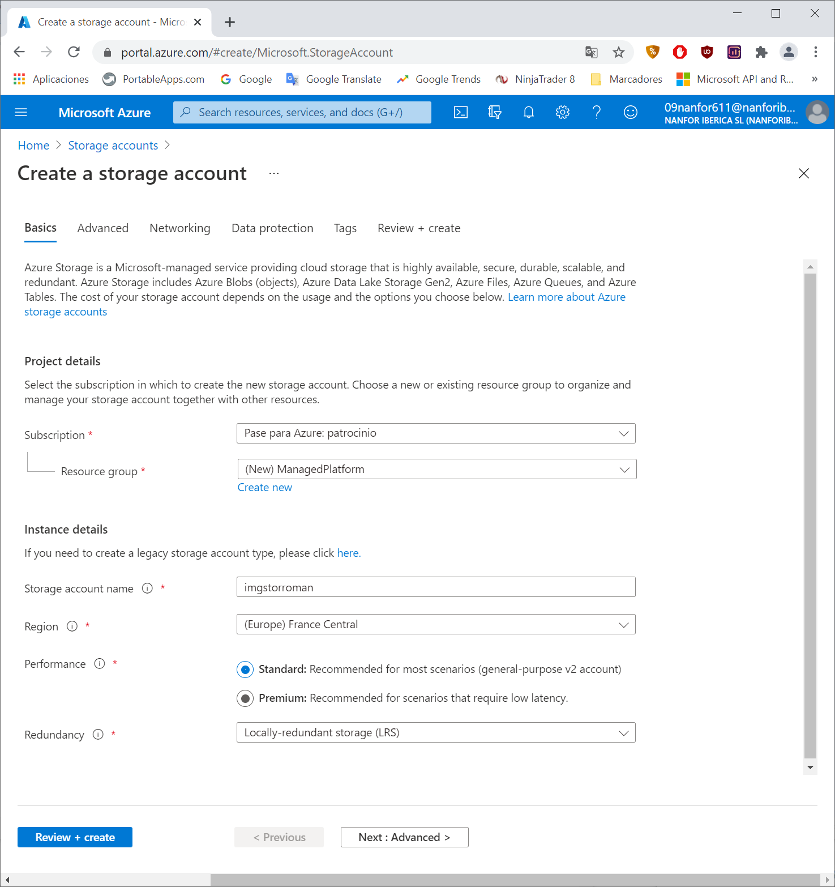

1.  Wait for Azure to finish creating the storage account before you move forward with the lab. You'll receive a notification when the account is created.

1.  Access the **Access Keys** blade of your newly created storage account instance.

1.  Record the value of the **Connection string** text box. You'll use this value later in this lab.

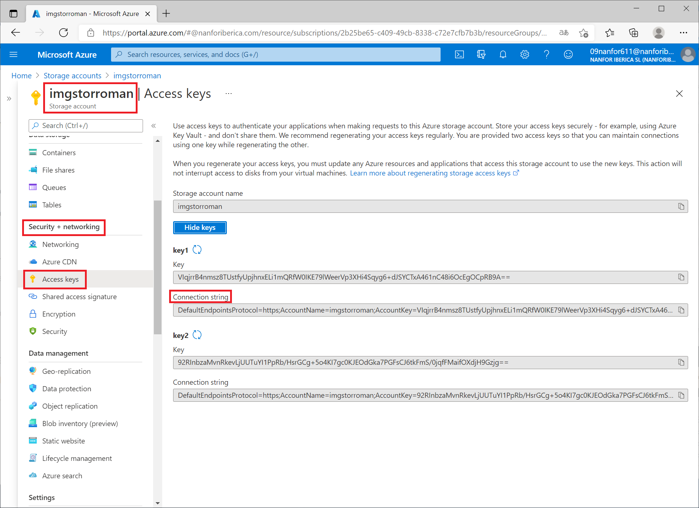

#### Task 3: Upload a sample blob

1.  Access the **imgstor*[yourname]*** storage account that you created earlier in this lab.

1.  In the **Blob service** section, select the **Containers** link.

1.  Create a new **container** with the following settings:
    
    -   Name: **images**

    -   Public access level: **Blob (anonymous read access for blobs only)**

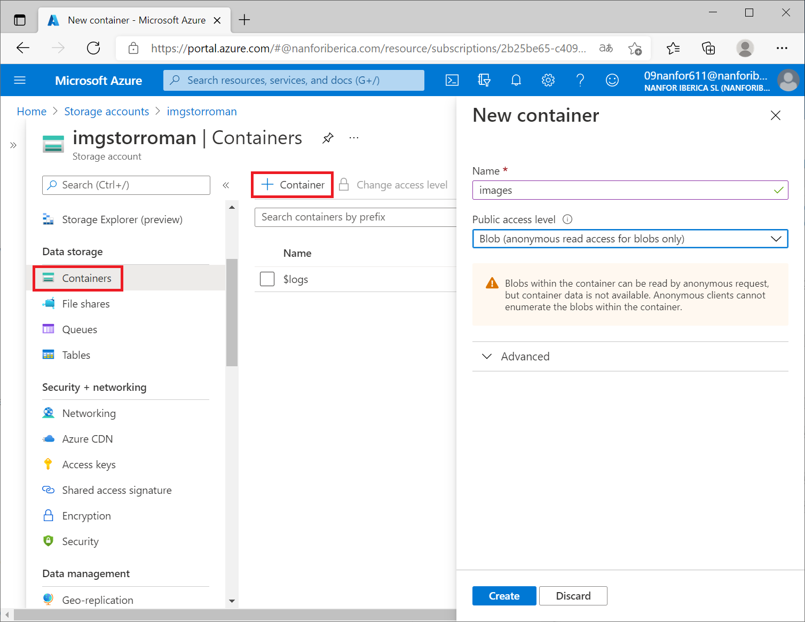

1.  Go to the new **images** container, and then use the **Upload** button to upload the **grilledcheese.jpg** file in the **Allfiles (F):\\Allfiles\\Labs\\01\\Starter\\Images** folder on your lab machine.

    > **Note**: We recommended that you enable the **Overwrite if files already exist** option.

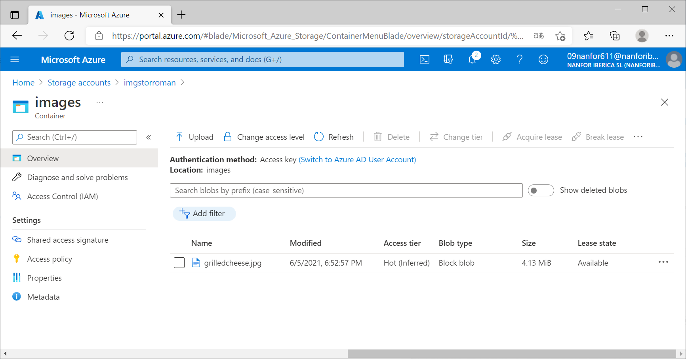

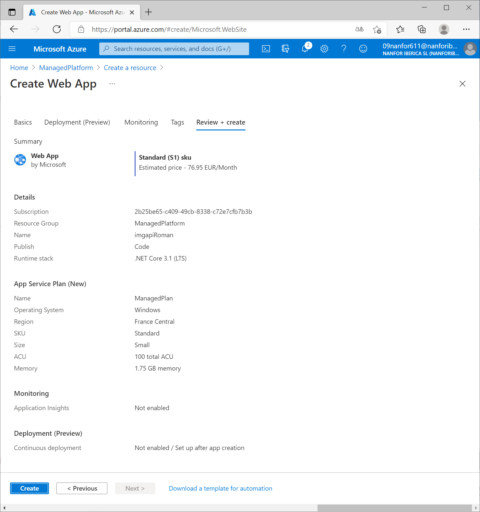

#### Task 4: Create a web app

1.	Create a new web app with the following details:

    -   Existing resource group: **ManagedPlatform**
    
    -   Web App name: **imgapi*[yourname]***

    -   Publish: **Code**

    -	Runtime stack: **.NET Core 3.1 (LTS)**

    -	Operating System: **Windows**

    -	Region: **East US**

    -	New App Service plan: **ManagedPlan**
    
    -	SKU and size: **Standard (S1)**

    -	Application Insights: **Disabled**


1.  Wait for Azure to finish creating the web app before you move forward with the lab. You'll receive a notification when the app is created.

#### Task 5: Configure the web app

1.  Access the **imgapi*[yourname]*** web app that you created earlier in this lab.

1.  In the **Settings** section, find the **Configuration** section, and then create a new application setting by using the following details:
    
    -   Name: **StorageConnectionString**

    -   Value: ***Storage Connection String copied earlier in this lab***

    -   Deployment slot setting: **Not selected**

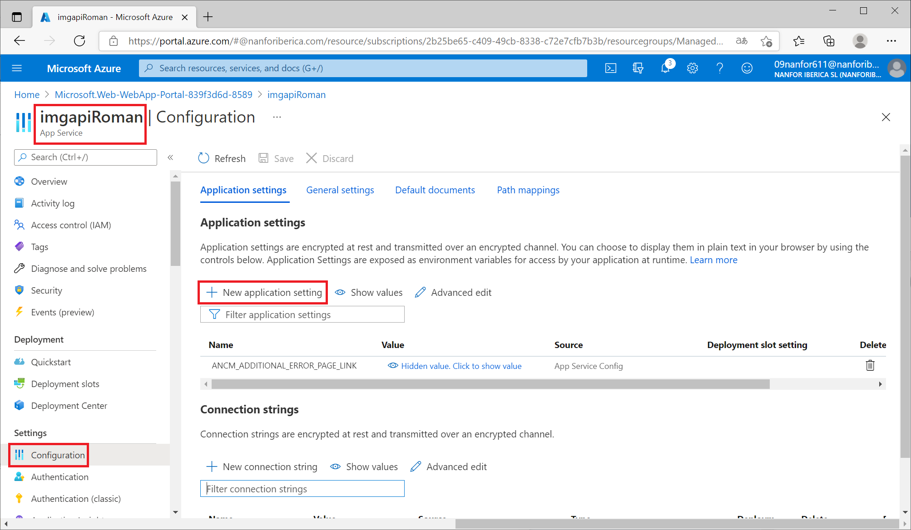

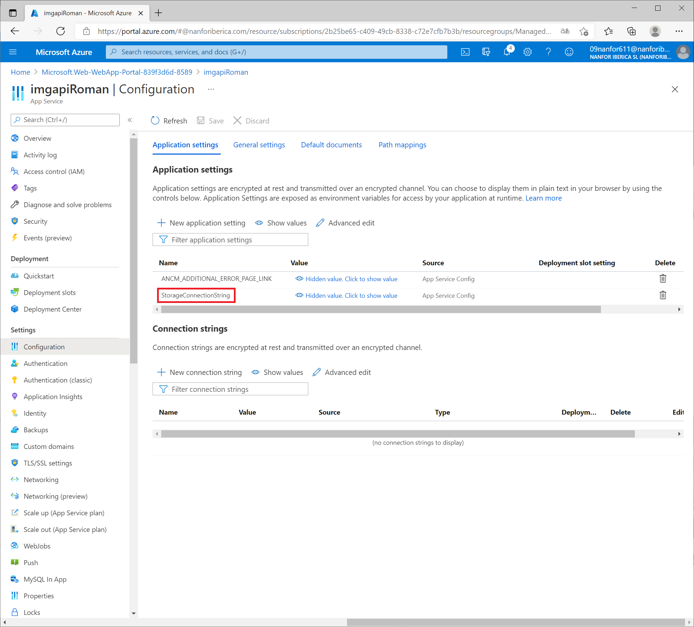

1.  Save your changes to the application settings.

1.  In the **Settings** section, find the **Properties** section.

1.  In the **Properties** section, copy the value of the **URL** text box. You'll use this value later in the lab.

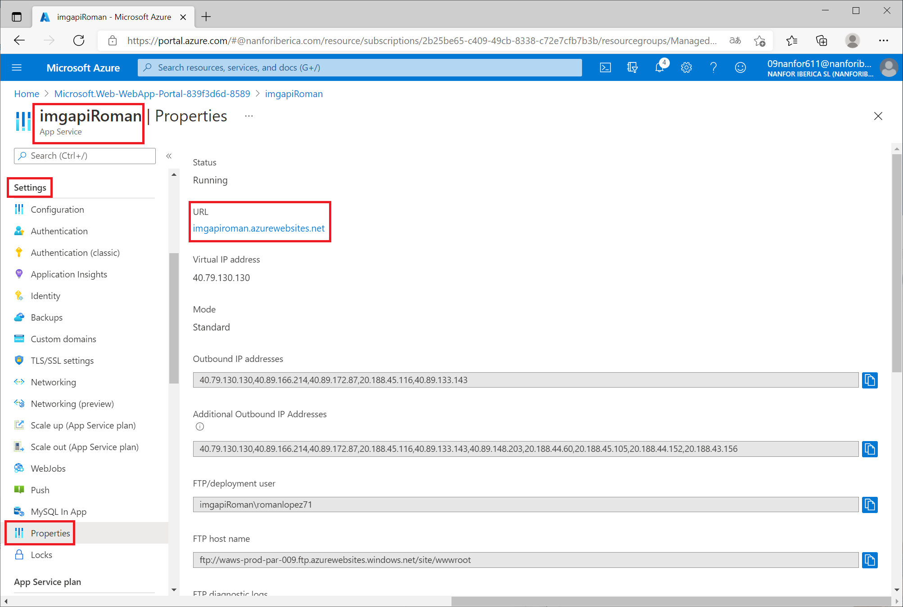

    > **Note**: At this point, the web server at this URL will return a 404 error. You have not deployed any code to the Web App yet. You will deploy code to the Web App later in this lab.

#### Task 6: Deploy an ASP.NET web application to Web Apps

1.  Using Visual Studio Code, open the web application in the **Allfiles (F):\\Allfiles\\Labs\\01\\Starter\\API** folder.

1.  Open the **Controllers\\ImagesController.cs** file, and then observe the code in each of the methods.

1. Open the Windows Terminal application.

1. Sign in to the Azure CLI by using your Azure credentials:

   ```
   az login
   ```
   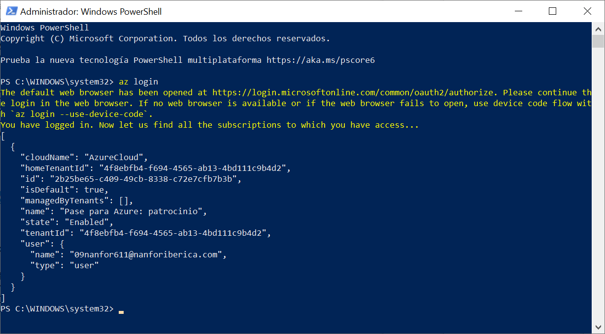
   
1. List all the apps in your **ManagedPlatform** resource group:

   ```
   az webapp list --resource-group ManagedPlatform
   ```
   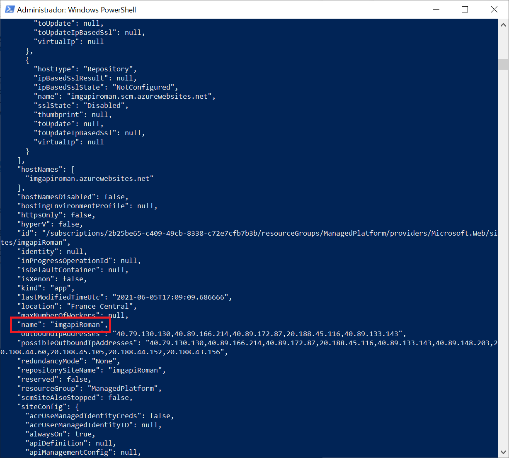
   
1. Find the apps that have the **imgapi\*** prefix:

   ```
   az webapp list --resource-group ManagedPlatform --query "[?starts_with(name, 'imgapi')]"
   ```

   

1. Print only the name of the single app that has the **imgapi\*** prefix:

   ```
   az webapp list --resource-group ManagedPlatform --query "[?starts_with(name, 'imgapi')].{Name:name}" --output tsv
   ```
   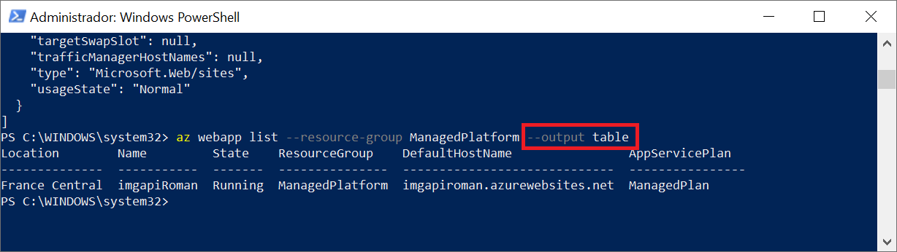
   
1. Change the current directory to the **Allfiles (F):\\Allfiles\\Labs\\01\\Starter\\API** directory that contains the lab files:

   ```
   cd F:\Allfiles\Labs\01\Starter\API\
   ```
   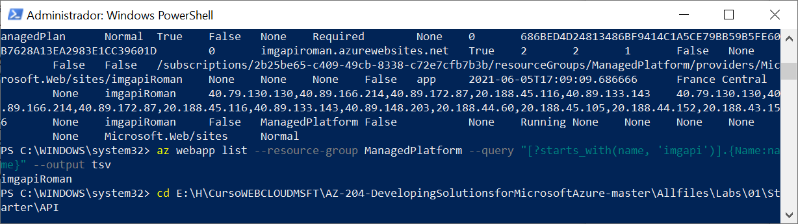
   
1.  Deploy the **api.zip** file to the web app that you created earlier in this lab:

    ```
    az webapp deployment source config-zip --resource-group ManagedPlatform --src api.zip --name <name-of-your-api-app>
    ```

    > **Note**: Replace the *\<name-of-your-api-app\>* placeholder with the name of the web app that you created earlier in this lab. You recently queried this app’s name in the previous steps.

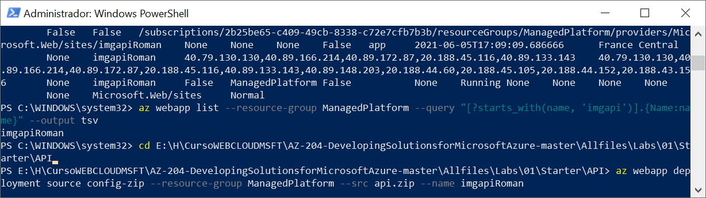

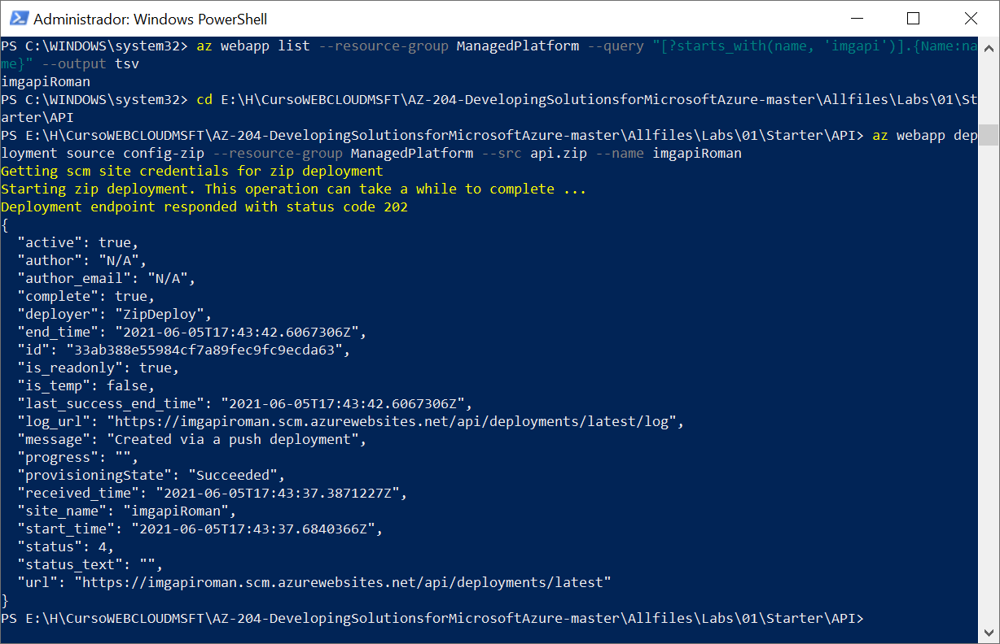

1.	Access the **imgapi*[yourname]*** web app that you created earlier in this lab. Open the **imgapi*[yourname]*** web app in your browser.

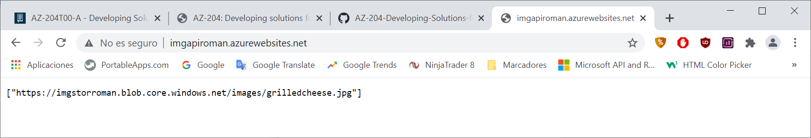

1.	Perform a GET request to the root of the website, and then observe the JavaScript Object Notation (JSON) array that's returned. This array should contain the URL for your single uploaded image in your storage account.

1.  Close the currently running Visual Studio Code and Windows Terminal applications.

#### Review

In this exercise, you created a web app in Azure and then deployed your ASP.NET web application to Web Apps by using the Azure CLI and the Kudu zip file deployment utility.

### Exercise 2: Build a front-end web application by using Azure Web Apps

#### Task 1: Create a web app

1.	In the Azure portal, create a new web app with the following details:

    -   Existing resource group: **ManagedPlatform**
    
    -   Web app name: **imgweb*[yourname]***

    -   Publish: **Code**

    -	Runtime stack: **.NET Core 3.1 (LTS)**

    -	Operating system: **Windows**

    -	Region: **East US**

    -	Existing App Service plan: **ManagedPlan**

    -	Application Insights: **Disabled**

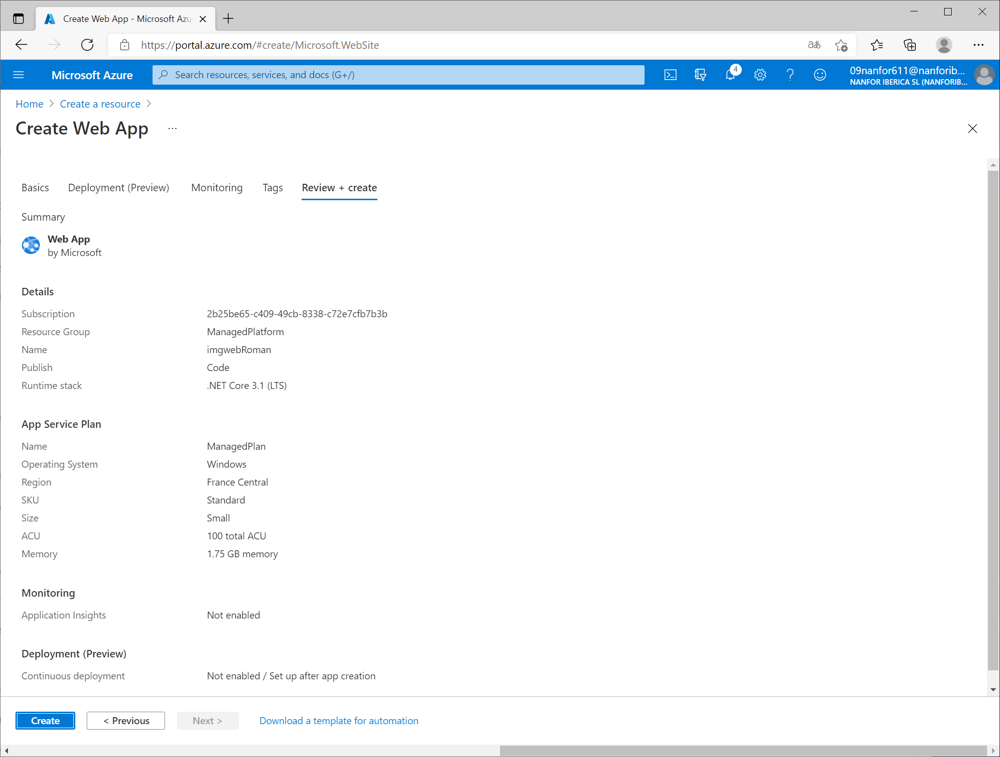

1.  Wait for Azure to finish creating the web app before you move forward with the lab. You'll receive a notification when the app is created.

#### Task 2: Configure a web app

1.  Access the **imgweb*[yourname]*** web app that you created in the previous task.

1.  In the **Settings** section, find the **Configuration** settings.

1.  Create a new application setting by using the following details:
    
    -   Name: **ApiUrl**
    
    -   Value: ***Web app URL copied earlier in this lab***
    
    -   Deployment slot setting: **Not selected**

    > **Note**: Make sure you include the protocol, such as **https://**, in the URL that you copy into the **Value** text box for this application setting.

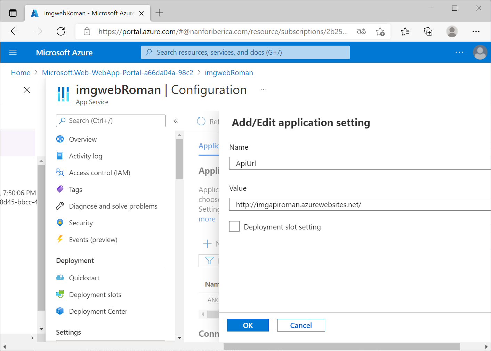

1.  Save your changes to the application settings.

#### Task 3: Deploy an ASP.NET web application to Web Apps

1.  Using Visual Studio Code, open the web application in the **Allfiles (F):\\Allfiles\\Labs\\01\\Starter\\Web** folder.

1.  Open the **Pages\\Index.cshtml.cs** file, and then observe the code in each of the methods.

1.  Open the Windows Terminal application, and then sign in to the Azure CLI by using your Azure credentials:

    ```
    az login
    ```

1.  List all the apps in your **ManagedPlatform** resource group:

    ```
    az webapp list --resource-group ManagedPlatform
    ```

1.  Find the apps that have the **imgweb\*** prefix:

    ```
    az webapp list --resource-group ManagedPlatform --query "[?starts_with(name, 'imgweb')]"
    ```

1.  Print only the name of the single app that has the **imgweb\*** prefix:
    
    ```
    az webapp list --resource-group ManagedPlatform --query "[?starts_with(name, 'imgweb')].{Name:name}" --output tsv
    ```
    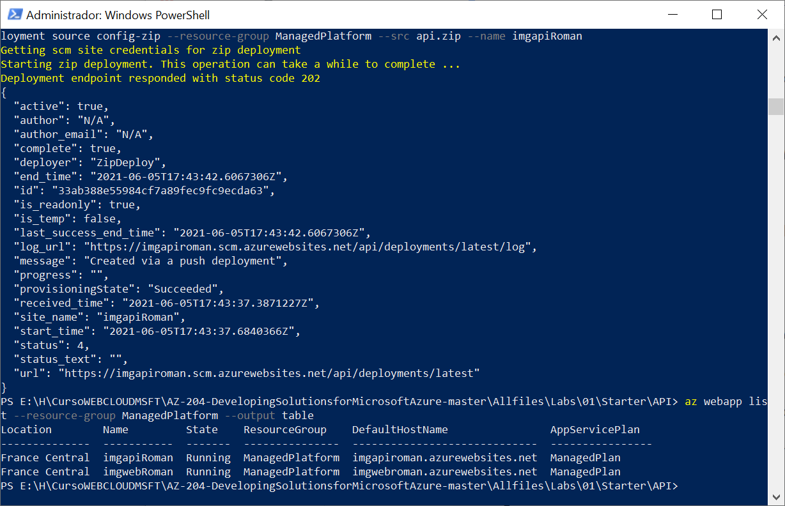

1.  Change your current directory to the **Allfiles (F):\\Allfiles\\Labs\\01\\Starter\\Web** directory that contains the lab files:

    ```
    cd F:\Allfiles\Labs\01\Starter\Web\
    ```

1.  Deploy the **web.zip** file to the web app that you created earlier in this lab:

    ```
    az webapp deployment source config-zip --resource-group ManagedPlatform --src web.zip --name <name-of-your-web-app>
    ```

    > **Note**: Replace the *\<name-of-your-web-app\>* placeholder with the name of the web app that you created earlier in this lab. You recently queried this app’s name in the previous steps.

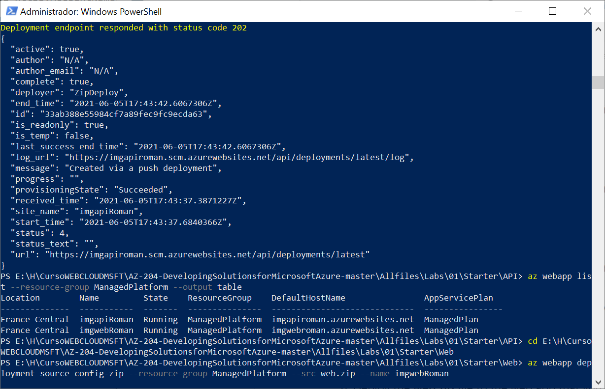

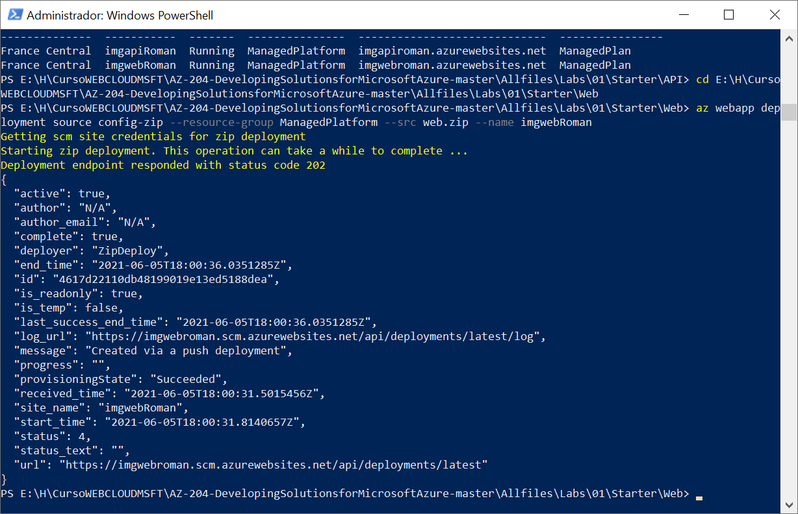

1.  Access the **imgweb*[yourname]*** web app that you created earlier in this lab. Open the **imgweb*[yourname]*** web app in your browser.

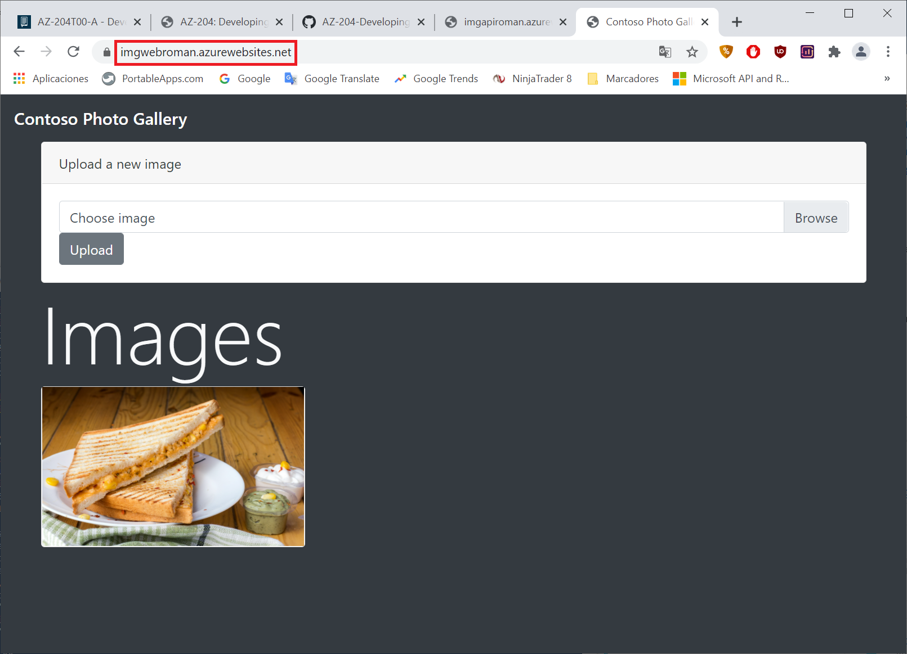

1.	From the **Contoso Photo Gallery** webpage, find the **Upload a new image** section, and then upload the **bahnmi.jpg** file in the **Allfiles (F):\\Allfiles\\Labs\\01\\Starter\\Images** folder on your lab machine.

    > **Note**: Ensure you click the **Upload** button to upload the image to Azure.

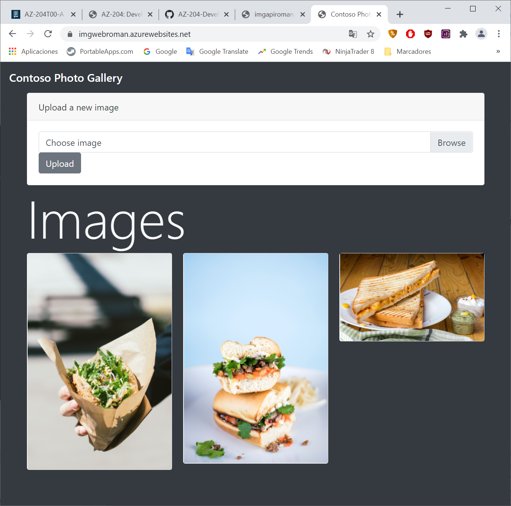

1.	Observe that the list of gallery images has updated with your new image.

    > **Note**: In some rare cases, you might need to refresh your browser window to retrieve the new image.

1.  Close the currently running Visual Studio Code and Windows Terminal applications.

#### Review

In this exercise, you created an Azure web app and deployed an existing web application’s code to the resource in the cloud.

### Exercise 3: Clean up your subscription 

#### Task 1: Open Azure Cloud Shell

1.  In the Azure portal, select the **Cloud Shell** icon to open a new shell instance.

1.  If **Cloud Shell** isn't already configured, configure the shell for **Bash** by using the default settings.

#### Task 2: Delete resource groups

1.  Enter the following command, and then select Enter to delete the **ManagedPlatform** resource group:

    ```
    az group delete --name ManagedPlatform --no-wait --yes
    ```
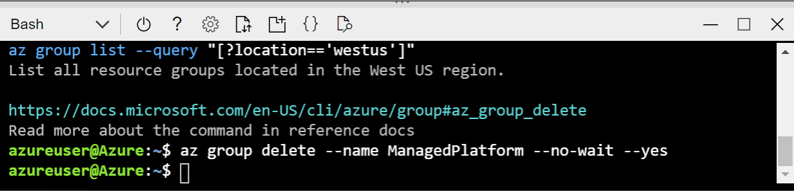

1.  Close the Cloud Shell pane in the portal.

#### Task 3: Close the active applications

-   Close the currently running Microsoft Edge application.

#### Review

In this exercise, you cleaned up your subscription by removing the resource groups used in this lab.
