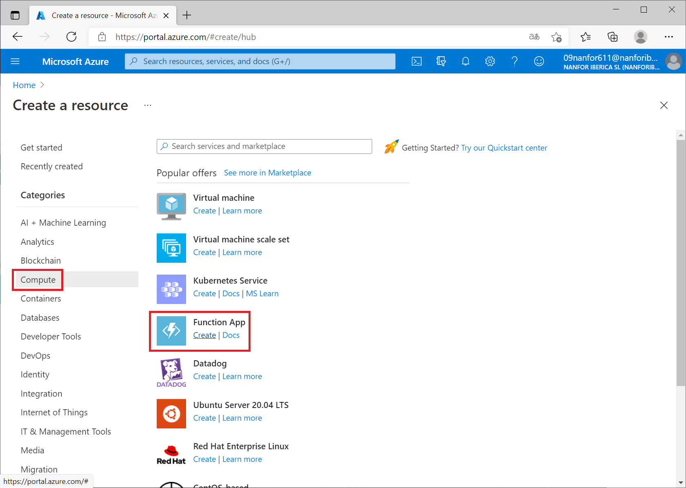
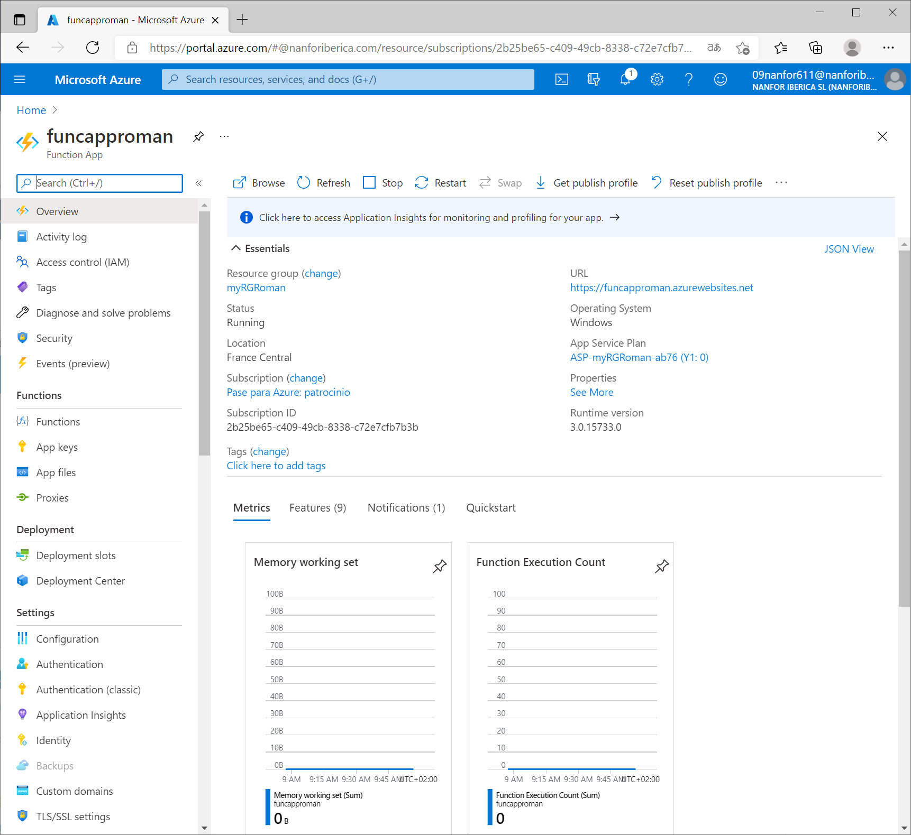
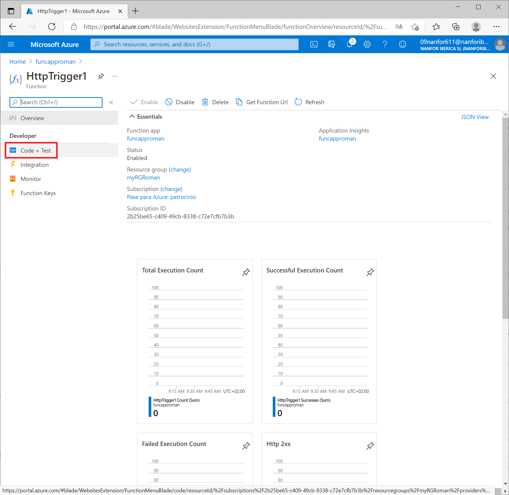
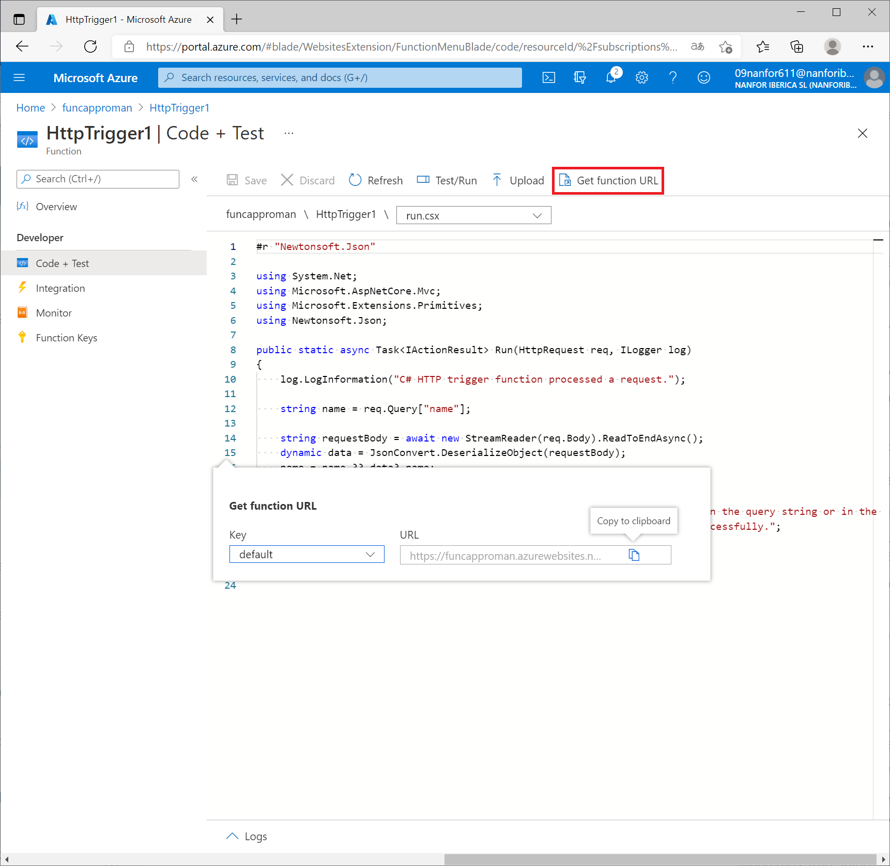
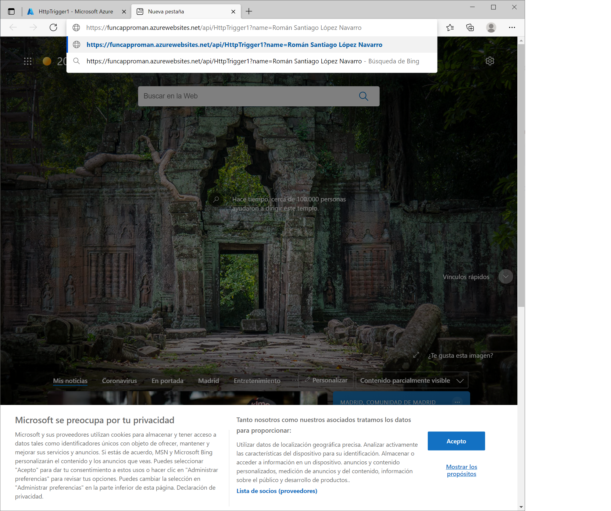
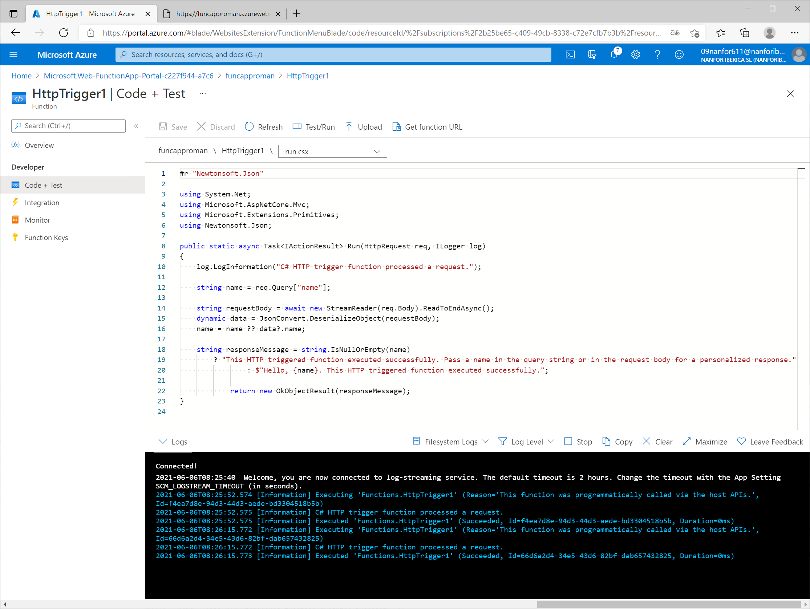

### Demo: Create an HTTP trigger function by using the Azure portal

In this demo, you'll learn how to use Functions to create a “hello world” function in the Azure portal. This demo has two main steps:

1. Create a Function app to host the function
2. Create and test the HTTP trigger function

To begin, sign in to the Azure portal at [https://portal.azure.com](https://portal.azure.com/) with your account.

#### Create a function app

You must have a function app to host the execution of your functions. A function app lets you group functions as a logic unit for easier management, deployment, and sharing of resources.

1. From the Azure portal menu, select **Create a resource**.

2. In the **New** page, select **Compute** > **Function App**.

3. Use the function app settings as specified in the table below.

   | Setting               | Suggested value      | Description                                                  |
   | --------------------- | -------------------- | ------------------------------------------------------------ |
   | **Subscription**      | Your subscription    | The subscription under which this new function app is created. |
   | **Resource Group**    | *myResourceGroup*    | Name for the new resource group in which to create your function app. |
   | **Function App name** | Globally unique name | Name that identifies your new function app. Valid characters are a-z (case insensitive), 0-9, and -. |
   | **Publish**           | Code                 | Option to publish code files or a Docker container.          |
   | **Runtime stack**     | Preferred language   | Choose a runtime that supports your favorite function programming language. Choose **.NET** for C# and F# functions. |
   | **Region**            | Preferred region     | Choose a region near you or near other services your functions access. |

1. Select the **Next : Hosting >** button and enter the following settings for hosting.

   | Setting              | Suggested value            | Description                                                  |
   | -------------------- | -------------------------- | ------------------------------------------------------------ |
   | **Storage account**  | Globally unique name       | Create a storage account used by your function app. You can accept the account name generated for you, or create one with a different name. |
   | **Operating system** | Preferred operating system | An operating system is pre-selected for you based on your runtime stack selection, but you can change the setting if necessary. |
   | **Plan**             | Consumption plan           | Hosting plan that defines how resources are allocated to your function app. In the default **Consumption Plan**, resources are added dynamically as required by your functions. |

2. Select **Review + Create** to review the app configuration selections.

3. Select **Create** to provision and deploy the function app. When the deployment is complete select **Go to resource** to view your new function app.

Next, you'll create a function in the new function app.

#### Create and test the HTTP triggered function

1. Expand your new function app, then select the **+** button next to **Functions**.

   

2. Select the **Develop in portal** development environment.

3. Choose **HTTP trigger** and **Anonymous** then select **Add**.

A function is created using a language-specific template for an HTTP triggered function.

##### Test the function

1. In your new function, click **</> Get function URL** at the top right.

   

   

2. In the dialog box that appears select **default (Function key)**, and then click **Copy**.

3. Paste the function URL into your browser's address bar. Add the query string value &name=<yourname> to the end of this URL and press the Enter key on your keyboard to execute the request. You should see the response returned by the function displayed in the browser.

   > Hay que poner **?name=<yourname>** con el símbolo de interrogación ya que es el primer parámetro de la *URL*, si hubiera más se separarían por ampersands. *<yourname>* no tiene por qué llevar comillas y los espacios en blanco se formatearán automáticamente como %20.

4. When your function runs, trace information is written to the logs. To see the trace output from the previous execution, return to your function in the portal and click the arrow at the bottom of the screen to expand the **Logs**.

#### Clean up resources

You can clean up the resources created in this demo simply by deleting the resource group that was created early in the demo.

