---
lab:
    az204Title: 'Lab 02: Implement task processing logic by using Azure Functions'
    az020Title: 'Lab 02: Implement task processing logic by using Azure Functions'
    az204Module: 'Module 02: Implement Azure Functions'
    az020Module: 'Module 02: Implement Azure Functions'
---

# Lab 02: Implement task processing logic by using Azure Functions

## Escenario de laboratorio

Su empresa ha creado una herramienta de software de escritorio que analiza un archivo JavaScript Object Notation (JSON) local para sus ajustes de configuración. Durante su última reunión, su equipo decidió reducir la cantidad de archivos que se distribuyen con su aplicación sirviendo su configuración predeterminada desde una URL en lugar de un archivo local. Como nuevo desarrollador del equipo, se le asignó la tarea de evaluar las funciones de Microsoft Azure como una solución a este problema.

## Objetivos

Después de completar este lab, podrá:

- Cree una aplicación de Azure Functions en Azure Portal.

- Cree un proyecto de Azure Functions local con las herramientas principales de Azure Functions.

- Cree varias funciones mediante el uso de activadores incorporados e integraciones de entrada.
  Implemente un proyecto de Azure Functions local en Azure.


## Arquitectura


# Student lab manual

## Lab scenario

Your company has built a desktop software tool that parses a local JavaScript Object Notation (JSON) file for its configuration settings. During its latest meeting, your team decided to reduce the number of files that are distributed with your application by serving your default configuration settings from a URL instead of from a local file. As the new developer on the team, you've been tasked with evaluating Microsoft Azure Functions as a solution to this problem.

## Objectives

After you complete this lab, you'll be able to:

- Create an Azure Functions app in the Azure Portal.
- Create a local Azure Functions project using the [Azure Functions Core Tools][azure-functions-core-tools].
- Create various functions by using built-in triggers and input integrations.
- Deploy a local Azure Functions project to Azure.

## Lab setup

- Estimated time: **45 minutes**

## Instructions

### Before you start

#### Sign in to the lab virtual machine

Ensure that you're signed in to your Windows 10 virtual machine (VM) by using the following credentials:

- Username: **Admin**
- Password: **Pa55w.rd**

#### Review the installed applications

Find the taskbar on your Windows 10 desktop. The taskbar contains the icons for the applications that you'll use in this lab:

- Microsoft Edge
- File Explorer
- Windows Terminal
- Visual Studio Code

### Exercise 1: Create Azure resources

#### Task 1: Open the Azure portal

1. Sign in to the Azure portal (<https://portal.azure.com>).
1. If this is your first time signing in to the Azure portal, a dialog box offering a tour of the portal will appear. If you prefer to skip the tour, select **Get Started**.

#### Task 2: Create an Azure Storage account

1. Create a new storage account with the following details:
    - New resource group: **Serverless**
    - Name: **funcstor[yourname]**
    - Location: **(US) East US**
    - Performance: **Standard**
    - Account kind: **StorageV2 (general purpose v2)**
    - Replication: **Locally-redundant storage (LRS)**
    > **Note**: Wait for Azure to finish creating the storage account before you move forward with the lab. You'll receive a notification when the account is created.
1. Open the **Access Keys** section of your newly created storage account instance.
1. Record the value of the **Connection string** text box.
   
    > **Note**: You'll use this value later in the lab. It doesn't matter which connection string you choose. They are interchangeable.

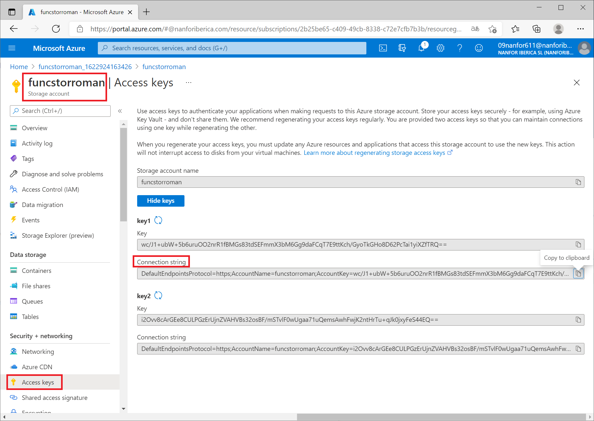

#### Task 3: Create a function app

1. Create a new function app with the following details:
    - Existing resource group: **Serverless**
    - App name: **funclogic[yourname]**
    - Publish: **Code**
    - Runtime stack: **.NET**
    - Version: **3.1**
    - Region: **East US**
    - Operating system: **Linux**
    - Storage account: **funcstor[yourname]**
    - Plan: **Consumption**
    - Enable Application Insights: **Yes**
    > **Note**: Wait for Azure to finish creating the function app before you move forward with the lab. You'll receive a notification when the app is created.

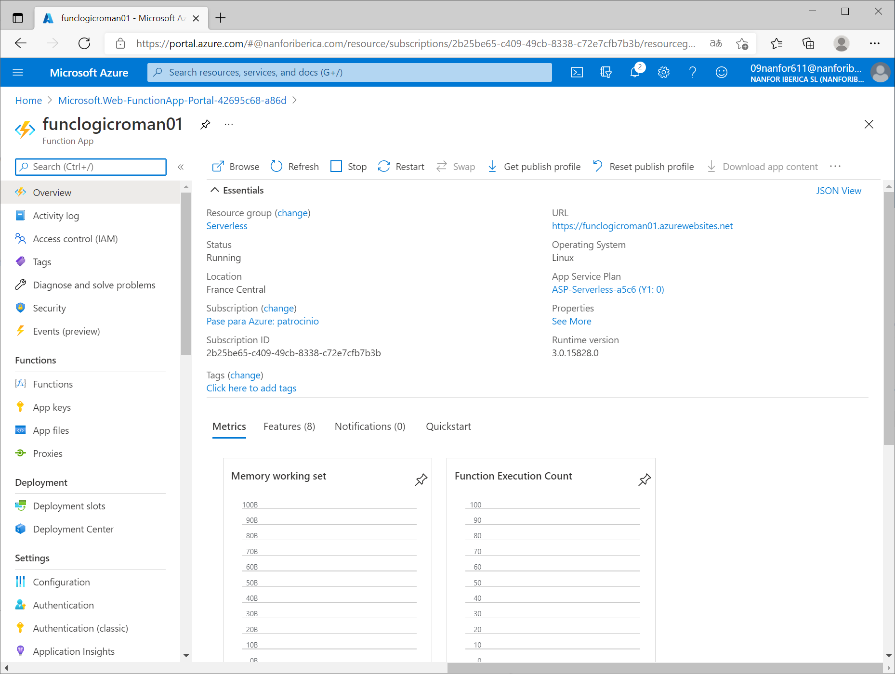

> **Review**: In this exercise, you created all the resources that you'll use for this lab.

### Exercise 2: Configure local Azure Functions project

#### Task 1: Initialize function project

1. Open the **Windows Terminal** application.
1. Change the current directory to the **Allfiles (F):\\Allfiles\\Labs\\02\\Starter\\func** empty directory:

    ```powershell
    cd F:\Allfiles\Labs\02\Starter\func
    ```


1. Use the **Azure Functions Core Tools** to create a new local Azure Functions project with the following details:
    - worker runtime: **dotnet**
    > **Note**: You can review the documentation to [create a new project][azure-functions-core-tools-new-project] using the **Azure Functions Core Tools**.


Close the currently running **Windows Terminal** application.

#### Task 2: Configure connection string

1. Open **Visual Studio Code**.
1. Using **Visual Studio Code**, open the solution folder found at **Allfiles (F):\\Allfiles\\Labs\\02\\Starter\\func**.
1. Open the **local.settings.json** file.
1. Update the **AzureWebJobsStorage** setting by setting its value to the **connection string** of the storage account that you recorded earlier in this lab.

#### Task 3: Build and validate project

1. Open the **Windows Terminal** application.
1. Change the current directory to the **Allfiles (F):\\Allfiles\\Labs\\02\\Starter\\func** project directory.
1. **Build** the .NET Core 3.1 project:

    ```powershell
    dotnet build
    ```
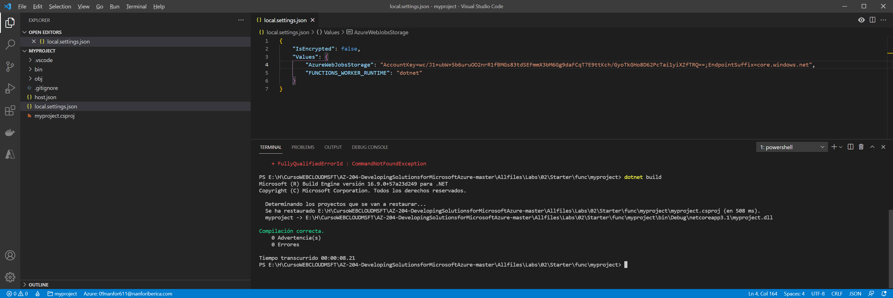

1. Close the currently running **Windows Terminal** application.

> **Review**: In this exercise, you created a local project that you'll use for Azure Functions development.

### Exercise 3: Create a function that's triggered by an HTTP request

#### Task 1: Create an HTTP-triggered function

1. Open the **Windows Terminal** application.
1. Change the current directory to the **Allfiles (F):\\Allfiles\\Labs\\02\\Starter\\func** project directory.
1. Create a new function with the following details:
    - template: **HTTP trigger**
    - name: **Echo**
    > **Note**: You can review the documentation to [create a new function][azure-functions-core-tools-new-function] using the **Azure Functions Core Tools**.
1. Close the currently running **Windows Terminal** application.

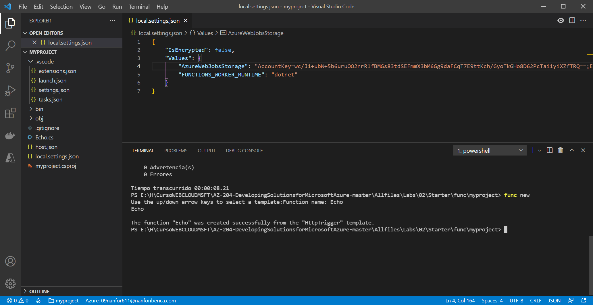

#### Task 2: Write HTTP-triggered function code

1. Open **Visual Studio Code**.
1. Using **Visual Studio Code**, open the solution folder found at **Allfiles (F):\\Allfiles\\Labs\\02\\Starter\\func**.
1. Open the **Echo.cs** file.
1. In the code editor, delete all the code within the **Echo.cs** file.
1. Add **using directives** for the **Microsoft.AspNetCore.Mvc**, **Microsoft.Azure.WebJobs**, **Microsoft.AspNetCore.Http**, and **Microsoft.Extensions.Logging** namespaces for libraries that will be referenced by the application:

    ```csharp
    using Microsoft.AspNetCore.Mvc;
    using Microsoft.Azure.WebJobs;
    using Microsoft.AspNetCore.Http;
    using Microsoft.Extensions.Logging;
    ```

1. Create a new **public static** class named **Echo**:

    ```csharp
    public static class Echo
    { }
    ```

1. Within the **Echo** class, create a new **public static** method named **Run** that returns a variable of type **IActionResult** and that also takes in variables of type **HttpRequest** and **ILogger** as parameters named *request* and *logger*:

    ```csharp
    public static IActionResult Run(
        HttpRequest request,
        ILogger logger)
    { }
    ```

1. Append an attribute to the **Run** method of type **FunctionNameAttribute** that has its **name** parameter set to a value of **Echo**:

    ```csharp
    [FunctionName("Echo")]
    public static IActionResult Run(
        HttpRequest request,
        ILogger logger)
    { }
    ```

1. Append an attribute to the **request** parameter of type **HttpTriggerAttribute** that has its **methods** parameter array set to a single value of **POST**:

    ```csharp
    [FunctionName("Echo")]
    public static IActionResult Run(
        [HttpTrigger("POST")] HttpRequest request,
        ILogger logger)
    { }
    ```

1. Within the **Run** method, log a fixed message:

    ```csharp
    logger.LogInformation("Received a request");
    ```

1. Finally, echo the body of the HTTP request as the HTTP response:

    ```csharp
    return new OkObjectResult(request.Body);
    ```

1. **Save** the **Echo.cs** file.

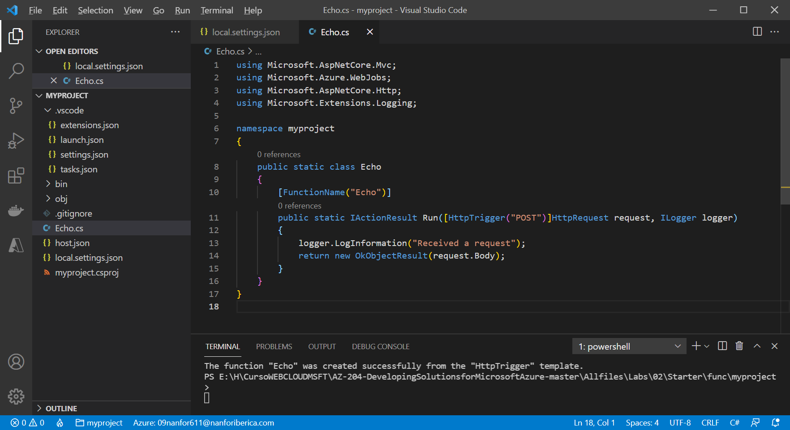

#### Task 3: Test the HTTP-triggered function by using httprepl

1. Open the **Windows Terminal** application.

1. Change the current directory to the **Allfiles (F):\\Allfiles\\Labs\\02\\Starter\\func** project directory.

1. Start the function app project:
   
    > **Note**: You can review the documentation to [start the function app project locally][azure-functions-core-tools-start-function] using the **Azure Functions Core Tools**.
    
    
    
1. Open a new instance of the **Windows Terminal** application.

1. Start the **httprepl** tool, and then set the base Uniform Resource Identifier (URI) to ``http://localhost:7071``:

    > Antes tuve que instalar la herramienta **httprepl**. Se puede instalar con comandos desde la propia terminal.
    
    ```powershell
    httprepl http://localhost:7071
    ```
    
    > **Note**: An error message is displayed by the httprepl tool. This message occurs because the tool is searching for a Swagger definition file to use to "traverse" the API. Because your functio projectp does not produce a Swagger definition file, you'll need to traverse the API manually.
    
1. When you receive the tool prompt, browse to the relative **api/echo** directory:

    ```powershell
    cd api
    cd echo
    ```

1. Run the **post** command sending in an HTTP request body set to a numeric value of **3** by using the **\-\-content** option:

    ```powershell
    post --content 3
    ```

1. Run the **post** command sending in an HTTP request body set to a numeric value of **5** by using the **\-\-content** option:

    ```powershell
    post --content 5
    ```
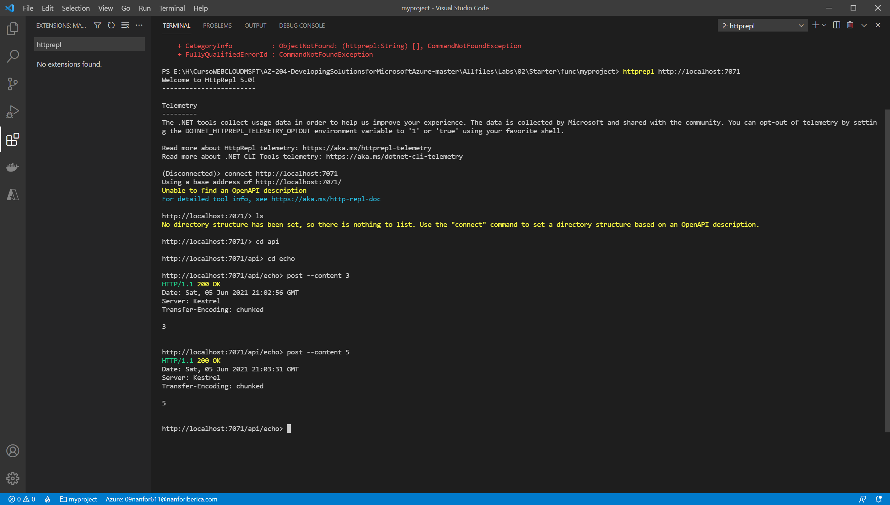

1. Run the **post** command sending in an HTTP request body set to a string value of **"Hello"** by using the **\-\-content** option:

    ```powershell
    post --content "Hello"
    ```

1. Run the **post** command sending in an HTTP request body set to a JSON value of **{"msg": "Successful"}** by using the **\-\-content** option:

    ```powershell
    post --content "{"msg": "Successful"}"
    ```
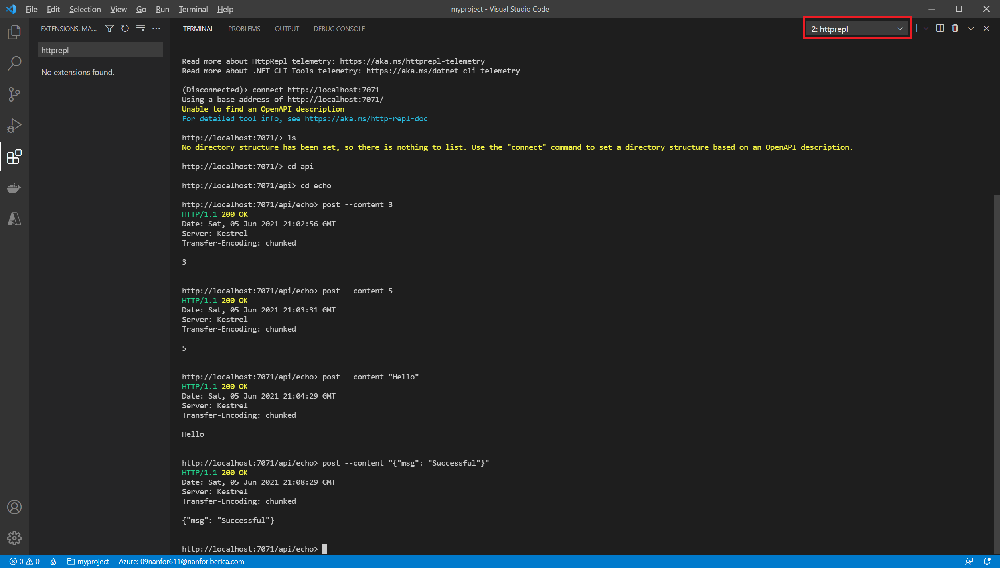

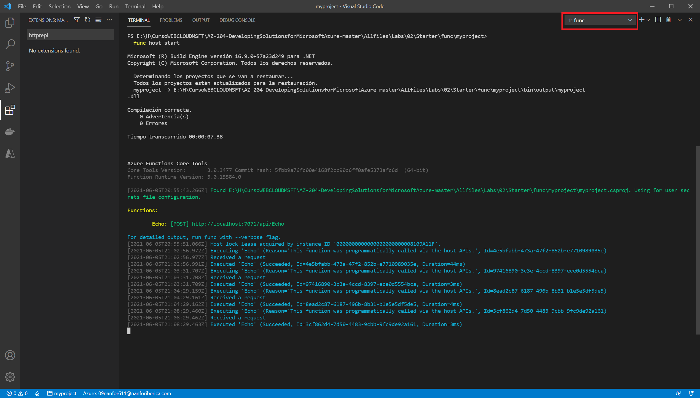

1. Exit the **httprepl** application:

    ```powershell
    exit
    ```

1. Close all currently running instances of the **Windows Terminal** application.

> **Review**: In this exercise, you created a basic function that echoes the content sent via an HTTP POST request.

### Exercise 4: Create a function that triggers on a schedule

#### Task 1: Create a schedule-triggered function

1. Open the **Windows Terminal** application.
1. Change the current directory to the **Allfiles (F):\\Allfiles\\Labs\\02\\Starter\\func** project directory.
1. Create a new function with the following details:
    - template: **Timer trigger**
    - name: **Recurring**
    > **Note**: You can review the documentation to [create a new function][azure-functions-core-tools-new-function] using the **Azure Functions Core Tools**.
1. Close the currently running **Windows Terminal** application.

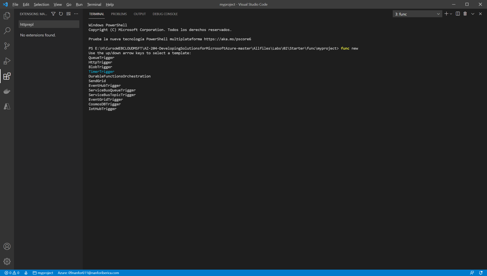


#### Task 2: Observe function code

1. Open **Visual Studio Code**.
1. Using **Visual Studio Code**, open the solution folder found at **Allfiles (F):\\Allfiles\\Labs\\02\\Starter\\func**.
1. Open the **Recurring.cs** file.
1. In the code editor, observe the implementation:

    ```csharp
    using System;
    using Microsoft.Azure.WebJobs;
    using Microsoft.Azure.WebJobs.Host;
    using Microsoft.Extensions.Logging;
    
    namespace func
    {
        public static class Recurring
        {
            [FunctionName("Recurring")]
            public static void Run([TimerTrigger("0 */5 * * * *")]TimerInfo myTimer, ILogger log)
            {
                log.LogInformation($"C# Timer trigger function executed at: {DateTime.Now}");
            }
        }
    }
    ```
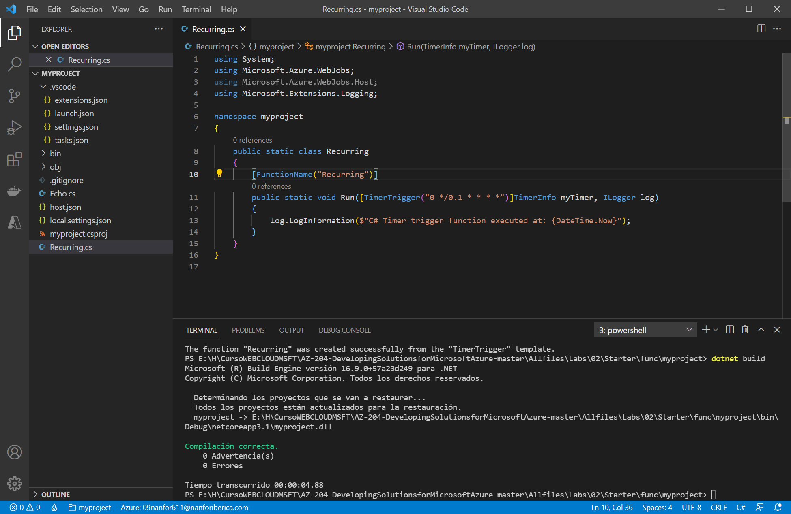

#### Task 3: Observe function runs

1. Open the **Windows Terminal** application.
1. Change the current directory to the **Allfiles (F):\\Allfiles\\Labs\\02\\Starter\\func** project directory.
1. Start the function app project:
   
    > **Note**: You can review the documentation to [start the function app project locally][azure-functions-core-tools-start-function] using the **Azure Functions Core Tools**.
1. Observe the function run that occurs about every five minutes. Each function run should render a simple message to the log.
1. Close the currently running **Windows Terminal** application.

#### Task 4: Update the function integration configuration

1. Open **Visual Studio Code**.
1. Using **Visual Studio Code**, open the solution folder found at **Allfiles (F):\\Allfiles\\Labs\\02\\Starter\\func**.
1. Open the **Recurring.cs** file.
1. In the code editor, update the **Run** method signature to change the schedule to execute once every **30 seconds**:

    ```csharp
    [FunctionName("Recurring")]
    public static void Run([TimerTrigger("*/30 * * * * *")]TimerInfo myTimer, ILogger log)
    ```

1. **Save** the **Recurring.cs** file.

#### Task 5: Observe function runs

1. Open the **Windows Terminal** application.
1. Change the current directory to the **Allfiles (F):\\Allfiles\\Labs\\02\\Starter\\func** project directory.
1. Start the function app project:
   
    > **Note**: You can review the documentation to [start the function app project locally][azure-functions-core-tools-start-function] using the **Azure Functions Core Tools**.
1. Observe the function run that occurs about every thirty seconds. Each function run should render a simple message to the log.
1. Close the currently running **Windows Terminal** application.

> **Review**: In this exercise, you created a function that runs automatically based on a fixed schedule.

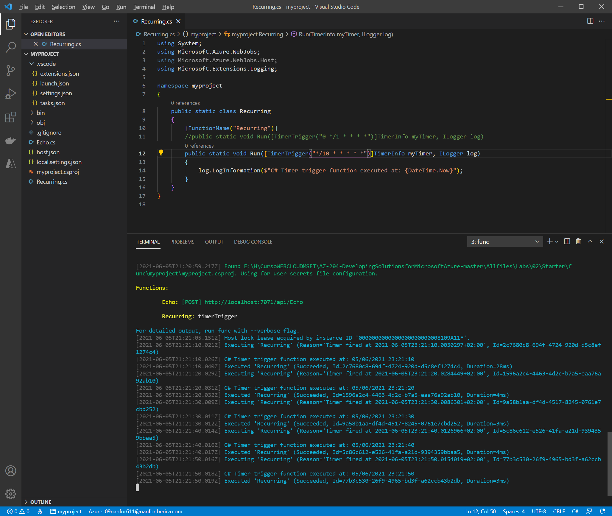

### Exercise 5: Create a function that integrates with other services

#### Task 1: Upload sample content to Azure Blob Storage

1. Access the **funcstor[yourname]** storage account that you created earlier in this lab.
1. Select the **Containers** link in the **Blob service** section, and then create a new container with the following settings:
    - Name: **content**
    - Public access level: **Private (no anonymous access)**
1. Select the recently created **content** container.
1. In the **content** container, select **Upload** to upload the **settings.json** file in the **Allfiles (F): \\Allfiles\\Labs\\02\\Starter** folder on your lab VM.
   
    > **Note**: You should enable the **Overwrite if files already exist** option.

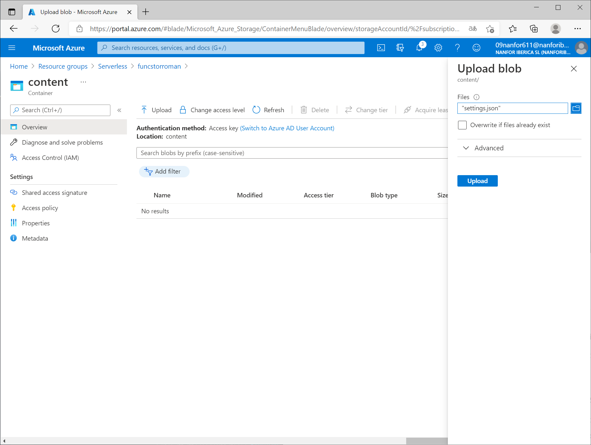

#### Task 2: Create an HTTP-triggered function

1. Open the **Windows Terminal** application.
1. Change the current directory to the **Allfiles (F):\\Allfiles\\Labs\\02\\Starter\\func** project directory.
1. Create a new function with the following details:
    - template: **HTTP trigger**
    - name: **GetSettingInfo**
    > **Note**: You can review the documentation to [create a new function][azure-functions-core-tools-new-function] using the **Azure Functions Core Tools**.
1. Close the currently running **Windows Terminal** application.

#### Task 3: Write HTTP-triggered and blob-inputted function code

1. Open **Visual Studio Code**.
1. Using **Visual Studio Code**, open the solution folder found at **Allfiles (F):\\Allfiles\\Labs\\02\\Starter\\func**.
1. Open the **GetSettingInfo.cs** file.
1. In the code editor, delete all the code within the **GetSettingInfo.cs** file.
1. Add **using directives** for the **Microsoft.AspNetCore.Http**, **Microsoft.AspNetCore.Mvc**, and **Microsoft.Azure.WebJobs** namespaces:

    ```csharp
    using Microsoft.AspNetCore.Http;
    using Microsoft.AspNetCore.Mvc;
    using Microsoft.Azure.WebJobs;
    ```

1. Create a new **public static** class named **GetSettingInfo**:

    ```csharp
    public static class GetSettingInfo
    { }
    ```

1. Within the **GetSettingInfo** class, create a new **public static** expression-bodied method named **Run** that returns a variable of type **IActionResult** and that also takes in variables of type **HttpRequest** and **string** as parameters named *request* and *json*:

    ```csharp
    public static IActionResult Run(
        HttpRequest request,
        string json)
        => null;
    ```

    > **Note**: You are only temporarily setting the return value to **null**.

1. Append an attribute to the **Run** method of type **FunctionNameAttribute** that has its **name** parameter set to a value of **GetSettingInfo**:

    ```csharp
    [FunctionName("GetSettingInfo")]
    public static IActionResult Run(
        HttpRequest request,
        string json)
        => null;
    ```

1. Append an attribute to the **request** parameter of type **HttpTriggerAttribute** that has its **methods** parameter array set to a single value of **GET**:

    ```csharp
    [FunctionName("GetSettingInfo")]
    public static IActionResult Run(
        [HttpTrigger("GET")] HttpRequest request,
        string json)
        => null;
    ```

1. Append an attribute to the **json** parameter of type **BlobAttribute** that has its **blobPath** parameter set to a value of **content/settings.json**:

    ```csharp
    [FunctionName("GetSettingInfo")]
    public static IActionResult Run(
        [HttpTrigger("GET")] HttpRequest request,
        [Blob("content/settings.json")] string json)
        => null;
    ```

1. Update the **Run** expression-bodied method to return a new instance of the **OkObjectResult** class passing in the value of the **json** method parameter as the sole constructor parameter:

    ```csharp
    [FunctionName("GetSettingInfo")]
    public static IActionResult Run(
        [HttpTrigger("GET")] HttpRequest request,
        [Blob("content/settings.json")] string json)
        => new OkObjectResult(json);
    ```

1. **Save** the **GetSettingInfo.cs** file.

#### Task 4: Register Azure Storage blob extensions

1. Open the **Windows Terminal** application.
1. Change the current directory to the **Allfiles (F):\\Allfiles\\Labs\\02\\Starter\\func** project directory.
1. Use the following command to **register** the [Microsoft.Azure.WebJobs.Extensions.Storage](https://www.nuget.org/packages/Microsoft.Azure.WebJobs.Extensions.Storage/4.0.4) extension:

    ```powershell
    func extensions install --package Microsoft.Azure.WebJobs.Extensions.Storage --version 4.0.4
    ```

1. Use the following command to validate the extensions were installed correctly by **building** the .NET project:

    ```powershell
    dotnet build
    ```

1. Close all currently running instances of the **Windows Terminal** application.

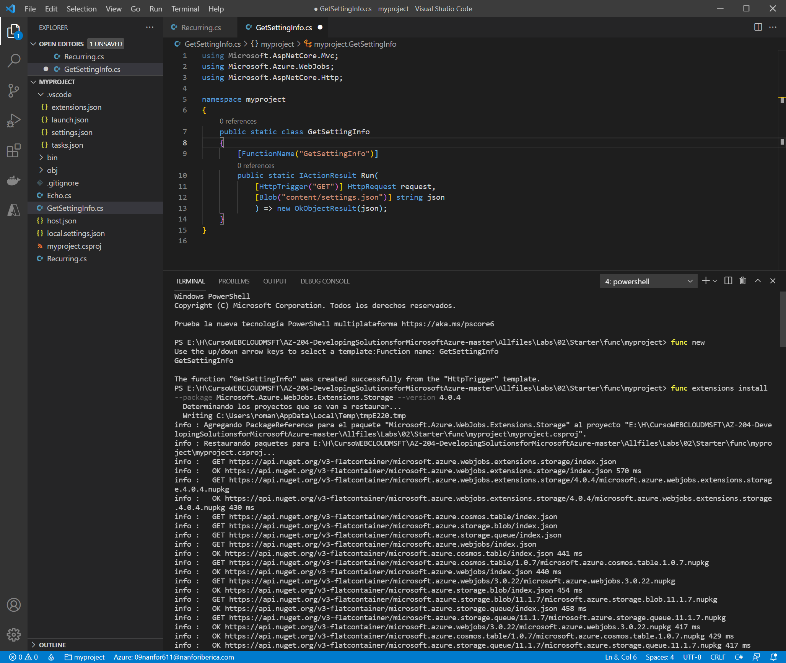


#### Task 5: Test the function by using httprepl

1. Open the **Windows Terminal** application.
1. Change the current directory to the **Allfiles (F):\\Allfiles\\Labs\\02\\Starter\\func** project directory.
1. Start the function app project:
   
    > **Note**: You can review the documentation to [start the function app project locally][azure-functions-core-tools-start-function] using the **Azure Functions Core Tools**.
1. Open a new instance of the **Windows Terminal** application.
1. Start the **httprepl** tool, and then set the base URI to ``http://localhost:7071``:

    ```powershell
    httprepl http://localhost:7071
    ```

    > **Note**: An error message is displayed by the httprepl tool. This message occurs because the tool is searching for a Swagger definition file to use to "traverse" the API. Because your functio projectp does not produce a Swagger definition file, you'll need to traverse the API manually.

1. When you receive the tool prompt, browse to the relative **api/getsettinginfo** endpoint:

    ```powershell
    cd api
    cd getsettinginfo
    ```

1. Run the **get** command for the current endpoint:

    ```powershell
    get
    ```

1. Observe the JSON content of the response from the function app.


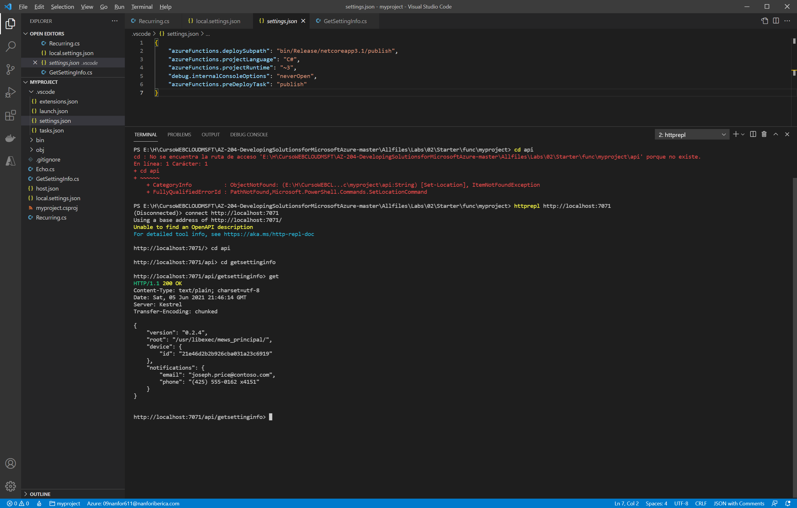

1. Exit the **httprepl** application:

    ```powershell
    exit
    ```

1. Close all currently running instances of the **Windows Terminal** application.

> **Review**: In this exercise, you created a function that returns the content of a JSON file in Storage.

### Exercise 6: Deploy a local function project to an Azure Functions app

#### Task 1: Deploy using the Azure Functions Core Tools

1. Open the **Windows Terminal** application.
1. Change the current directory to the **Allfiles (F):\\Allfiles\\Labs\\02\\Starter\\func** project directory.
1. Log in to the Azure Command-Line Interface (CLI) by using your Azure credentials:

    ```powershell
    az login
    ```

1. Publish the function app project:

    ```powershell
    func azure functionapp publish <function-app-name>
    ```

    > **Note**: For example, if your **Function App name** is **funclogicstudent**, your command would be ``func azure functionapp publish funclogicstudent``. You can review the documentation to [publish the local function app project][azure-functions-core-tools-publish-azure] using the **Azure Functions Core Tools**.
1. Wait for the deployment to finalize before you move forward with the lab.
1. Close the currently running **Windows Terminal** application.

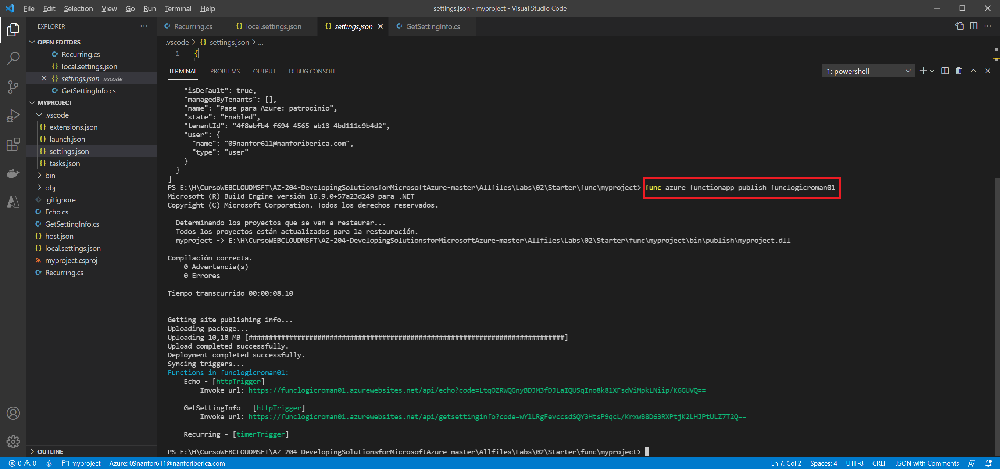


#### Task 2: Validate deployment

1. Sign in to the Azure portal (<https://portal.azure.com>).
1. Access the **funclogic[yourname]** function app that you created earlier in this lab.
1. From the **App Service** blade, locate and open the **Functions** section, then locate and open the **GetSettingInfo** function.

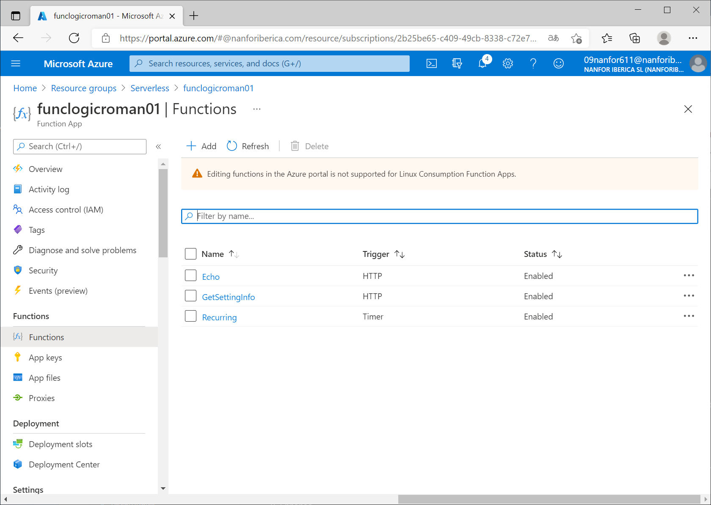

1. In the **Function** blade, select the **Code + Test** option from the **Developer** section.
1. In the function editor, select **Test/Run**.
1. In the popup dialog that appears, perform the following actions:
    - In the **HTTP method** list, select **GET**.
1. Select **Run** to test the function.
1. Observe the results of the test run. the JSON content should be the same as the **settings.json** file.

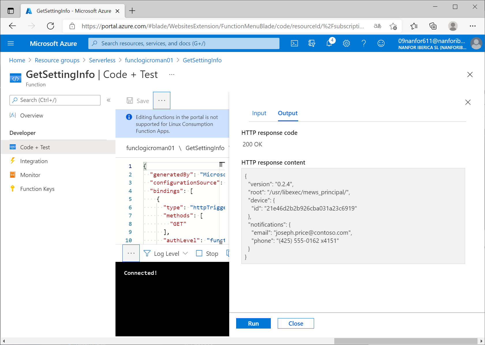

> **Review**: In this exercise, you deployed a local function project to Azure Functions and validated that the functions work in Azure.

### Exercise 7: Clean up your subscription

#### Task 1: Open Azure Cloud Shell and list resource groups

1. In the Azure portal, select the **Cloud Shell** icon to open a new shell instance.
1. If **Cloud Shell** isn't already configured, configure the shell for **Bash** by using the default settings.

#### Task 2: Delete a resource group

1. Enter the following command, and then select Enter to delete the **Serverless** resource group:

    ```powershell
    az group delete --name Serverless --no-wait --yes
    ```

1. Close the Cloud Shell pane in the portal.

#### Task 3: Close the active application

1. Close the currently running Microsoft Edge application.

> **Review**: In this exercise, you cleaned up your subscription by removing the resource group that was used in this lab.

[azure-functions-core-tools]: https://docs.microsoft.com/azure/azure-functions/functions-run-local
[azure-functions-core-tools-new-function]: https://docs.microsoft.com/azure/azure-functions/functions-run-local#create-func
[azure-functions-core-tools-new-project]: https://docs.microsoft.com/azure/azure-functions/functions-run-local#create-a-local-functions-project
[azure-functions-core-tools-start-function]: https://docs.microsoft.com/azure/azure-functions/functions-run-local#start
[azure-functions-core-tools-publish-azure]: https://docs.microsoft.com/azure/azure-functions/functions-run-local#publish
