---
lab:
    az204Title: 'Lab 03: Retrieving Azure Storage resources and metadata by using the Azure Storage SDK for .NET'
    az020Title: 'Lab 03: Retrieving Azure Storage resources and metadata by using the Azure Storage SDK for .NET'
    az204Module: 'Module 03: Develop solutions that use blob storage'
    az020Module: 'Module 03: Develop solutions that use blob storage'
    type: 'Answer Key'
---

# Lab 03: Retrieving Azure Storage resources and metadata by using the Azure Storage SDK for .NET

##  Escenario de laboratorio

Se está preparando para alojar una aplicación web en Microsoft Azure que utiliza una combinación de gráficos vectoriales y ráster. Como grupo de desarrollo, su equipo ha decidido almacenar cualquier contenido multimedia en Azure Storage y administrarlo de forma automatizada mediante el uso de código C# en .NET. Antes de comenzar este importante hito, decidió tomarse un tiempo para aprender la versión más reciente del SDK de .NET que se usa para acceder al almacenamiento mediante la creación de una aplicación simple para administrar y enumerar blobs y contenedores.

## Objetivos

Después de completar esta práctica de laboratorio, podrá:

- Crear contenedores y cargar blobs mediante Azure Portal.
- Enumerar blobs y contenedores con el SDK de almacenamiento de Microsoft Azure para .NET.
- Extraer metadatos de blob con el SDK de almacenamiento.

## Arquitectura


# Student lab answer key

## Microsoft Azure user interface

Given the dynamic nature of Microsoft cloud tools, you might experience Azure UI changes after the development of this training content. These changes might cause the lab instructions and lab steps to not match up.

Microsoft updates this training course when the community brings needed changes to our attention; however, because cloud updates occur frequently, you might encounter UI changes before this training content updates. **If this occurs, adapt to the changes, and then work through them in the labs as needed.**

## Instructions

### Before you start

#### Sign in to the lab virtual machine

Sign in to your Windows 10 virtual machine (VM) by using the following credentials:
    
-   Username: **Admin**

-   Password: **Pa55w.rd**

> **Note**: Instructions to connect to the virtual lab environment will be provided by your instructor.

#### Review the installed applications

Find the taskbar on your Windows 10 desktop. The taskbar contains the icons for the applications that you'll use in this lab:
    
-   Microsoft Edge

-   File Explorer

### Exercise 1: Create Azure resources

#### Task 1: Open the Azure portal

1.  On the taskbar, select the **Microsoft Edge** icon.

1.  In the open browser window, go to the Azure portal (<https://portal.azure.com>).

1.  Enter the email address for your Microsoft account, and then select **Next**.

1.  Enter the password for your Microsoft account, and then select **Sign in**.

    > **Note**: If this is your first time signing in to the Azure portal, you'll be offered a tour of the portal. Select **Get Started** to skip the tour and begin using the portal.

#### Task 2: Create a Storage account

1.  In the Azure portal's navigation pane, select **All services**.

1.  On the **All services** blade, select **Storage Accounts**.


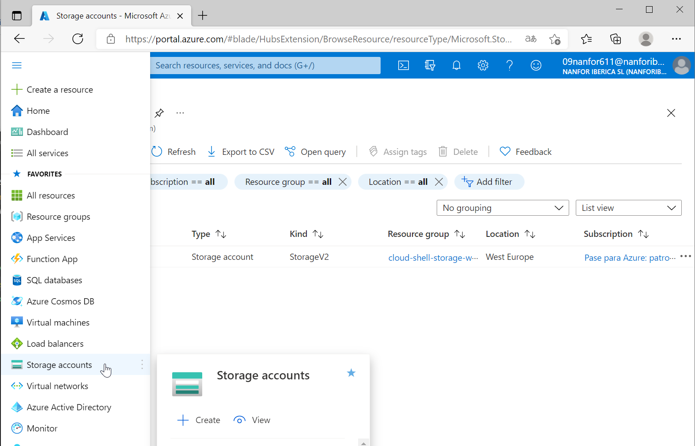

1.  On the **Storage accounts** blade, find your list of Storage instances.

1.  On the **Storage accounts** blade, select **New**.


1.  Find the tabs on the **Create storage account** blade, such as **Basics**.

    > **Note**: Each tab represents a step in the workflow to create a new storage account. You can select **Review + Create** at any time to skip the remaining tabs.

1.  On the **Basics** tab, perform the following actions:
    
    1.  Leave the **Subscription** text box set to its default value.

    1.  In the **Resource group** section, select **Create new**, enter **StorageMedia**, and then select **OK**.

    1.  In the **Storage account name** text box, enter **mediastor*[yourname]***.

    1.  In the **Location** drop-down list, select the **(US) East US** region.

    1.  In the **Performance** section, select **Standard**.

    1.  In the **Account kind** drop-down list, select **StorageV2 (general purpose v2)**.

    1.  In the **Replication** drop-down list, select **Read-access geo-redundant storage (RA-GRS)**.

    1.  Select **Review + Create**.

1.  On the **Review + Create** tab, review the options that you selected during the previous steps.

1.  Select **Create** to create the storage account by using your specified configuration. 

    > **Note**: Wait for the creation task to complete before you move forward with this lab.

1.  In the Azure portal's navigation pane, select **All services**.

1.  On the **All services** blade, select **Storage Accounts**.

1.  On the **Storage accounts** blade, select the **mediastor*[yourname]*** storage account instance.

1.  On the **Storage account** blade, find the **Settings** section, and then select the **Properties** link.

1.  In the **Properties** section, record the value of the **Primary Blob Service Endpoint** text box.

    > **Note**: You'll use this value later in the lab.


1.  Still on the **Storage account** blade, find the **Settings** section, and then select the **Access keys** link.

1.  In the **Access keys** section, perform the following actions:

    1.  Record the value in the **Storage account name** text box.
    
    1.  Select any one of the keys, and then record the value in either of the **Key** boxes.

    > **Note**: All these values will be used later in this lab.

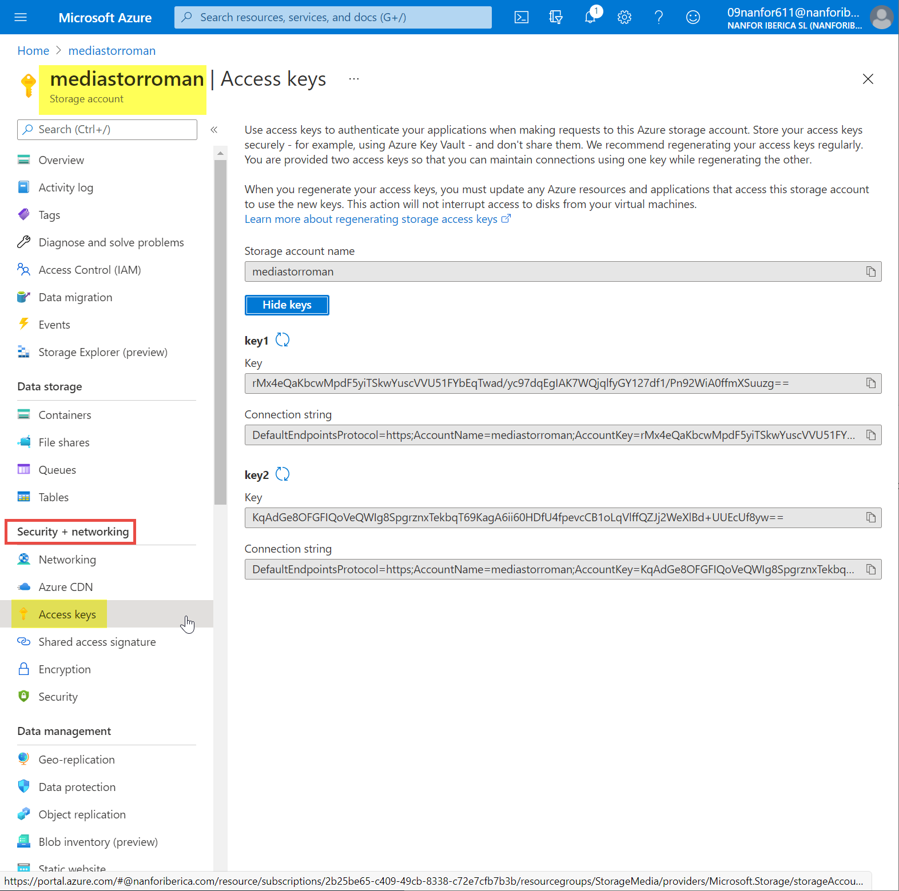

#### Review

In this exercise, you created a new Storage account to use throughout the remainder of the lab.

### Exercise 2: Upload a blob into a container

#### Task 1: Create storage account containers

1.  In the Azure portal's navigation pane, select the **Resource groups** link.

1.  On the **Resource groups** blade, find and then select the **StorageMedia** resource group that you created earlier in this lab.

1.  On the **StorageMedia** blade, select the **mediastor*[yourname]*** storage account that you created earlier in this lab.

1.  On the **Storage account** blade, select the **Containers** link in the **Blob service** section.


1.  In the **Containers** section, select **+ Container**.

1.  In the **New container** pop-up window, perform the following actions:
    
    1.  In the **Name** text box, enter **raster-graphics**.
    
    1.  In the **Public access level** drop-down list, select **Private (no anonymous access)**, and then select **OK**.


1.  Back in the **Containers** section, select **+ Container**.

1.  In the **New container** pop-up window, perform the following actions:
    
    1.  In the **Name** text box, enter **compressed-audio**.
    
    1.  In the **Public access level** drop-down list, select **Private (no anonymous access)**, and then select **OK**.

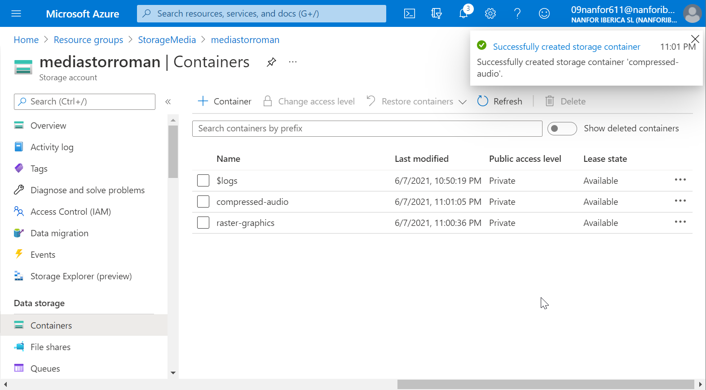

1.  Back in the **Containers** section, observe the updated list of containers.

#### Task 2: Upload a storage account blob

1.  In the Azure portal's navigation pane, select the **Resource groups** link.

1.  On the **Resource groups** blade, find and then select the **StorageMedia** resource group that you created earlier in this lab.

1.  On the **StorageMedia** blade, select the **mediastor*[yourname]*** storage account that you created earlier in this lab.

1.  On the **Storage account** blade, select the **Containers** link in the **Blob service** section.

1.  In the **Containers** section, select the recently created **raster-graphics** container.

1.	On the **Container** blade, select **Upload**.

1.	In the **Upload blob** window, perform the following actions:

    1.  In the **Files** section, select the **Folder** icon.

    1.  In the **File Explorer** window, browse to **Allfiles (F):\\Allfiles\\Labs\\03\\Starter\\Images**, select the **graph.jpg** file, and then select **Open**.

    1.  Ensure that the **Overwrite if files already exist** check box is selected, and then select **Upload**. 
    
    > **Note**: Wait for the blob to upload before you continue with this lab.

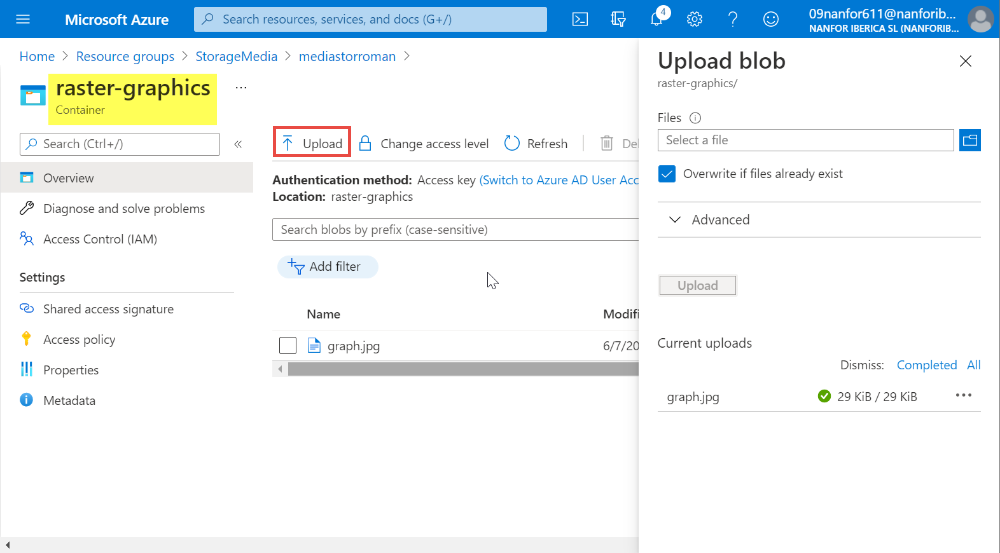

#### Review

In this exercise, you created a couple of placeholder containers in the storage account and populated one of the containers with a blob.

### Exercise 3: Access containers by using the .NET SDK

#### Task 1: Create .NET project

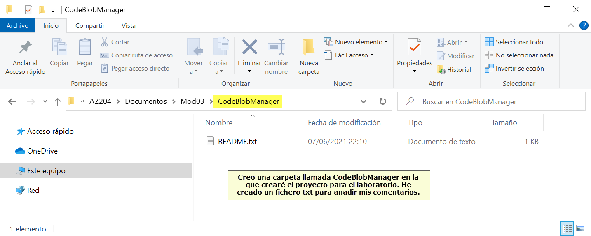

1.  On the **Start** screen, select the **Visual Studio Code** tile.

1.  From the **File** menu, select **Open Folder**.

1.  In the **File Explorer** window that opens, browse to **Allfiles (F):\\Allfiles\\Labs\\03\\Starter\\BlobManager**, and then select **Select Folder**.

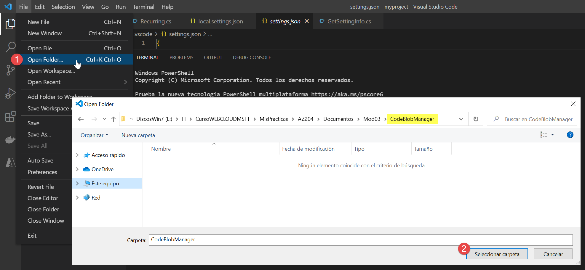

1.  In the **Visual Studio Code** window, right-click or activate the shortcut menu for the Explorer pane, and then select **Open in Terminal**.


1. At the open command prompt, enter the following command, and then select Enter to create a new .NET project named **BlobManager** in the current folder:

   ```
   dotnet new console --name BlobManager --output .
   ```

   > **Note**: The **dotnet new** command will create a new **console** project in a folder with the same name as the project.

   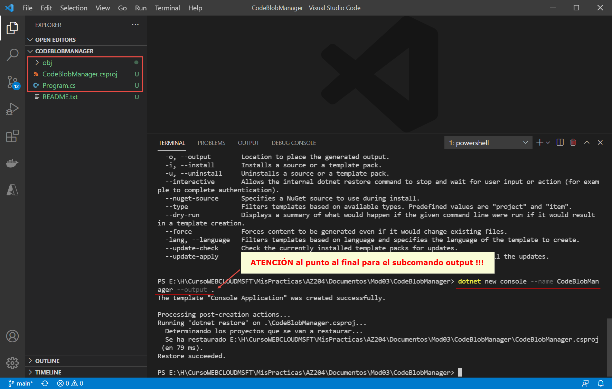

1. At the command prompt, enter the following command, and then select Enter to import version 12.0.0 of **Azure.Storage.Blobs** from NuGet:

   ```
   dotnet add package Azure.Storage.Blobs --version 12.0.0
   ```

   > **Note**: The **dotnet add package** command will add the **Azure.Storage.Blobs** package from NuGet. For more information, go to [Azure.Storage.Blobs](https://www.nuget.org/packages/Azure.Storage.Blobs/12.0.0).

   

1. At the command prompt, enter the following command, and then select Enter to build the .NET web application:

   ```
   dotnet build
   ```

   

1.  Select **Kill Terminal** or the **Recycle Bin** icon to close the currently open terminal and any associated processes.

#### Task 2: Modify the Program class to access Storage

1.  In the Explorer pane of the **Visual Studio Code** window, open the **Program.cs** file.

1.  On the code editor tab for the **Program.cs** file, delete all the code in the existing file.

1.  Add the following line of code to import the **Azure.Storage**, **Azure.Storage.Blobs**, and **Azure.Storage.Blobs.Models** namespaces from the **Azure.Storage.Blobs** package imported from NuGet:

    ```
    using Azure.Storage;
    using Azure.Storage.Blobs;
    using Azure.Storage.Blobs.Models;
    ```
    
1.  Add the following lines of code to add **using** directives for the built-in namespaces that will be used in this file:

    ```
    using System;
    using System.Threading.Tasks;
    ```

1.  Enter the following code to create a new **Program** class:

    ```
    public class Program
    {
    }
    ```

1.  In the **Program** class, enter the following line of code to create a new string constant named **blobServiceEndpoint**:

    ```
    private const string blobServiceEndpoint = "";
    ```

1.  Update the **blobServiceEndpoint** string constant by setting its value to the **Primary Blob Service Endpoint** of the Storage account that you recorded earlier in this lab.

1.  In the **Program** class, enter the following line of code to create a new string constant named **storageAccountName**:

    ```
    private const string storageAccountName = "";
    ```

1.  Update the **storageAccountName** string constant by setting its value to the **Storage account name** of the Storage account that you recorded earlier in this lab.

1.  In the **Program** class, enter the following line of code to create a new string constant named **storageAccountKey**:

    ```
    private const string storageAccountKey = "";
    ```

1.  Update the **storageAccountKey** string constant by setting its value to the **Key** of the Storage account that you recorded earlier in this lab.

1.  In the **Program** class, enter the following code to create a new asynchronous **Main** method:

    ```
    public static async Task Main(string[] args)
    {
    }
    ```

1.  Observe the **Program.cs** file, which should now include:

    ```
    using Azure.Storage;
    using Azure.Storage.Blobs;
    using Azure.Storage.Blobs.Models;
    using System;
    using System.Threading.Tasks;
    
    public class Program
    {
        private const string blobServiceEndpoint = "<primary-blob-service-endpoint>";
        private const string storageAccountName = "<storage-account-name>";
        private const string storageAccountKey = "<key>";
    
        public static async Task Main(string[] args)
        {
        }
    }
    ```

#### Task 3: Connect to the Azure Storage blob service endpoint

1.  In the **Main** method, add the following line of code to create a new instance of the **StorageSharedKeyCredential** class by using the **storageAccountName** and **storageAccountKey** constants as constructor parameters:

    ```
    StorageSharedKeyCredential accountCredentials = new StorageSharedKeyCredential(storageAccountName, storageAccountKey);
    ```

1.  In the **Main** method, add the following line of code to create a new instance of the **BlobServiceClient** class by using the **blobServiceEndpoint** constant and the *accountCredentials* variable as constructor parameters:

    ```
    BlobServiceClient serviceClient = new BlobServiceClient(new Uri(blobServiceEndpoint), accountCredentials);
    ```

1.  In the **Main** method, add the following line of code to invoke the **GetAccountInfoAsync** method of the **BlobServiceClient** class to retrieve account metadata from the service:

    ```
    AccountInfo info = await serviceClient.GetAccountInfoAsync();
    ```
    
1.  In the **Main** method, add the following line of code to render a welcome message:

    ```
    await Console.Out.WriteLineAsync($"Connected to Azure Storage Account");
    ```
    
1.  In the **Main** method, add the following line of code to render the storage account's name:

    ```
    await Console.Out.WriteLineAsync($"Account name:\t{storageAccountName}");
    ```
    
1.  In the **Main** method, add the following line of code to render the type of storage account:

    ```
    await Console.Out.WriteLineAsync($"Account kind:\t{info?.AccountKind}");
    ```
    
1.  In the **Main** method, add the following line of code to render the currently selected stock keeping unit (SKU) for the storage account:

    ```
    await Console.Out.WriteLineAsync($"Account sku:\t{info?.SkuName}");
    ```

1.  Observe the **Main** method, which should now include:

    ```
    public static async Task Main(string[] args)
    {
        StorageSharedKeyCredential accountCredentials = new StorageSharedKeyCredential(storageAccountName, storageAccountKey);	

        BlobServiceClient serviceClient = new BlobServiceClient(new Uri(blobServiceEndpoint), accountCredentials);

        AccountInfo info = await serviceClient.GetAccountInfoAsync();

        await Console.Out.WriteLineAsync($"Connected to Azure Storage Account");
        await Console.Out.WriteLineAsync($"Account name:\t{storageAccountName}");
        await Console.Out.WriteLineAsync($"Account kind:\t{info?.AccountKind}");
        await Console.Out.WriteLineAsync($"Account sku:\t{info?.SkuName}");
    }
    ```

1.  Save the **Program.cs** file.

1.  In the **Visual Studio Code** window, right-click or activate the shortcut menu for the Explorer pane, and then select **Open in Terminal**.

1.  At the open command prompt, enter the following command, and then select Enter to run the .NET web application:

    ```
    dotnet run
    ```

    > **Note**: If there are any build errors, review the **Program.cs** file in the **Allfiles (F):\\Allfiles\\Labs\\03\\Solution\\BlobManager** folder.

1. Observe the output from the currently running console application. The output contains metadata for the Storage account that was retrieved from the service.

   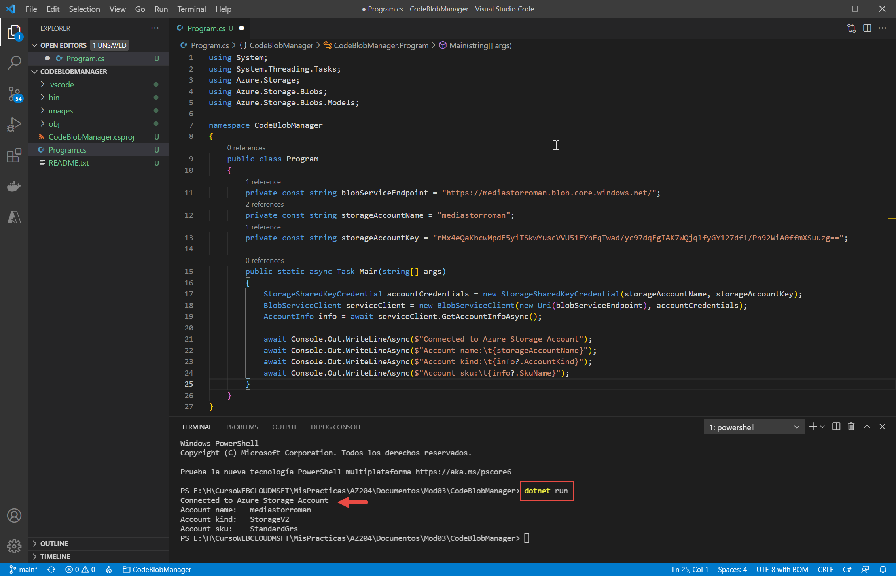

1.  Select **Kill Terminal** or the **Recycle Bin** icon to close the currently open terminal and any associated processes.

#### Task 4: Enumerate the existing containers

1.  In the **Program** class, enter the following code to create a new **private static** method named **EnumerateContainersAsync** that's asynchronous and has a single **BlobServiceClient** parameter type:

    ```
    private static async Task EnumerateContainersAsync(BlobServiceClient client)
    {        
    }
    ```

1.  In the **EnumerateContainersAsync** method, enter the following code to create an asynchronous **foreach** loop that iterates over the results of an invocation of the **GetBlobContainersAsync** method of the **BlobServiceClient** class:

    ```
    await foreach (BlobContainerItem container in client.GetBlobContainersAsync())
    {
    }
    ```

1.  Within the **foreach** loop, enter the following code to print the name of each container:

    ```
    await Console.Out.WriteLineAsync($"Container:\t{container.Name}");
    ```

1.  Observe the **EnumerateContainersAsync** method, which should now include:

    ```
    private static async Task EnumerateContainersAsync(BlobServiceClient client)
    {        
        await foreach (BlobContainerItem container in client.GetBlobContainersAsync())
        {
            await Console.Out.WriteLineAsync($"Container:\t{container.Name}");
        }
    }
    ```

1.  In the **Main** method, enter the following code at the end of the method to invoke the **EnumerateContainersAsync** method, passing in the *serviceClient* variable as a parameter:

    ```
    await EnumerateContainersAsync(serviceClient);
    ```

1.  Observe the **Main** method, which should now include:

    ```
    public static async Task Main(string[] args)
    {
        // Existing code removed for brevity
        
        await EnumerateContainersAsync(serviceClient);
    }
    ```

1.  Save the **Program.cs** file.

1.  In the **Visual Studio Code** window, right-click or access the shortcut menu for the Explorer pane, and then select **Open in Terminal**.

1.  At the open command prompt, enter the following command, and then select Enter to run the .NET web application:

    ```
    dotnet run
    ```

    > **Note**: If there are any build errors, review the **Program.cs** file in the **Allfiles (F):\\Allfiles\\Labs\\03\\Solution\\BlobManager** folder.

1. Observe the output from the currently running console application. The updated output includes a list of every existing container in the account.

   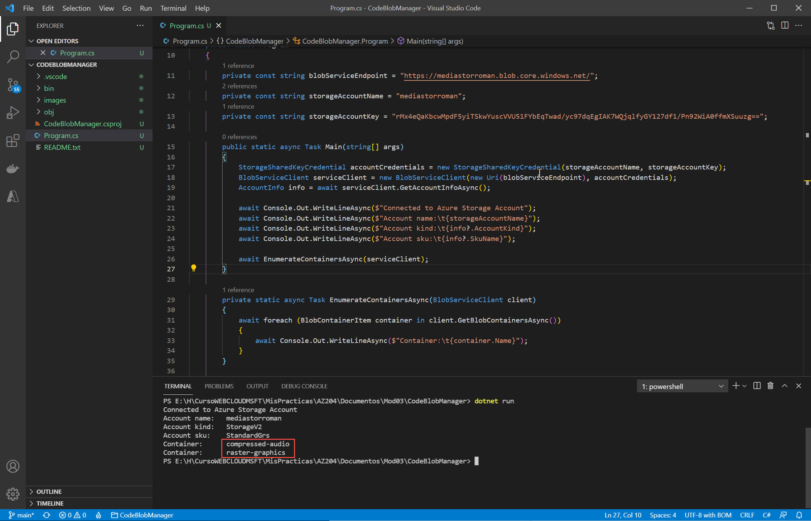

1.  Select **Kill Terminal** or the **Recycle Bin** icon to close the currently open terminal and any associated processes.

#### Review

In this exercise, you accessed existing containers by using the Azure Storage SDK. 

### Exercise 4: Retrieve blob Uniform Resource Identifiers (URIs) by using the .NET SDK

#### Task 1: Enumerate the blobs in an existing container by using the SDK

1.  In the **Program** class, enter the following code to create a new **private static** method named **EnumerateBlobsAsync** that's asynchronous and has two parameter types, **BlobServiceClient** and **string**:

    ```
    private static async Task EnumerateBlobsAsync(BlobServiceClient client, string containerName)
    {      
    }
    ```

1.  In the **EnumerateBlobsAsync** method, enter the following code to get a new instance of the **BlobContainerClient** class by using the **GetBlobContainerClient** method of the **BlobServiceClient** class, passing in the **containerName** parameter:

    ```
    BlobContainerClient container = client.GetBlobContainerClient(containerName);
    ```

1.  In the **EnumerateBlobsAsync** method, enter the following code to render the name of the container that will be enumerated:

    ```
    await Console.Out.WriteLineAsync($"Searching:\t{container.Name}");
    ```

1.  In the **EnumerateBlobsAsync** method, enter the following code to create an asynchronous **foreach** loop that iterates over the results of an invocation of the **GetBlobsAsync** method of the **BlobContainerClient** class:

    ```
    await foreach (BlobItem blob in container.GetBlobsAsync())
    {        
    }
    ```

1.  Within the **foreach** loop, enter the following code to print the name of each blob:

    ```
     await Console.Out.WriteLineAsync($"Existing Blob:\t{blob.Name}");
    ```

1.  Observe the **EnumerateBlobsAsync** method, which should now include:

    ```
    private static async Task EnumerateBlobsAsync(BlobServiceClient client, string containerName)
    {      
        BlobContainerClient container = client.GetBlobContainerClient(containerName);
        
        await Console.Out.WriteLineAsync($"Searching:\t{container.Name}");
        
        await foreach (BlobItem blob in container.GetBlobsAsync())
        {        
             await Console.Out.WriteLineAsync($"Existing Blob:\t{blob.Name}");
        }
    }
    ```

1.  In the **Main** method, enter the following code at the end of the method to create a variable named *existingContainerName* with a value of **raster-graphics**:

    ```
    string existingContainerName = "raster-graphics";
    ```

1.  In the **Main** method, enter the following code at the end of the method to invoke the **EnumerateBlobsAsync** method, passing in the *serviceClient* and *existingContainerName* variables as parameters:

    ```
    await EnumerateBlobsAsync(serviceClient, existingContainerName);
    ```

1.  Observe the **Main** method, which should now include:

    ```
    public static async Task Main(string[] args)
    {
        // Existing code removed for brevity
        
        await EnumerateContainersAsync(serviceClient);

        string existingContainerName = "raster-graphics";
        await EnumerateBlobsAsync(serviceClient, existingContainerName);
    }
    ```

1.  Save the **Program.cs** file.

1.  In the **Visual Studio Code** window, right-click or activate the shortcut menu for the Explorer pane, and then select **Open in Terminal**.

1.  At the open command prompt, enter the following command, and then select Enter to run the .NET web application:

    ```
    dotnet run
    ```

    > **Note**: If there are any build errors, review the **Program.cs** file in the **Allfiles (F):\\Allfiles\\Labs\\03\\Solution\\BlobManager** folder.

1. Observe the output from the currently running console application. The updated output includes metadata about the existing container and blobs.

   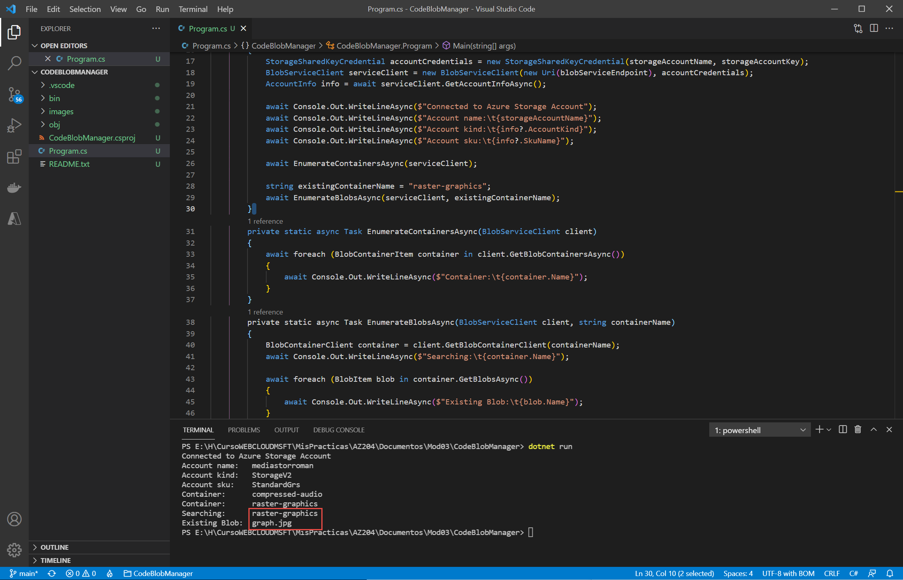

1.  Select **Kill Terminal** or the **Recycle Bin** icon to close the currently open terminal and any associated processes.

#### Task 2: Create a new container by using the SDK

1.  In the **Program** class, enter the following code to create a new **private static** method named **GetContainerAsync** that's asynchronous and has two parameter types, **BlobServiceClient** and **string**:

    ```
    private static async Task<BlobContainerClient> GetContainerAsync(BlobServiceClient client, string containerName)
    {      
    }
    ```

1.  In the **GetContainerAsync** method, enter the following code to get a new instance of the **BlobContainerClient** class by using the **GetBlobContainerClient** method of the **BlobServiceClient** class, passing in the **containerName** parameter:

    ```
    BlobContainerClient container = client.GetBlobContainerClient(containerName);
    ```

1.  In the **GetContainerAsync** method, enter the following code to invoke the **CreateIfNotExistsAsync** method of the **BlobContainerClient** class:

    ```
    await container.CreateIfNotExistsAsync(PublicAccessType.Blob);
    ```

1.  In the **GetContainerAsync** method, enter the following code to render the name of the container that was potentially created:

    ```
    await Console.Out.WriteLineAsync($"New Container:\t{container.Name}");
    ```

1.  In the **GetContainerAsync** method, enter the following code to return the instance of the **BlobContainerClient** class named **container** as the result of the **GetContainerAsync** method:

    ```
    return container;
    ```

1.  Observe the **GetContainerAsync** method, which should now include:

    ```
    private static async Task<BlobContainerClient> GetContainerAsync(BlobServiceClient client, string containerName)
    {      
        BlobContainerClient container = client.GetBlobContainerClient(containerName);
        
        await container.CreateIfNotExistsAsync(PublicAccessType.Blob);
        
        await Console.Out.WriteLineAsync($"New Container:\t{container.Name}");
        
        return container;
    }
    ```

1.  In the **Main** method, enter the following code at the end of the method to create a variable named *newContainerName* with a value of **vector-graphics**:

    ```
    string newContainerName = "vector-graphics";
    ```

1.  In the **Main** method, enter the following code at the end of the method to invoke the **GetContainerAsync** method, passing in the *serviceClient* and *newContainerName* variables as parameters, and to store the result in a variable named *containerClient* of type **BlobContainerClient**:

    ```
    BlobContainerClient containerClient = await GetContainerAsync(serviceClient, newContainerName);
    ```

1.  Observe the **Main** method, which should now include:

    ```
    public static async Task Main(string[] args)
    {
        // Existing code removed for brevity
        
        await EnumerateContainersAsync(serviceClient);

        string existingContainerName = "raster-graphics";
        await EnumerateBlobsAsync(serviceClient, existingContainerName);
        
        string newContainerName = "vector-graphics";
        BlobContainerClient containerClient = await GetContainerAsync(serviceClient, newContainerName);
    }
    ```

1.  Save the **Program.cs** file.

1.  In the **Visual Studio Code** window, right-click or activate the shortcut menu for the Explorer pane, and then select **Open in Terminal**.

1.  At the open command prompt, enter the following command, and then select Enter to run the .NET web application:

    ```
    dotnet run
    ```

    > **Note**: If there are any build errors, review the **Program.cs** file in the **Allfiles (F):\\Allfiles\\Labs\\03\\Solution\\BlobManager** folder.

1. Observe the output from the currently running console application. The updated output includes metadata about the existing container and blobs.

   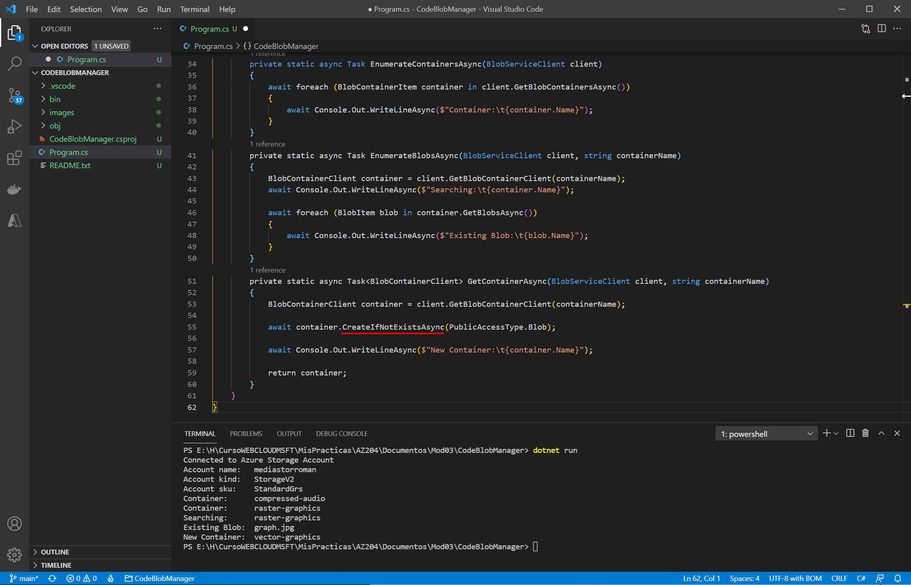

1.  Select **Kill Terminal** or the **Recycle Bin** icon to close the currently open terminal and any associated processes.

#### Task 3: Upload a new blob by using the portal

1.  In the Azure portal's navigation pane, select the **Resource groups** link.

1.  On the **Resource groups** blade, find and then select the **StorageMedia** resource group that you created earlier in this lab.

1.  On the **StorageMedia** blade, select the **mediastor*[yourname]*** storage account that you created earlier in this lab.

1.  On the **Storage account** blade, select the **Containers** link in the **Blob service** section.

1.  In the **Containers** section, select the newly created **vector-graphics** container.

1.	On the **Container** blade, select **Upload**.

1.	In the **Upload blob** window, perform the following actions:

    1.  In the **Files** section, select the **Folder** icon.

    1.  In the **File Explorer** window, browse to **Allfiles (F):\\Allfiles\\Labs\\03\\Starter\\Images**, select the **graph.svg** file, and then select **Open**.

    1.  Ensure that the **Overwrite if files already exist** check box is selected, and then select **Upload**. 
    
    > **Note**: Wait for the blob to upload before you continue with this lab.
    
    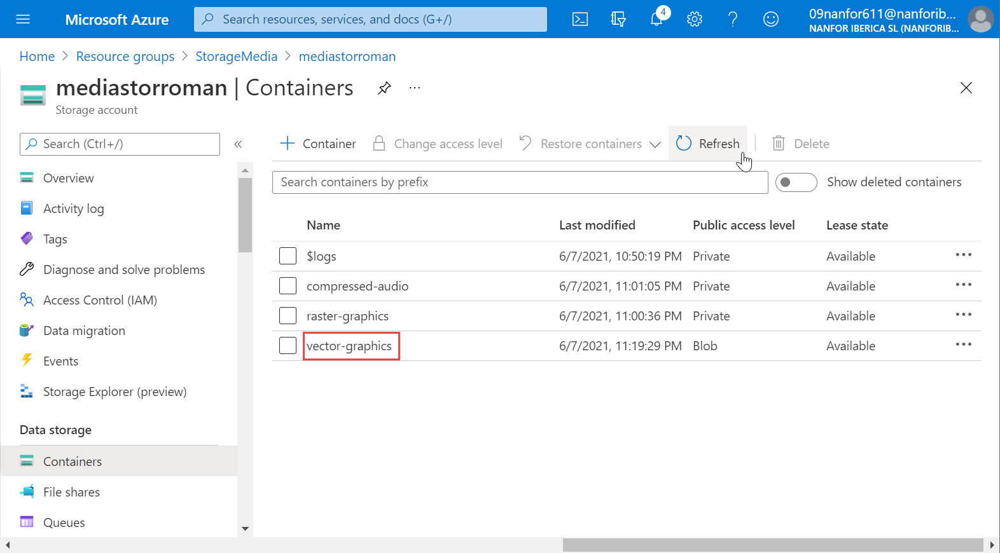
    
    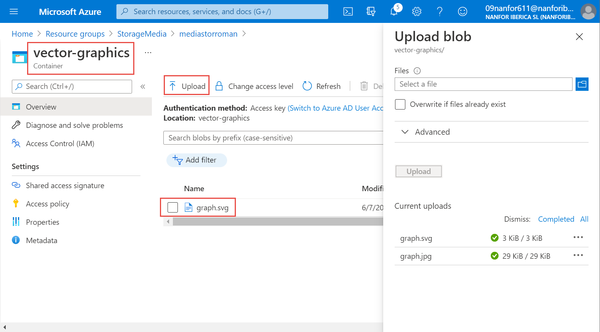

#### Task 4: Access blob URI by using the SDK

1.  In the **Program** class, enter the following code to create a new **private static** method named **GetBlobAsync** that's asynchronous and has two parameter types, **BlobContainerClient** and **string**:

    ```
    private static async Task<BlobClient> GetBlobAsync(BlobContainerClient client, string blobName)
    {      
    }
    ```

1.  In the **GetBlobAsync** method, enter the following code to get a new instance of the **BlobClient** class by using the **GetBlobClient** method of the **BlobContainerClient** class, passing in the **blobName** parameter:

    ```
    BlobClient blob = client.GetBlobClient(blobName);
    ```

1.  In the **GetBlobAsync** method, enter the following code to render the name of the blob that was referenced:

    ```
    await Console.Out.WriteLineAsync($"Blob Found:\t{blob.Name}");
    ```

1.  In the **GetBlobAsync** method, enter the following code to return the instance of the **BlobClient** class named **blob** as the result of the **GetBlobAsync** method:

    ```
    return blob;
    ```

1.  Observe the **GetBlobAsync** method, which should now include:

    ```
    private static async Task<BlobClient> GetBlobAsync(BlobContainerClient client, string blobName)
    {      
        BlobClient blob = client.GetBlobClient(blobName);
        await Console.Out.WriteLineAsync($"Blob Found:\t{blob.Name}");
        return blob;
    }
    ```

1.  In the **Main** method, enter the following code at the end of the method to create a variable named *uploadedBlobName* with a value of **graph.svg**:

    ```
    string uploadedBlobName = "graph.svg";
    ```

1.  In the **Main** method, enter the following code at the end of the method to invoke the **GetBlobAsync** method, passing in the *containerClient* and *uploadedBlobName* variables as parameters, and to store the result in a variable named *blobClient* of type **BlobClient**:

    ```
    BlobClient blobClient = await GetBlobAsync(containerClient, uploadedBlobName);
    ```

1.  In the **Main** method, enter the following code at the end of the method to render the **Uri** property of the *blobClient* variable:

    ```
    await Console.Out.WriteLineAsync($"Blob Url:\t{blobClient.Uri}");
    ```

1.  Observe the **Main** method, which should now include:

    ```
    public static async Task Main(string[] args)
    {
        // Existing code removed for brevity
        
        await EnumerateContainersAsync(serviceClient);

        string existingContainerName = "raster-graphics";
        await EnumerateBlobsAsync(serviceClient, existingContainerName);
        
        string newContainerName = "vector-graphics";
        BlobContainerClient containerClient = await GetContainerAsync(serviceClient, newContainerName);
        
        string uploadedBlobName = "graph.svg";
        BlobClient blobClient = await GetBlobAsync(containerClient, uploadedBlobName);

        await Console.Out.WriteLineAsync($"Blob Url:\t{blobClient.Uri}");
    }
    ```

1.  Save the **Program.cs** file.

1.  In the **Visual Studio Code** window, right-click or activate the shortcut menu for the Explorer pane, and then select **Open in Terminal**.

1.  At the open command prompt, enter the following command, and then select Enter to run the .NET web application:

    ```
    dotnet run
    ```

    > **Note**: If there are any build errors, review the **Program.cs** file in the **Allfiles (F):\\Allfiles\\Labs\\03\\Solution\\BlobManager** folder.

1. Observe the output from the currently running console application. The updated output includes the final URL to access the blob online. Record the value of this URL to use later in the lab.

   > **Note**: The URL will likely be similar to the following string: **https://mediastor*[yourname]*.blob.core.windows.net/vector-graphics/graph.svg**

   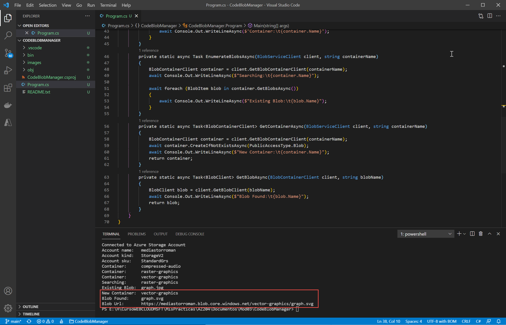

1.  Select **Kill Terminal** or the **Recycle Bin** icon to close the currently open terminal and any associated processes.

#### Task 5: Test the URI by using a browser

1.  On the taskbar, right-click the **Microsoft Edge** icon or activate the shortcut menu, and then select **New window**.
1.  In the new browser window, go to the URL that you copied for the blob earlier in this lab.
1.  You should now notice the Scalable Vector Graphic (SVG) file in your browser window.

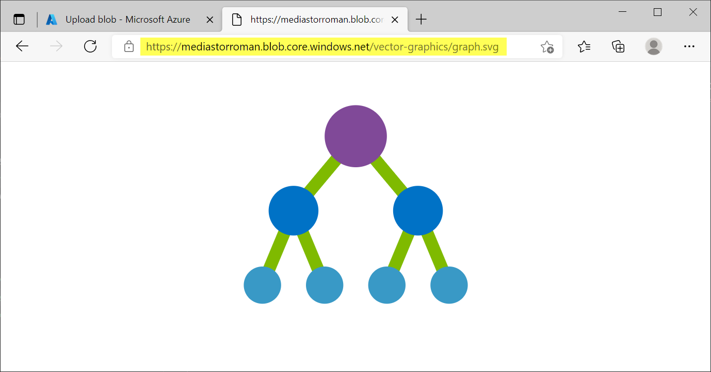

#### Review

In this exercise, you created containers and managed blobs by using the Storage SDK. 

### Exercise 5: Clean up your subscription 

#### Task 1: Open Azure Cloud Shell and list resource groups

1.  In the Azure portal's navigation pane, select the **Cloud Shell** icon to open a new shell instance.

    > **Note**: The **Cloud Shell** icon is represented by a greater than sign (\>) and underscore character (\_).

1.  If this is your first time opening Cloud Shell using your subscription, you can use the **Welcome to Azure Cloud Shell Wizard** to configure Cloud Shell for first-time usage. Perform the following actions in the wizard:
    
    1.  A dialog box prompts you to configure the shell. Select **Bash**, review the selected subscription, and then select **Create storage**. 

    > **Note**: Wait for Cloud Shell to finish its initial setup procedures before moving forward with the lab. If you don't notice Cloud Shell configuration options, this is most likely because you're using an existing subscription with this course's labs. The labs are written with the presumption that you're using a new subscription.

#### Task 2: Delete a resource group

1.  At the command prompt, enter the following command, and then select Enter to delete the **StorageMedia** resource group:

    ```
    az group delete --name StorageMedia --no-wait --yes
    ```
    
    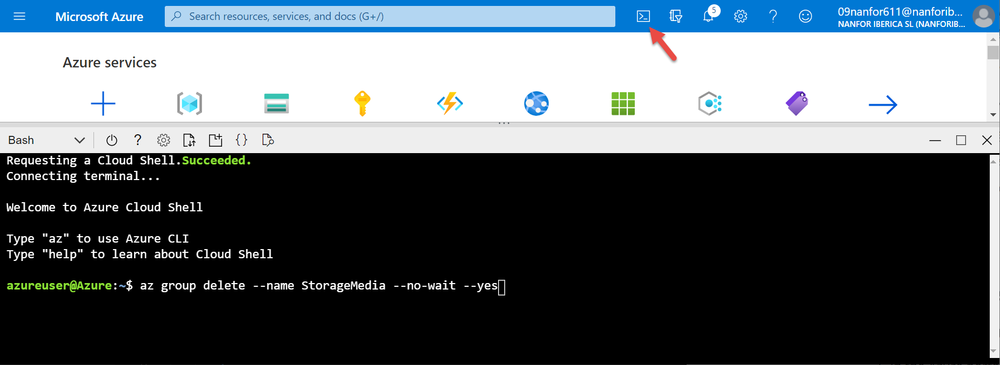
    
1.  Close the Cloud Shell pane in the portal.

#### Task 3: Close the active application

1.     the currently running Microsoft Edge application.

#### Review

In this exercise, you cleaned up your subscription by removing the resource group used in this lab.
