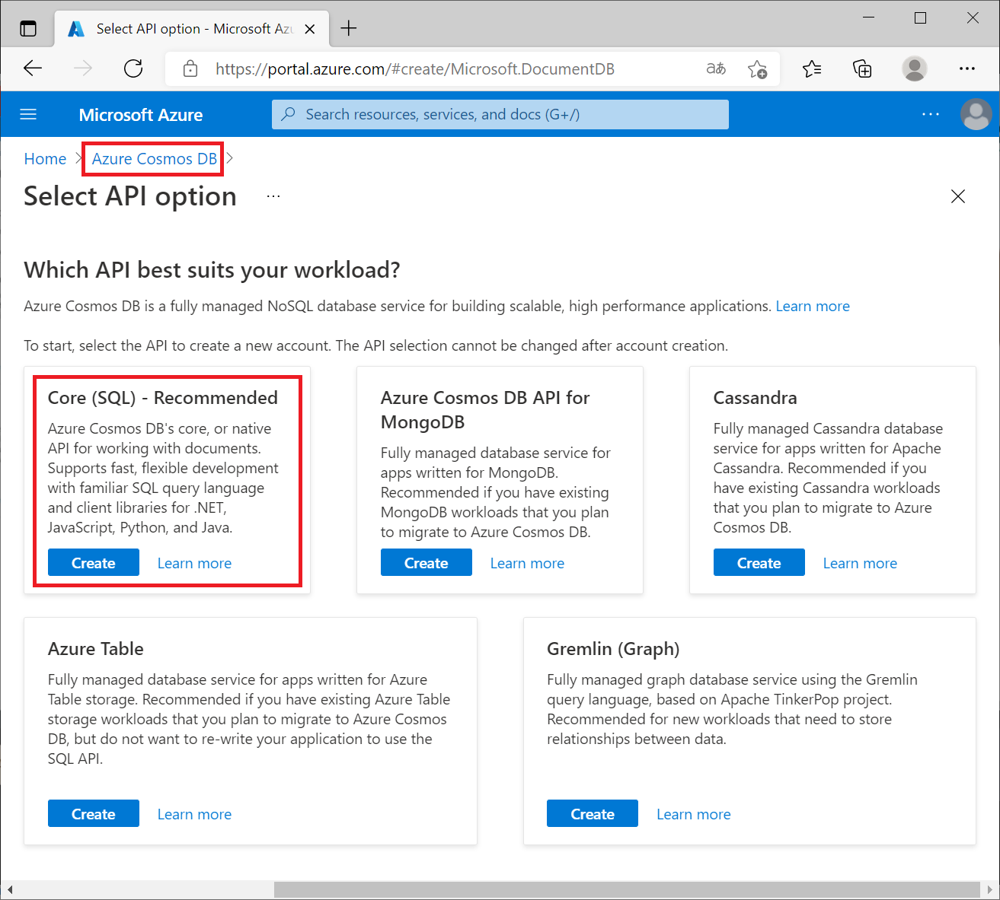
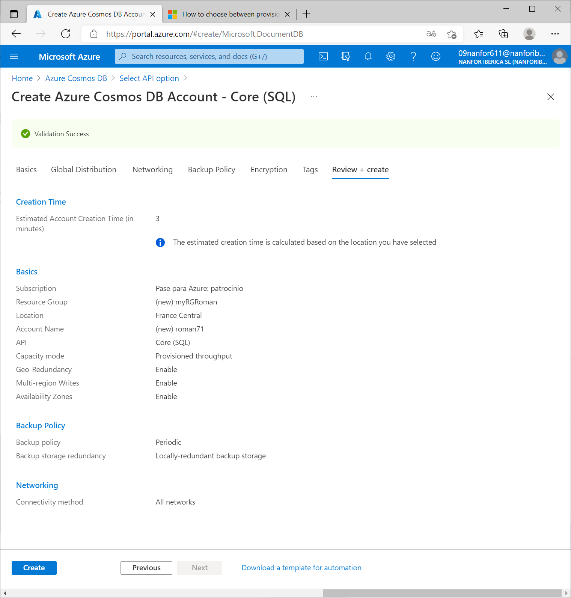
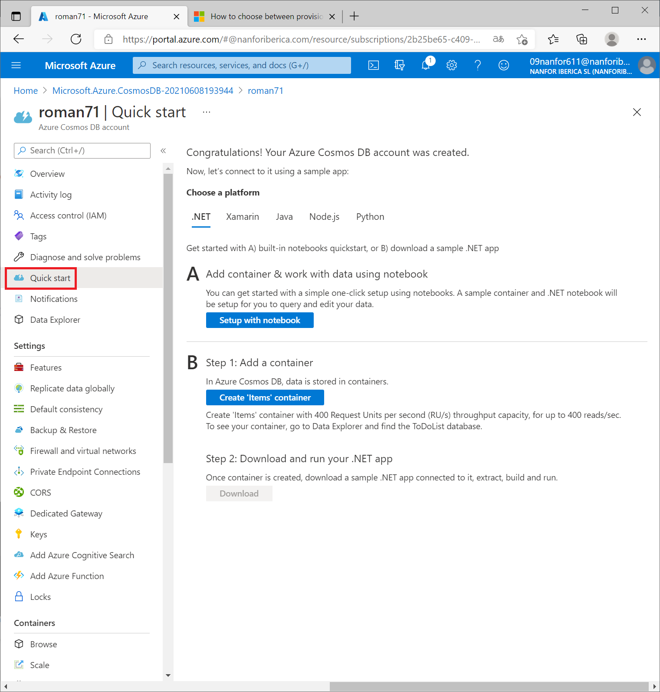
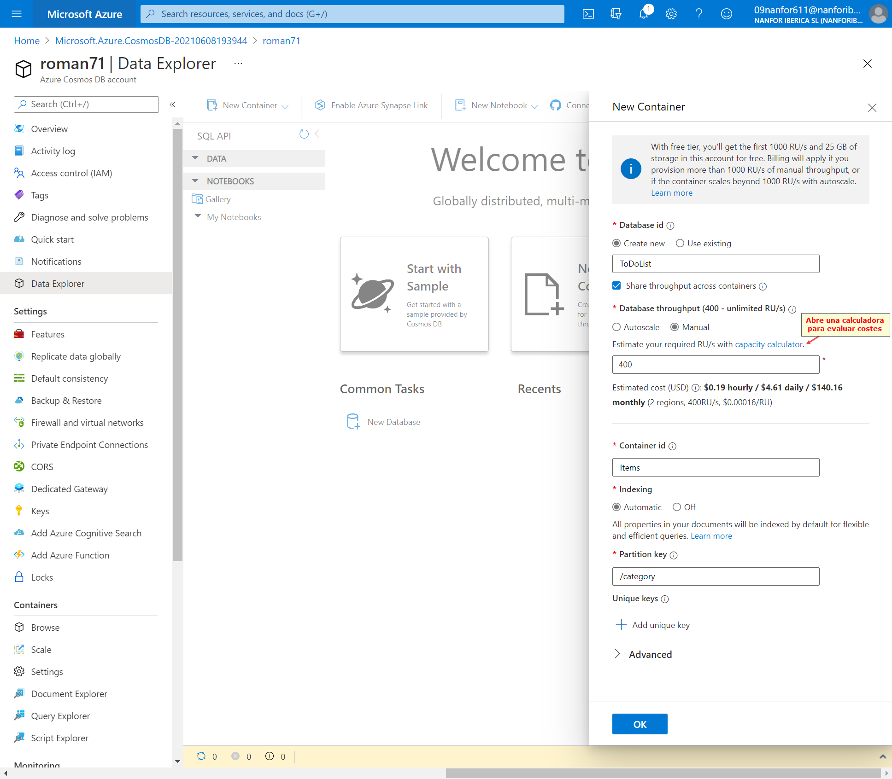
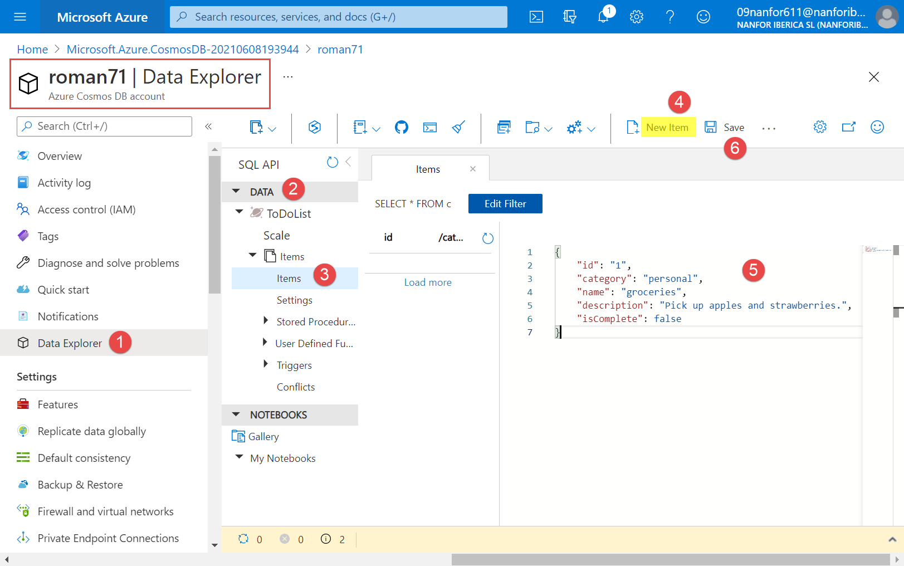

### Demo: Create Azure Cosmos DB resources by using the Azure Portal

In this demo you'll learn how to perform the following actions in the Azure Portal:

- Create an Azure Cosmos DB account
- Add a database and a container
- Add data to your database

#### Prerequisites

This demo is performed in the Azure Portal.

##### Login to Azure

1. Login to the Azure Portal. [https://portal.azure.com](https://portal.azure.com/)

#### Create an Azure Cosmos DB account

1. In the Azure search bar, search for and select **Azure Cosmos DB**.

   

2. Select **Add**.

3. On the **Create Azure Cosmos DB Account** page, enter the basic settings for the new Azure Cosmos account.

   - **Subscription**: Select the subscription for your pass.
   - **Resource Group**: Select **Create new**, then enter *az204-cosmos-rg*.
   - **Account Name**: Enter a *unique* name to identify your Azure Cosmos account. The name can only contain lowercase letters, numbers, and the hyphen (-) character. It must be between 3-31 characters in length.
   - **API**: Select **Core (SQL)** to create a document database and query by using SQL syntax.
   - **Location**: Use the location that is closest to your users to give them the fastest access to the data.



4. Select **Review + create**. You can skip the **Network** and **Tags** sections.

5. Review the account settings, and then select **Create**. It takes a few minutes to create the account. Wait for the portal page to display **Your deployment is complete**.

6. Select **Go to resource** to go to the Azure Cosmos DB account page.



#### Add a database and a container

You can use the Data Explorer in the Azure portal to create a database and container.

1. Select **Data Explorer** from the left navigation on your Azure Cosmos DB account page, and then select **New Container**.


2. In the **Add container** pane, enter the settings for the new container.

   - **Database ID**: Enter *ToDoList* and check the **Provision database throughput** option, it allows you to share the throughput provisioned to the database across all the containers within the database.
   - **Throughput**: Enter *400*
   - **Container ID**: Enter *Items*
   - **Partition key**: Enter */category*. The samples in this demo use */category* as the partition key.

   ✔️ **Note:** Don't add **Unique keys** for this example. Unique keys let you add a layer of data integrity to the database by ensuring the uniqueness of one or more values per partition key.

3. Select **OK**. The Data Explorer displays the new database and the container that you created.



#### Add data to your database

Add data to your new database using Data Explorer.

1. In **Data Explorer**, expand the **ToDoList** database, and expand the **Items** container. Next, select **Items**, and then select **New Item**.

2. Add the following structure to the document on the right side of the **Documents** pane:

   ```
   {
       "id": "1",
       "category": "personal",
       "name": "groceries",
       "description": "Pick up apples and strawberries.",
       "isComplete": false
   }
   ```

   

   


3. Select **Save**.

4. Select **New Document** again, and create and save another document with a unique id, and any other properties and values you want. Your documents can have any structure, because Azure Cosmos DB doesn't impose any schema on your data.

❗️ **Important:** Don't delete the Azure Cosmos DB account or the az204-cosmos-rg resource group just yet, we'll use it for another demo later in this lesson.

