# Lab 05: Deploying compute workloads by using images and containers

## Escenario de laboratorio

Su organización está buscando una forma de crear automáticamente máquinas virtuales (VM) para ejecutar tareas y finalizarlas de inmediato. Tiene la tarea de evaluar varios servicios en Microsoft Azure y determinar cual de ellos puede ayudarlo a crear automáticamente máquinas virtuales e instalar software personalizado en esas máquinas. Como prueba de concepto, ha decidido intentar crear máquinas virtuales a partir de imágenes predefinidas e imágenes de contenedor para poder comparar las dos soluciones. Para que su prueba de concepto sea simple, creará una aplicación especial de "verificación de IP" escrita en .NET que implementará automáticamente en sus máquinas. Su prueba de concepto evaluará los servicios de Azure Container Instances y Azure Virtual Machines.

## Objetivos

Después de completar esta práctica de laboratorio, podrá:

- Cree una máquina virtual mediante la interfaz de línea de comandos (CLI) de Azure.

- Implemente una imagen de contenedor de Docker en Azure Container Registry.

- Implemente un contenedor desde una imagen de contenedor en Container Registry mediante Container Instances.

## Arquitectura


# Student lab answer key

## Microsoft Azure user interface

Given the dynamic nature of Microsoft cloud tools, you might experience Azure UI changes after the development of this training content. These changes might cause the lab instructions and lab steps to not match up.

Microsoft updates this training course when the community brings needed changes to our attention; however, because cloud updates occur frequently, you might encounter UI changes before this training content updates. **If this occurs, adapt to the changes, and then work through them in the labs as needed.**

### Exercise 1: Create a VM by using the Azure Command-Line Interface (CLI)

#### Task 1: Open the Azure portal

1.  On the taskbar, select the **Microsoft Edge** icon.

1.  In the open browser window, go to the Azure portal (<https://portal.azure.com>).

1.  Enter the email address for your Microsoft account, and then select **Next**.

1.  Enter the password for your Microsoft account, and then select **Sign in**.

    > **Note**: If this is your first time signing in to the Azure portal, you will be offered a tour of the portal. Select **Get Started** to begin using the portal.

#### Task 2: Create a resource group

1.  In the Azure portal's navigation pane, select the **Create a resource** link.

    > **Note**: If you can't find the **Create a resource** link, the **Create a resource** icon is a plus sign (+) character from the portal.

1.  From the **New** blade, find the **Search the Marketplace** text box above the list of featured services.

1.  In the search box, enter the text **Resource Group**, and then select Enter.

1.  From the **Marketplace** search results blade, select the **Resource group** result.

1.  From the **Resource group** blade, select **Create**.

1.  From the additional **Resource group** blade, find the tabs from the blade, such as **Basics**.

    > **Note**: Each tab represents a step in the workflow to create a new resource group. You can select **Review + Create** at any time to skip the remaining tabs.

1.  From the **Basics** tab, perform the following actions:
    
    1.  Leave the **Subscription** text box set to its default value.
    
    1.  In the **Resource group** text box, enter the value **ContainerCompute**.
    
    1.  In the **Region** drop-down list, select the **(US) East US** location.
    
    1.  Select **Review + Create**.

1.  From the **Review + Create** tab, review the options that you selected during the previous steps.

1.  Select **Create** to create the resource group by using your specified configuration.  

    > **Note**: Wait for the creation task to complete before moving forward with this lab.


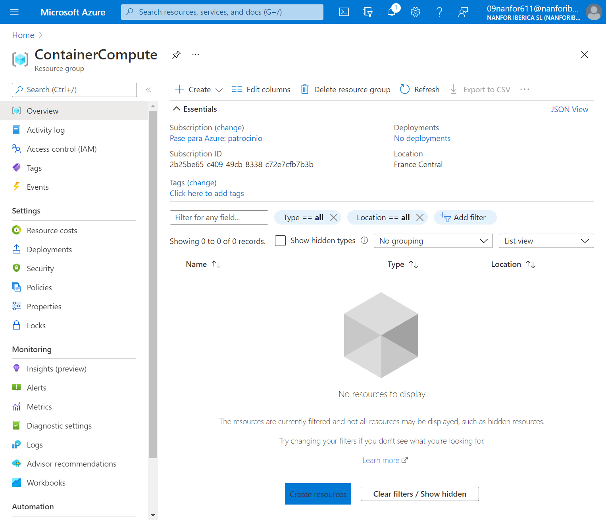


#### Task 3: Open Azure Cloud Shell

1.  In the Azure portal, select the **Cloud Shell** icon to open a new shell instance.

    > **Note**: The **Cloud Shell** icon is represented by a greater than sign () and underscore character (\_).

1.  If this is your first time opening Cloud Shell using your subscription, you can use the **Welcome to Azure Cloud Shell Wizard** to configure Cloud Shell for first-time usage. Perform the following actions in the wizard:
    
    1.  A dialog box prompts you to configure the shell. Select **Bash**, review the selected subscription, and then select **Create storage**. 

    > **Note**: Wait for Cloud Shell to finish its initial setup procedures before moving forward with the lab. If you don't notice the **Cloud Shell** configuration options, this is most likely because you're using an existing subscription with this course's labs. The labs are written with the presumption that you're using a new subscription.

1.  At the **Cloud Shell** command prompt in the portal, enter the following command, and then select Enter to get the version of the Azure CLI tool:

    ```
    az --version
    ```

#### Task 4: Use the Azure CLI commands

1.  Enter the following command, and then select Enter to get a list of subgroups and commands at the root level of the CLI:

    ```
    az --help
    ```

1.  Enter the following command, and then select Enter to get a list of subgroups and commands for Azure Virtual Machines:

    ```
    az vm --help
    ```

1.  Enter the following command, and then select Enter to get a list of arguments and examples for the **Create Virtual Machine** command:

    ```
    az vm create --help
    ```

1.  Enter the following command, and then select Enter to create a new **virtual machine** with the following settings:
    
    -	Resource group: **ContainerCompute**

    -	Name: **quickvm**

    -	Image: **Debian**

    -	Username: **Student**

    -	Password: **StudentPa55w.rd**

    ```
    az vm create --resource-group ContainerCompute --name quickvm --image Debian --admin-username student --admin-password StudentPa55w.rd
    ```

    > **Note**: Wait for the VM creation process to complete. After the process completes, the command will return a JSON file containing details about the machine.

    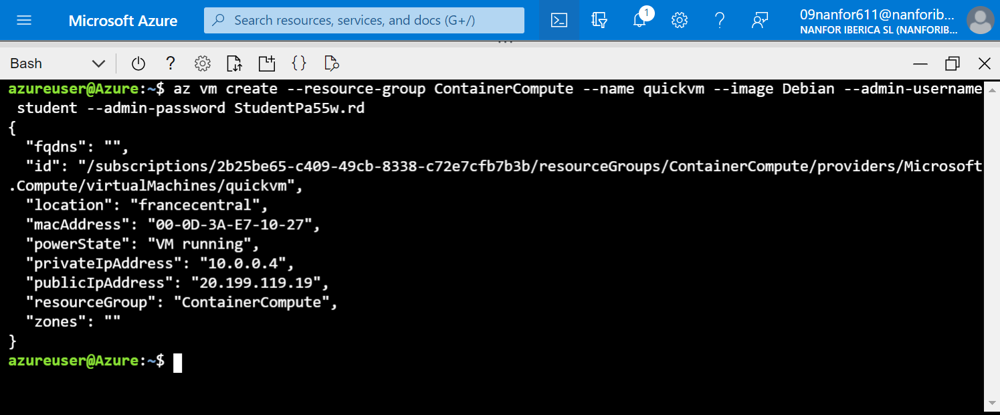
    
1. Enter the following command, and then select Enter to get a more detailed JavaScript Object Notation (JSON) file that contains various metadata about the newly created VM:

   ```
   az vm show --resource-group ContainerCompute --name quickvm
   ```

   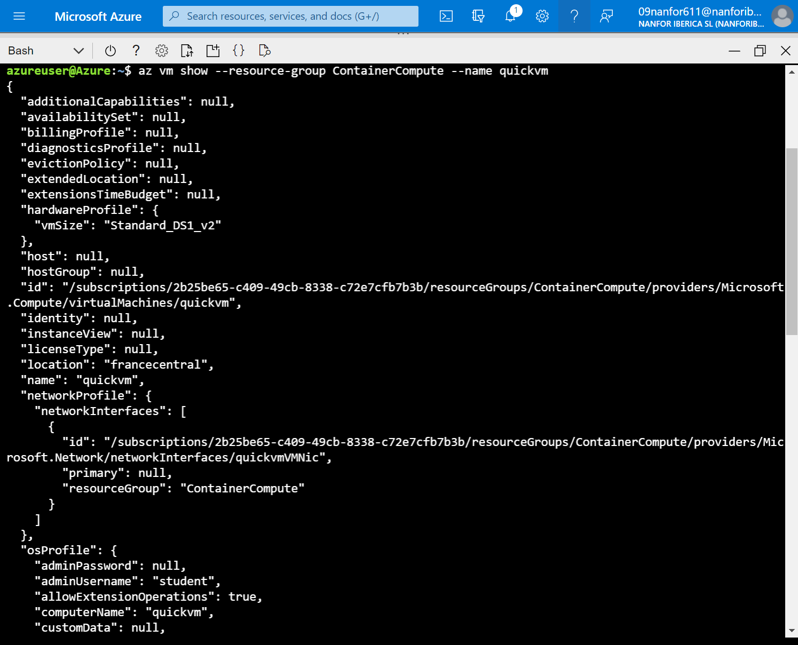

1. Enter the following command, and then select Enter to list all the IP addresses associated with the VM:

   ```
   az vm list-ip-addresses --resource-group ContainerCompute --name quickvm
   ```

   

1. Enter the following command, and then select Enter to filter the output to only return the first IP address value:

   ```
   az vm list-ip-addresses --resource-group ContainerCompute --name quickvm --query '[].{ip:virtualMachine.network.publicIpAddresses[0].ipAddress}' --output tsv
   ```

   

1.  Enter the following command, and then select Enter to store the results of the previous command in a new Bash shell variable named *ipAddress*:

    ```
    ipAddress=$(az vm list-ip-addresses --resource-group ContainerCompute --name quickvm --query '[].{ip:virtualMachine.network.publicIpAddresses[0].ipAddress}' --output tsv)
    ```

1. Enter the following command, and then select Enter to render the value of the Bash shell variable *ipAddress*:

   ```
   echo $ipAddress
   ```

   

1. Enter the following command, and then select Enter to connect to the VM that you created earlier in this lab by using the Secure Shell (SSH) tool and the IP address stored in the Bash shell variable *ipAddress*:

   ```
   ssh student@$ipAddress
   ```

   

1.  The SSH tool will first inform you that the authenticity of the host can’t be established and then ask if you want to continue connecting. Enter **yes**, and then select Enter to continue connecting to the VM.

1. The SSH tool will then ask you for a password. Enter **StudentPa55w.rd**, and then select Enter to authenticate with the VM.

1. After connecting to the VM by using SSH, enter the following command, and then select Enter to get metadata describing the Linux VM:

   ```
   uname -a
   ```

   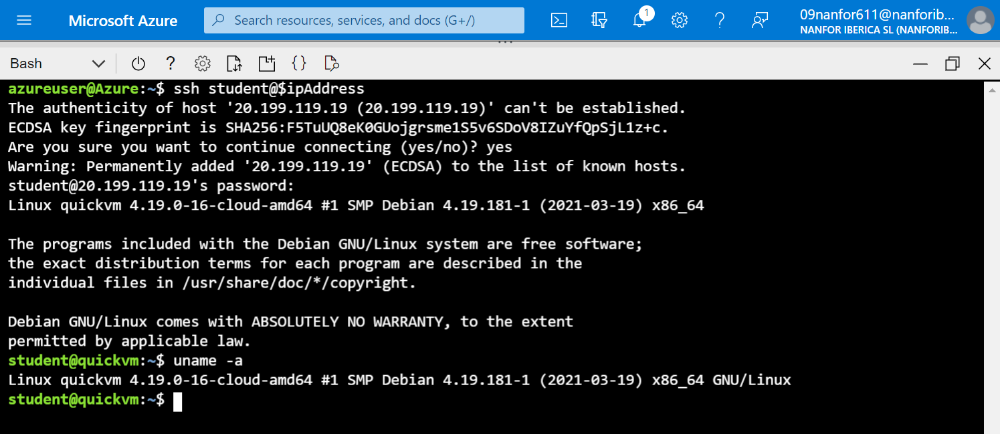

1.  Use the **exit** command to end your SSH session:

    ```
    exit
    ```

1.  Close the Cloud Shell pane in the portal.

#### Review

In this exercise, you used Cloud Shell to create a VM as part of an automated script.

### Exercise 2: Create a Docker container image and deploy it to Azure Container Registry

#### Task 1: Open the Cloud Shell and editor

1.  In the Azure portal's navigation pane, select the **Cloud Shell** icon to open a new shell instance.  

    > **Note**: Wait for Cloud Shell to finish connecting to an instance before moving on with the lab.

1.  At the **Cloud Shell** command prompt in the portal, enter the following command, and then select Enter to move from the root directory to the **\~/clouddrive** directory:

    ```
    cd ~/clouddrive
    ```

1.  Enter the following command, and then select Enter to create a new directory named **ipcheck** in the **\~/clouddrive** directory:

    ```
    mkdir ipcheck
    ```

1. Enter the following command, and then select Enter to change the active directory from **\~/clouddrive** to **\~/clouddrive/ipcheck**:

   ```
   cd ~/clouddrive/ipcheck
   ```

   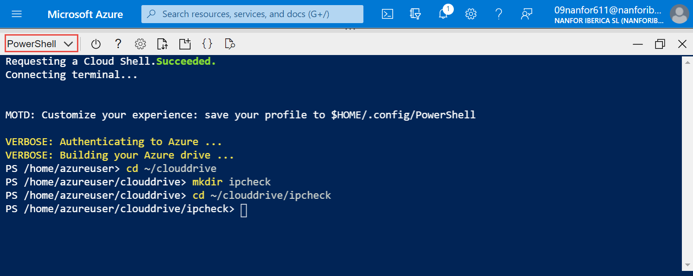

1. Enter the following command, and then select Enter to create a new .NET console application in the current directory:

   ```
   dotnet new console --output . --name ipcheck
   ```

   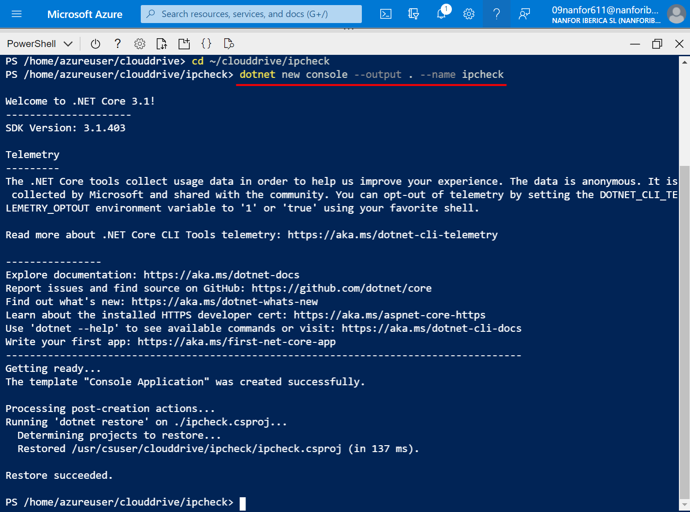

1.  Enter the following command, and then select Enter to create a new file in the **\~/clouddrive/ipcheck** directory named **Dockerfile**:

    ```
    touch Dockerfile
    ```

1.  Enter the following command, and then select Enter to open the embedded graphical editor in the context of the current directory:

    ```
    code .
    ```
    
    

#### Task 2: Create and test a .NET application

1.  In the graphical editor, find the FILES pane, and then open the **Program.cs** file to open it in the editor.

1.  Delete the entire contents of the **Program.cs** file.

1.  Copy and paste the following code into the **Program.cs** file:

    ```
    public class Program
    {
        public static void Main(string[] args)
        {        
            // Check if network is available
            if (System.Net.NetworkInformation.NetworkInterface.GetIsNetworkAvailable())
            {
                System.Console.WriteLine("Current IP Addresses:");

                // Get host entry for current hostname
                string hostname = System.Net.Dns.GetHostName();
                System.Net.IPHostEntry host = System.Net.Dns.GetHostEntry(hostname);
                
                // Iterate over each IP address and render their values
                foreach(System.Net.IPAddress address in host.AddressList)
                {
                    System.Console.WriteLine($"\t{address}");
                }
            }
            else
            {
                System.Console.WriteLine("No Network Connection");
            }
        }
    }
    ```

1. Save the **Program.cs** file by using the menu in the graphical editor or the Ctrl+S keyboard shortcut.  Don't close the graphical editor.

   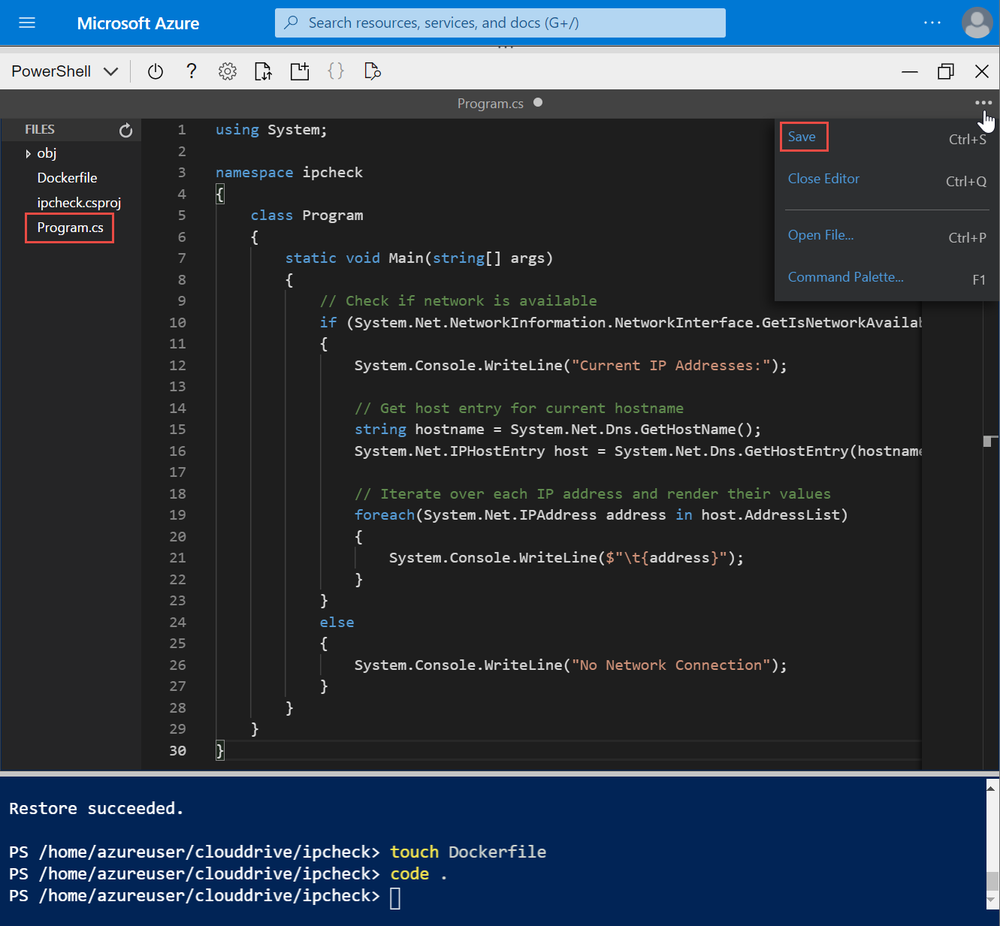

1.  Back at the command prompt, enter the following command, and then select Enter to run the application:

    ```
    dotnet run
    ```

1. Find the results of the run. At least one IP address should be listed for the Cloud Shell instance.

   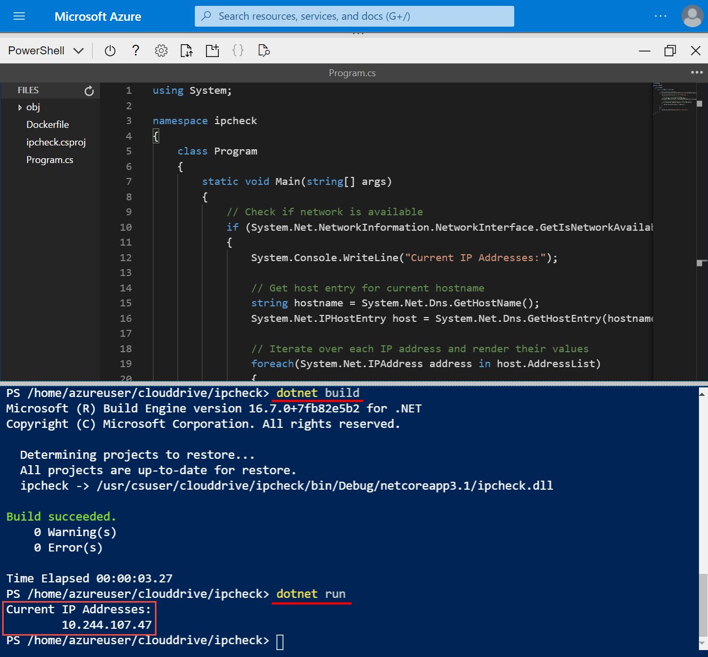

1.  In the graphical editor, find the FILES pane of the editor, and then open the **Dockerfile** file to open it in the editor.

1.  Copy and paste the following code into the **Dockerfile** file:

    ```
    # Start using the .NET Core 3.1 SDK container image
    FROM mcr.microsoft.com/dotnet/sdk:3.1-alpine AS build

    # Change current working directory
    WORKDIR /app

    # Copy existing files from host machine
    COPY . ./

    # Publish application to the "out" folder
    RUN dotnet publish --configuration Release --output out

    # Start container by running application DLL
    ENTRYPOINT ["dotnet", "out/ipcheck.dll"]
    ```

1. Save the **Dockerfile** file by using the menu in the graphical editor or by using the Ctrl+S keyboard shortcut.

   

1.  Close the Cloud Shell pane in the portal.

#### Task 3: Create a Container Registry resource

1.  In the Azure portal's navigation pane, select the **Create a resource** link.

1.  From the **New** blade, find the **Search the Marketplace** text box above the list of featured services.

1.  In the search box, enter **Container Registry**, and then select Enter.

1.  From the **Marketplace** search results blade, select the **Container Registry** result.

1.  From the **Container Registry** blade, select **Create**.

1.  From the **Create container registry** blade, perform the following actions:

    1.  In the **Registry name** text box, give your registry a globally unique name.

        >  **Note**: The blade will automatically check the name for uniqueness and inform you if you're required to choose a different name.

    1.  Leave the **Subscription** text box set to its default value.

    1.  In the **Resource group** drop-down list, select the existing **ContainerCompute** option.

    1.  In the **Location** text box, select **East US**.

    1.  In the **SKU** drop-down list, select **Basic**.

    1.  Select **Create**.  

    > **Note**: Wait for the creation task to complete before moving forward with this lab.
    
    

#### Task 4: Open Azure Cloud Shell and store Container Registry metadata

1.  In the Azure portal, select the **Cloud Shell** icon to open a new shell instance.  

    > **Note**: Wait for Cloud Shell to finish connecting to an instance before moving forward with the lab.

1.  At the **Cloud Shell** command prompt in the portal, enter the following command, and then select Enter to get a list of all container registries in your subscription:

    ```
    az acr list
    ```

1.  Enter the following command, and then select Enter:

    ```
    az acr list --query "max_by([], &creationDate).name" --output tsv
    ```

1.  Enter the following command, and then select Enter:

    ```
    acrName=$(az acr list --query "max_by([], &creationDate).name" --output tsv)
    ```

1.  Enter the following command, and then select Enter:

    ```
    echo $acrName
    ```
    
    

#### Task 5: Deploy a Docker container image to Container Registry

1.  Enter the following command, and then select Enter to change the active directory from **\~/** to **\~/clouddrive/ipcheck**:

    ```
    cd ~/clouddrive/ipcheck
    ```

1.  Enter the following command, and then select Enter to get the contents of the current directory:

    ```
    dir
    ```

1.  Enter the following command, and then select Enter to upload the source code to your container registry and build the container image as a Container Registry task:

    ```
    az acr build --registry $acrName --image ipcheck:latest .
    ```

    > **Note**: Wait for the build task to complete before moving forward with this lab.
    
    
    
    
    
    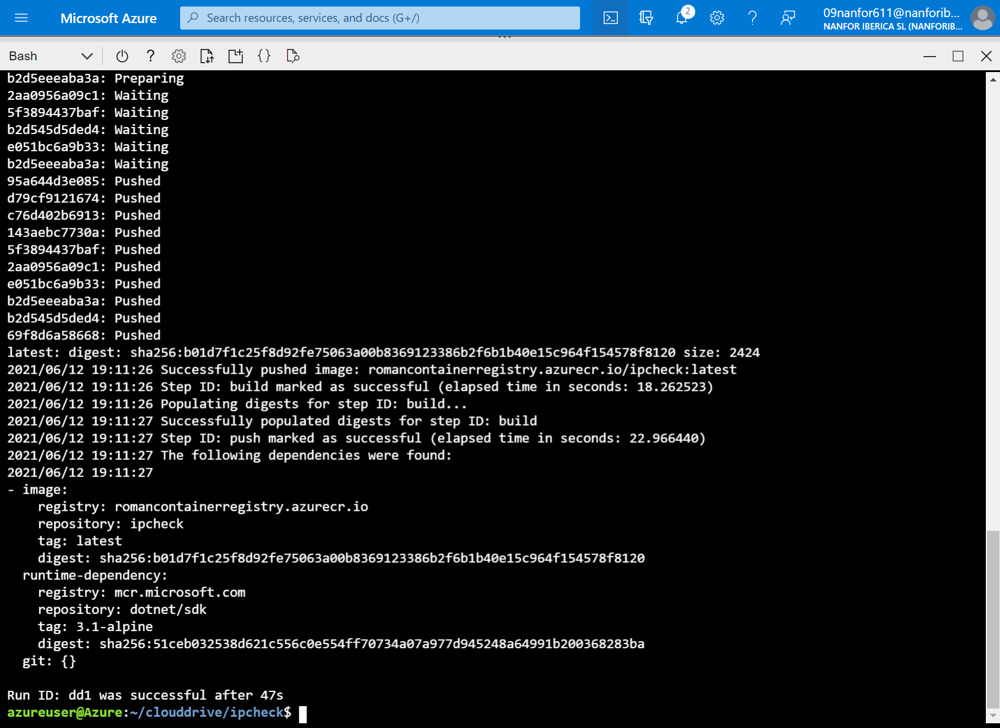
    
1.  Close the Cloud Shell pane in the portal

#### Task 6: Validate your container image in Container Registry

1.  In the Azure portal's navigation pane, select the **Resource groups** link.

1.  From the **Resource groups** blade, find and then select the **ContainerCompute** resource group that you created earlier in this lab.

1.  From the **ContainerCompute** blade, select the container registry that you created earlier in this lab.

1.  From the **Container Registry** blade, find the **Services** section, and then select the **Repositories** link.

1. In the **Repositories** section, select the **ipcheck** container image repository.

   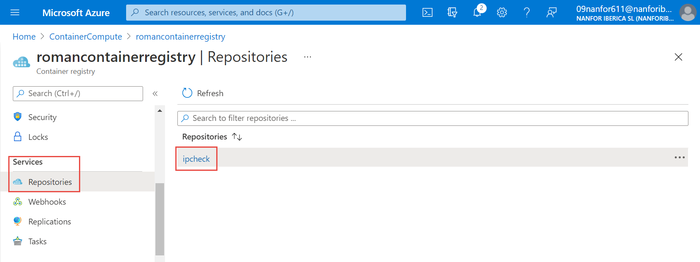

1.  From the **Repository** blade, select the **latest** tag.

1.  Find the metadata for the version of your container image with the **latest** tag.

    > **Note**: You can also select the **Run ID** link to find metadata about the build task.

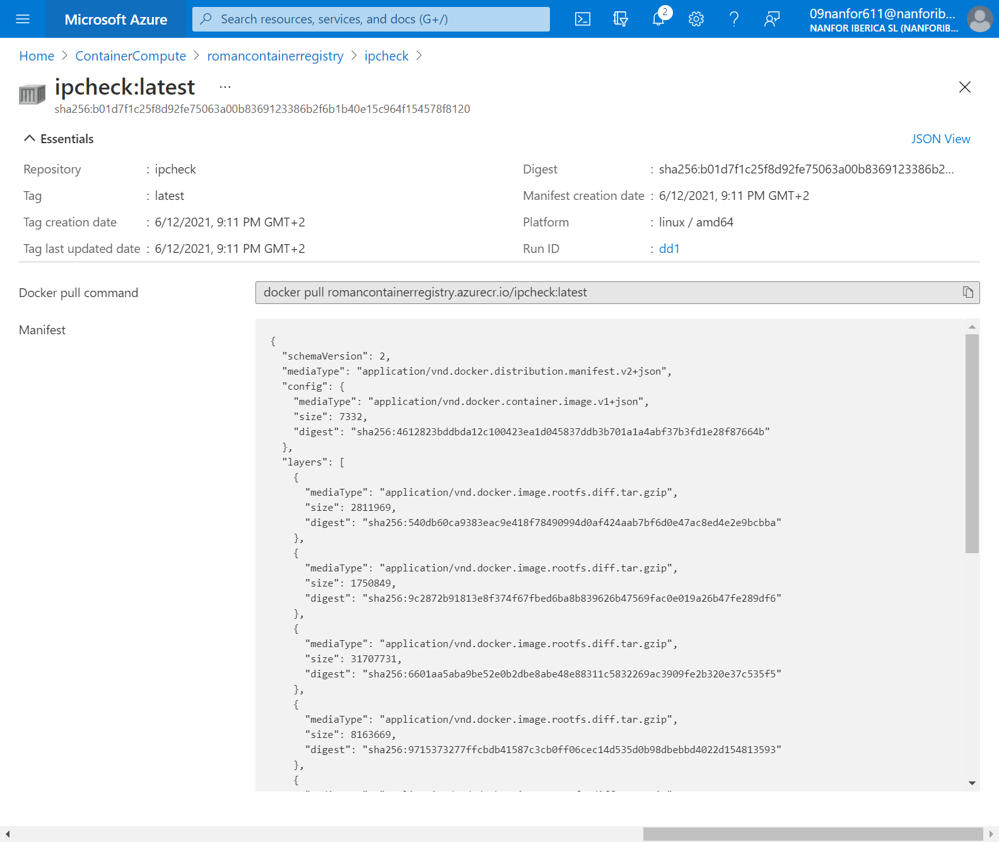

#### Review

In this exercise, you created a .NET console application to display a machine’s current IP address. You then added the **Dockerfile** file to the application so that it could be converted into a Docker container image. Finally, you deployed the container image to Container Registry.

### Exercise 3: Deploy an Azure container instance 

#### Task 1: Enable the admin user in Container Registry

1. In the Azure portal's navigation pane, select the **Resource groups** link.

1. From the **Resource groups** blade, find and then select the **ContainerCompute** resource group that you created earlier in this lab.

1. From the **ContainerCompute** blade, select the container registry that you created earlier in this lab.

1. From the **Container Registry** blade, select **Update**.

1.  From the **Update container registry** blade, perform the following actions:
    
    1.   In the **Admin user** section, select **Enable**.
    
    1.   Select **Save**.

    1.   Close the blade.
    
1. Close the **Update container registry** blade.

   

#### Task 2: Automatically deploy a container image to an Azure container instance

1.  From the **Container Registry** blade, find the **Services** section, and then select the **Repositories** link.

1.  In the **Repositories** section, select the **ipcheck** container image repository.

1.  From the **Repository** blade, select the ellipsis menu associated with the **latest** tag entry.

1. In the pop-up menu, select the **Run instance** link.

   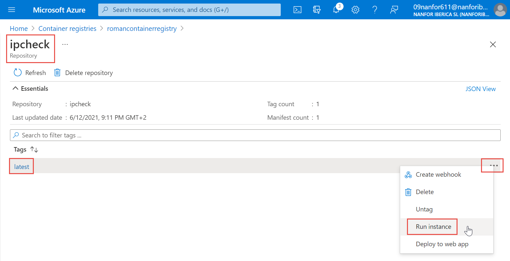

1.  From the **Create container instance** blade, perform the following actions:
    
    1.  In the **Container name** text box, enter **managedcompute**.
    
    1.  Leave the **Container image** text box set to its default value.
    
    1.  In the **OS type** section, select **Linux**.
    
    1.  Leave the **Subscription** text box set to its default value.
    
    1.  In the **Resource group** drop-down list, select **ContainerCompute**.
    
    1.  In the **Location** drop-down list, select **East US**.
    
    1.  In the **Number of cores** drop-down list, select **2**.
    
    1.  In the **Memory (GB)** text box, enter **4**.
    
    1.  In the **Public IP address** section, select **No**.
    
    1.  Select **OK**.

    > **Note**: Wait for the creation task to complete before moving forward with this lab.

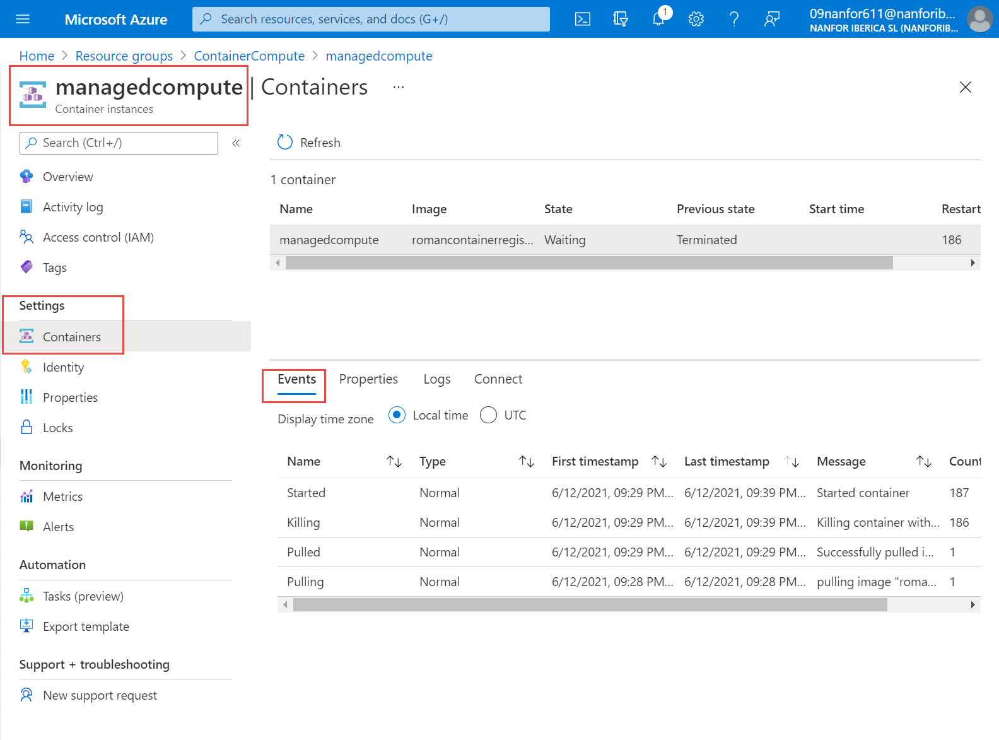

#### Task 3: Manually deploy a container image to Container Instances

1.  In the Azure portal's navigation pane, select the **Create a resource** link.

1.  From the **New** blade, find the **Search the Marketplace** text box above the list of featured services.

1.  In the search box, enter **container instances**, and then select Enter.

1.  From the **Marketplace** search results blade, select the **Container Instances** result.

1.  From the **Container Instances** blade, select **Create**.

1.  Find the tabs from the **Create Container Instances** blade, such as **Basics**, **Networking**, and **Advanced**.

    > **Note**: Each tab represents a step in the workflow to create a new container instance.

1.  From the **Basics** tab, perform the following actions:

    1.  Leave the **Subscription** text box set to its default value.

    1.  In the **Resource group** drop-down list, select **ContainerCompute**.
    
    1.  In the **Container name** text box, enter **manualcompute**.

    1.  In the **Region** drop-down list, select **(US) East US**.
    
    1.  In the **Image source** section, select **Azure Container Registry**.
    
    1.  In the **Registry** drop-down list, select the **Azure Container Registry** resource that you created earlier in this lab.
    
    1.  In the **Image** drop-down list, select **ipcheck**.
    
    1.  In the **Image tag** drop-down list, select **latest**.

    1.  Select **Review + Create**.

1.  From the **Review + Create** tab, review the selected options.

1.  Select **Create** to create the container instance by using your specified configuration.  

    > **Note**: Wait for the creation task to complete before moving forward with this lab.

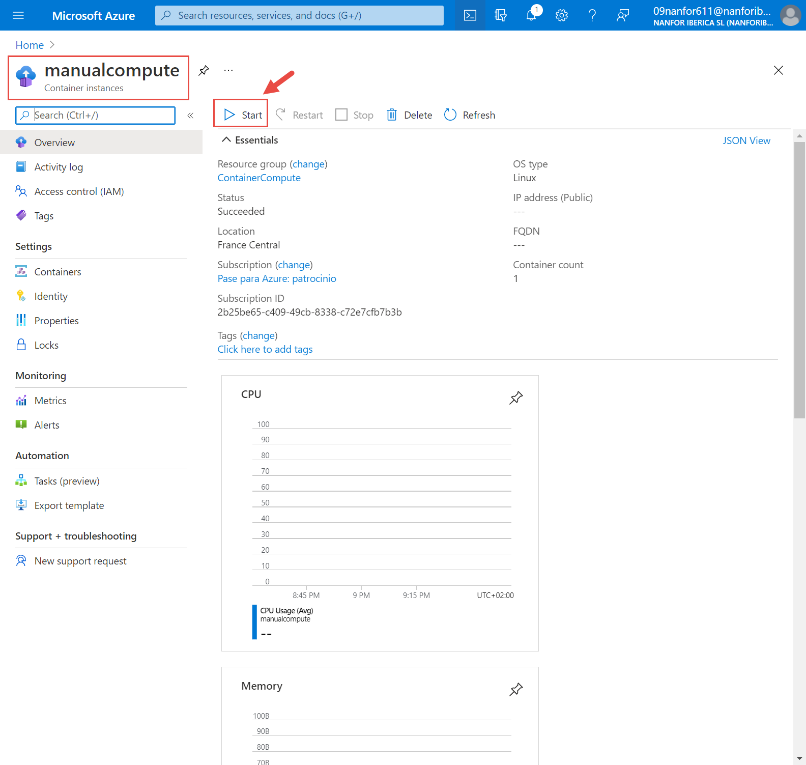

#### Task 4: Validate that the container instance ran successfully

1. In the Azure portal's navigation pane, select the **Resource groups** link.

1. From the **Resource groups** blade, find and then select the **ContainerCompute** resource group that you created earlier in this lab.

   

1. From the **ContainerCompute** blade, select the **manualcompute** container instance that you created earlier in this lab.

1. From the **Container Instance** blade, find the **Settings** section, and then select the **Containers** link.

1. In the **Containers** section, find the list of **Events**.

1.  Select the **Logs** tab, and then find the text logs from the container instance.

> **Note**: You can also optionally find the **Events** and **Logs** from the **managedcompute** container instance.

> **Note**: After the application finishes running, the container terminates because it has completed its work. For the manually created container instance, you indicated that a successful exit was acceptable, so the container ran once. The automatically created instance didn't offer this option, and it assumes the container should always be running, so you'll notice repeated restarts of the container.


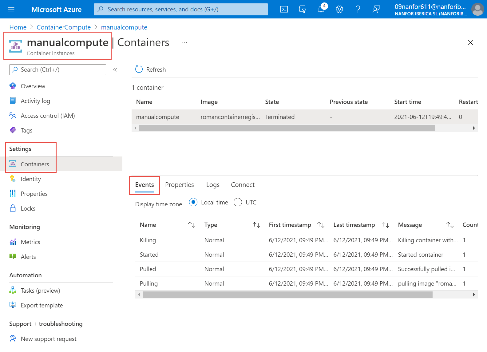

#### Review

In this exercise, you used multiple methods to deploy a container image to an Azure container instance. By using the manual method, you were also able to customize the deployment further and to run task-based applications as part of a container run.

### Exercise 4: Clean up your subscription 

#### Task 1: Open Azure Cloud Shell and list resource groups

1.  In the Azure portal's navigation pane, select the **Cloud Shell** icon to open a new shell instance.

    > **Note**: The **Cloud Shell** icon is represented by a greater than sign () and underscore character (\_).

1.  If this is your first time opening Cloud Shell using your subscription, you can use the **Welcome to Azure Cloud Shell Wizard** to configure Cloud Shell for first-time usage. Perform the following actions in the wizard:
    
    1.  A dialog box prompts you to configure the shell. Select **Bash**, review the selected subscription, and then select **Create storage**. 

    > **Note**: Wait for Cloud Shell to finish its initial setup procedures before moving forward with the lab. If you don't notice Cloud Shell configuration options, this is most likely because you are using an existing subscription with this course's labs. The labs are written with the presumption that you are using a new subscription.

#### Task 2: Delete resource groups

1.  Enter the following command, and then select Enter to delete the **ContainerCompute** resource group:

    ```
    az group delete --name ContainerCompute --no-wait --yes
    ```

1.  Close the Cloud Shell pane in the portal.

#### Task 3: Close the active applications

-   Close the currently running Microsoft Edge application.

#### Review

In this exercise, you cleaned up your subscription by removing the resource groups used in this lab.
