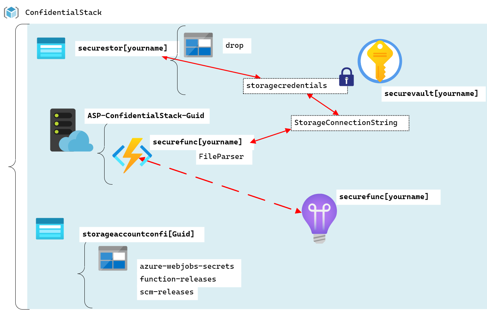

# Lab: Acceda a secretos de recursos de forma más segura en todos los servicios 

## Escenario de laboratorio
Su empresa tiene un acuerdo de intercambio de datos de empresa a empresa (B2B) con otra empresa local en el que se espera que analice un archivo que se entrega todas las noches. Para simplificar las cosas, la segunda empresa ha decidido eliminar el archivo como un blob de Microsoft Azure Storage todas las noches. Ahora tiene la tarea de idear una forma de acceder al archivo y generar una URL segura que cualquier sistema interno pueda usar para acceder al blob sin exponer el archivo a Internet. Decidió usar Azure Key Vault para almacenar las credenciales de la cuenta de almacenamiento y Azure Functions para escribir el código necesario para acceder al archivo sin almacenar las credenciales en texto sin formato o exponer el archivo a Internet.

## Objetivos

Después de completar este lab, podrá:

- Crear un almacén de claves de Azure y almacene secretos en el almacén de claves.
- Crear una identidad administrada asignada por el sistema para una instancia de Azure App Service.
- Crear una directiva de acceso de Key Vault para una identidad o aplicación de Azure Active Directory.
- Usar el SDK de Azure para .NET para descargar un blob con una función de Azure.

## Arquitectura

