# Create a Web App with a local Git deployment source

This demo shows you how to deploy your app to Azure App Service from a local Git repository by using the Kudu build server and the Azure CLI.

#### Download sample code and launch Azure CLI

1. To download a sample repository, run the following command in your Git Bash window:

   ```
   git clone https://github.com/Azure-Samples/html-docs-hello-world.git
   ```

   Later in the demo you'll be entering more commands in the Git Bash window so be sure to leave it open.

   En el local se puede crear una carpeta para alojar a ese [repositorio](https://github.com/Azure-Samples/html-docs-hello-world), e independizarlo de mis contenidos. Hay que procurar que no esté dentro de otra carpeta que a su vez tenga un *.git* porque estaríamos anidando carpetas *.git* y podrían surgir conflictos (como así me ocurrió en un primer intento).

   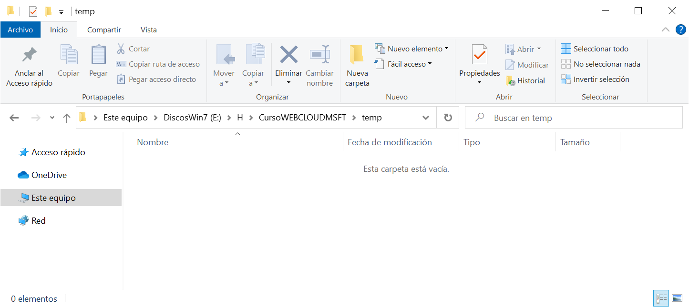

   

   Desde el *gitbash* me sitúo dentro de la carpeta que acabo de crear y clono el repositorio que me indican en el enunciado de la práctica.

   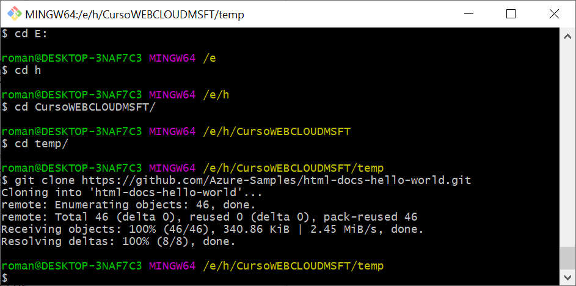

   

   Dentro de la carpeta local **temp** creada anteriormente, se ha creado el repositorio *.git* clonado en su propia carpeta **html-docs-hello-world**. Esta estructura de carpetas y ficheros contiene la *webapp* que quiero llevar a *Azure*.

   

   Borro la carpeta *.git* para romper el enlace con el repositorio remoto original y quedarme sólo con el *backup* del contenido. Más adelante sincronizaré este directorio local con un repositorio remoto en *Azure*.

   

2. Launch the Azure Cloud Shell and be sure to select the **Bash** environment.

   - You can either launch the Cloud Shell through the portal (https://portal.azure.com), or by launching the shell directly (https://shell.azure.com).

     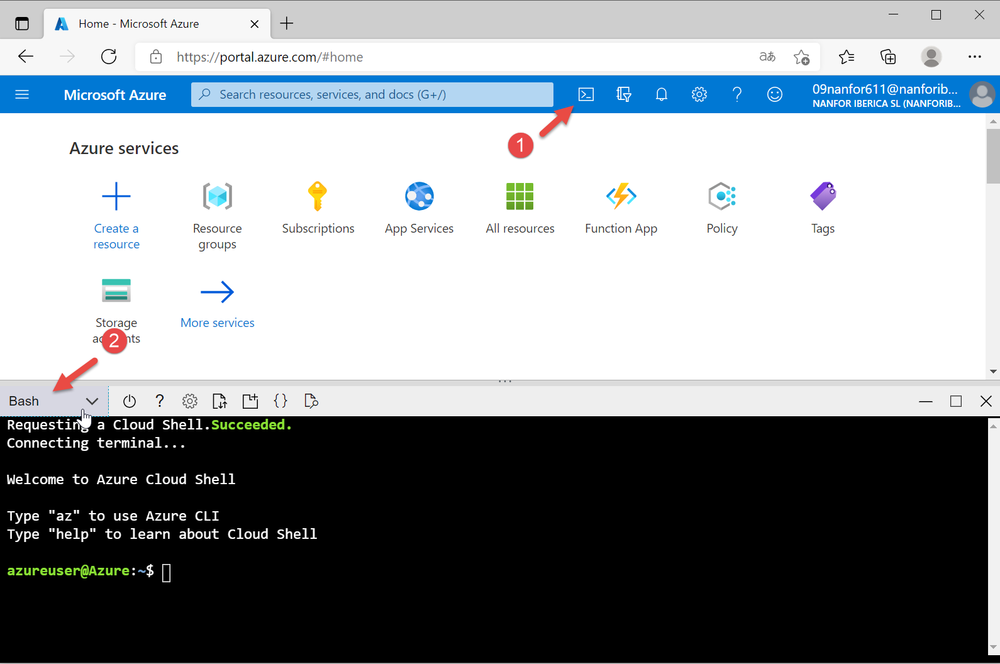

     

#### Create the web app

In the Cloud Shell run the following commands to create the web app and the necessary resources:

1. Create a resource group:

   ```
   az group create --location <MyLocation> --name <MyResourceGroup>
   ```
   
   
   
2. Create an app service plan:

   ```
   az appservice plan create --name <MyPlan> --resource-group <MyResourceGroup>
   ```
   
   
   
3. Create the web app:

   ```
   az webapp create --name <MyUniqueApp> --resource-group <MyResourceGroup> --plan <MyPlan>  --deployment-local-git
   ```
   
   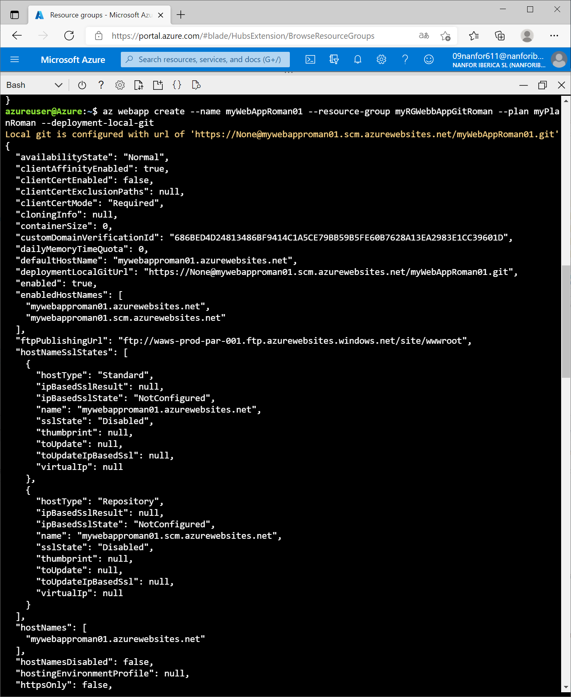
   
   
   
   Navegando a la *webapp* recien creada y que muestra el contenido por defecto:
   
   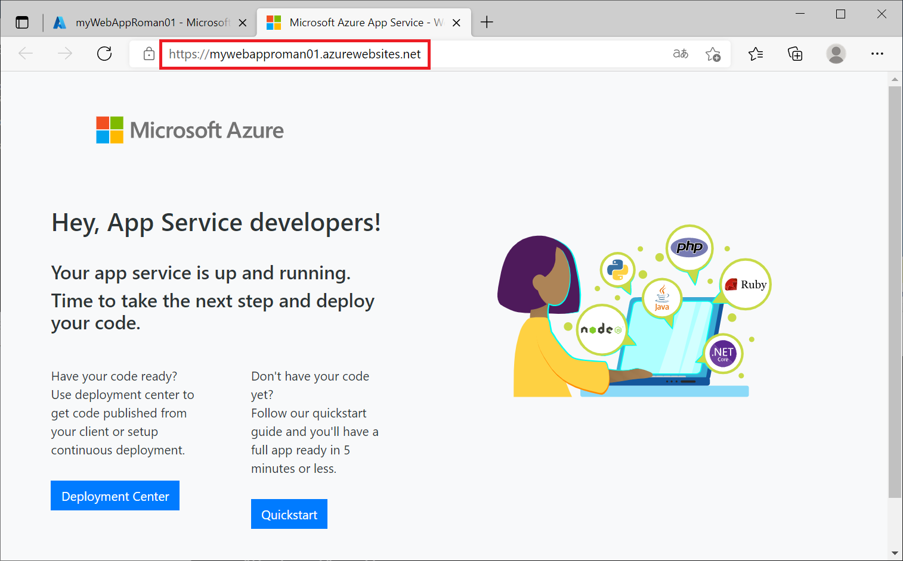
   
   

#### Deploy with Kudu build server

We'll be configuring and using the Kudu build server for deployments in this demo. FTP and local Git can deploy to an Azure web app by using a deployment user. Once you configure your deployment user, you can use it for all your Azure deployments. Your account-level deployment username and password are different from your Azure subscription credentials.

The first two steps in this section are performed in the Cloud Shell, the third is performed in the local Git Bash window.

1. Configure a deployment user.

   ```
   az webapp deployment user set \
       --user-name <username> \
       --password <password>
   ```
   
   - The username must be unique within Azure, and for local Git pushes, must not contain the ‘@’ symbol.
   - The password must be at least eight characters long, with two of the following three elements: letters, numbers, and symbols.
   - The JSON output shows the password as null. If you get a 'Conflict'. Details: 409 error, change the username. If you get a 'Bad Request'. Details: 400 error, use a stronger password.

   Record your username **romanlopez71** and password **Pa$$w0rd123** to use to deploy your web apps.
   
   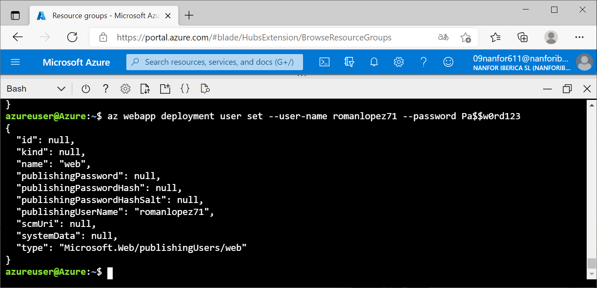
   
   Si tuviera problemas para la sincronización o la autenticación podría probar a introducir el usuario y la contraseña en Azure desde la WebApp en Deployment/Deployment Center/Local GIT-FTPS credentials y allí introducir el usuario y la contraseña y Grabar.
   
   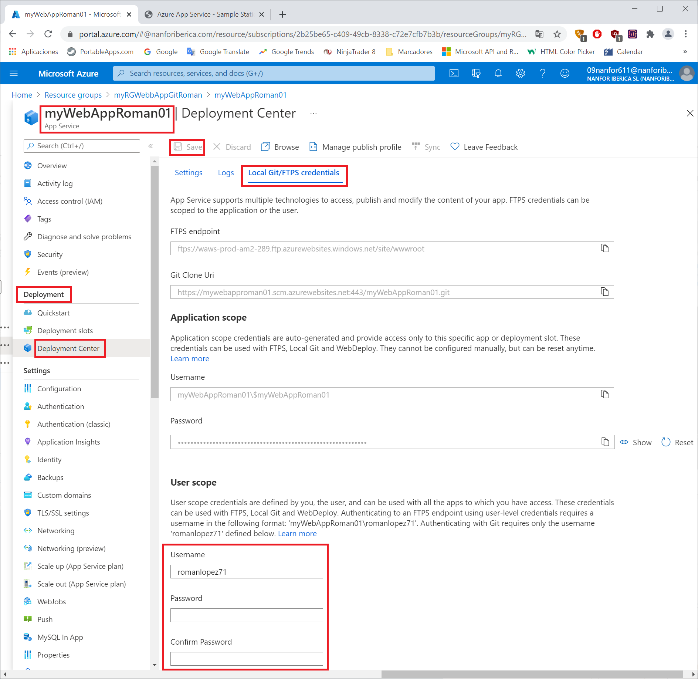
   
   
   
2. Get the web app deployment URL, the deployment URL is used in the Git Bash window to connect your local Git repository to the web app:

   ```
   az webapp deployment source config-local-git --name <MyUniqueApp> --resource-group <MyResourceGroup>
   ```

   The command will return JSON similar to the example below, you'll use the URL in the Git Bash window in the next step.

   ```
   {
   "url": "https://<deployment-user>@<MyUniqueApp>.scm.azurewebsites.net/<MyUniqueApp>.git"
   }
   ```

   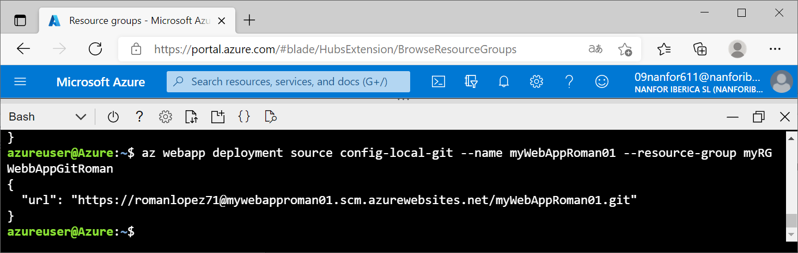

   ```
   az webapp deployment source show --name <MyUniqueApp> --resource-group <MyResourceGroup>
   ```

   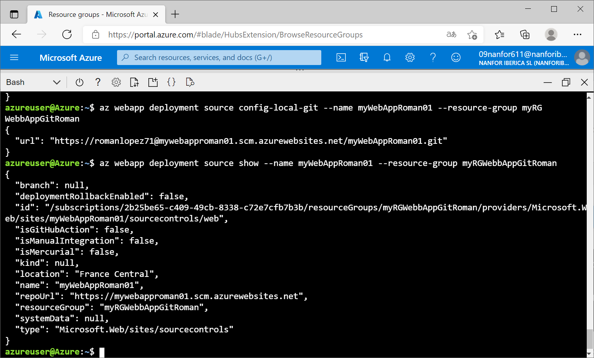

   

3. Deploy the web app:

   **This step is performed in the local Git Bash window left open from earlier in the demo.**

   Use the **cd** command to change in to the directory where the **html-docs-hello-world** was cloned.

   Desde *gitbash* me sitúo dentro de mi carpeta local y escribo los comandos para inicializar un repositorio local *.git*, (no asigno un nuevo nombre a la rama principal por lo que conservará el nombre por defecto que es **master**), sincronizo mi repositorio *.git* local con el repositorio remoto - que nombro como **azure** - y se ubica en la *URL* que facilito, hago el primer *commit* y subo los cambios con *push* al repositorio remoto **azure** desde la rama **master** de mi repositorio local.

   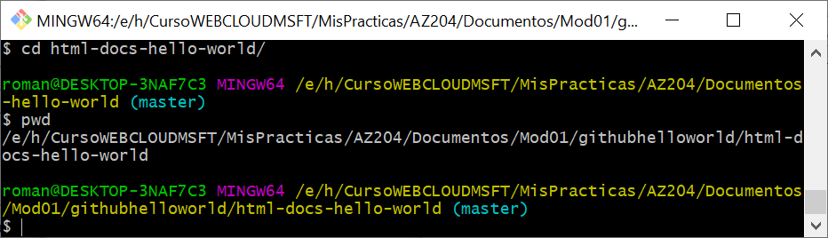
   
   ```
   git init
   git remote add azure https://romanlopez71@mywebapproman01.scm.azurewebsites.net/myWebAppRoman01.git
   gig add .
   git commit -m "First Commit"
   git push -u azure master
   ```
   
   Ahora puedo modificar los ficheros en local y actualizarlos en la *webapp* de *Azure* desde la consola local *gitbash* con `push`.
   
   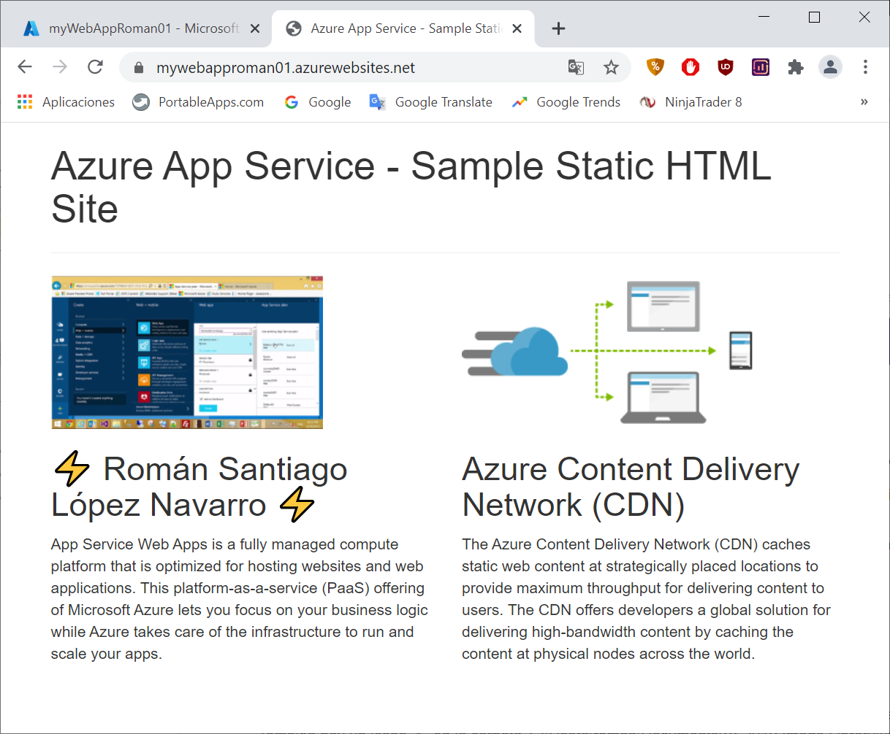
   
   

##### What happens to my app during deployment?

All the officially supported deployment methods make changes to the files in the /home/site/wwwroot folder of your app. These files are the same ones that are run in production. Therefore, the deployment can fail because of locked files. The app in production may also behave unpredictably during deployment, because not all the files updated at the same time. There are a few different ways to avoid these issues:

- Stop your app or enable offline mode for your app during deployment.
- Deploy to a staging slot with auto swap enabled.
- Use Run From Package instead of continuous deployment.

#### Verify results

In the Azure Portal navigate to the web app you created above:

1. In the **Overview** section select the **URL** to verify the app was deployed successfully.

2. Select **Deployment Center** to view deployment information.


From here you can make change to the code in the local repository and push the change to the web app.

#### Clean up resources

In the Cloud Shell use the following command to delete the resource group and the resources it contains. The --no-wait portion of the command will return you to the Bash prompt quickly without showing you the results of the command. You can confirm the resource group was deleted in the Azure Portal

```
az group delete --name <MyResourceGroup> --no-wait
```

