# Lab 10: Asynchronously processing messages by using Azure Queue Storage

Está estudiando varias formas de comunicarse entre componentes de servicios aislados en Microsoft Azure y ha decidido evaluar el servicio Azure Storage y su oferta de servicio de cola. Como parte de esta evaluación, creará una aplicación prototipo en .NET que puede enviar y recibir mensajes para que pueda medir la complejidad involucrada en el uso de este servicio. Para ayudarlo con su evaluación, también ha decidido utilizar Azure Storage Explorer como productor / consumidor de mensajes en cola a lo largo de sus pruebas.

## Objetivos

Después de completar esta práctica de laboratorio, podrá:

- Agregar las bibliotecas de Azure.Storage desde NuGet.

- Crear una cola en .NET.

- Generar un nuevo mensaje en la cola utilizando .NET.

- Consumir un mensaje de la cola utilizando .NET.

- Administrar una cola mediante el Azure Storage Explorador .

- ## Arquitectura


### Exercise 1: Create Azure resources

#### Task 1: Open the Azure portal

1.  On the taskbar, select the **Microsoft Edge** icon.

1.  In the open browser window, go to the Azure portal (<https://portal.azure.com>).

1.  Enter the email address for your Microsoft account, and then select **Next**.

1.  Enter the password for your Microsoft account, and then select **Sign in**.

    > **Note**: If this is your first time signing in to the Azure portal, you'll be offered a tour of the portal. Select **Get Started** to skip the tour and begin using the portal.

#### Task 2: Create a Storage account

1.  In the Azure portal's navigation pane, select **All services**.

1.  On the **All services** blade, select **Storage Accounts**.

1.  On the **Storage accounts** blade, get your list of storage account instances.

1.  On the **Storage accounts** blade, select **New**.

1.  On the **Create storage account** blade, observe the tabs on the blade, such as **Basics**, **Tags**, and **Review + Create**.

    > **Note**: Each tab represents a step in the workflow to create a new storage account. You can select **Review + Create** at any time to skip the remaining tabs.

1.  Select the **Basics** tab, and then in the tab area, perform the following actions:
    
    1.  Leave the **Subscription** text box set to its default value.
    
    1.  In the **Resource group** section, select **Create new**, enter **AsyncProcessor**, and then select **OK**.
    
    1.  In the **Storage account name** text box, enter **asyncstor*[yourname]***.
    
    1.  In the **Location** list, select the **(US) East US** region.
    
    1.  In the **Performance** section, select **Standard**.
    
    1.  In the **Account kind** list, select **StorageV2 (general purpose v2)**.
    
    1.  In the **Replication** list, select **Locally-redundant storage (LRS)**.
        
    1.  Select **Review + Create**.

1.  On the **Review + Create** tab, review the options that you specified in the previous steps.

1.  Select **Create** to create the storage account by using your specified configuration.

    > **Note**: On the **Deployment** blade, wait for the creation task to complete before moving forward with this lab.

1. Select the **Go to resource** button on the **Deployment** blade to go to the newly created storage account.

   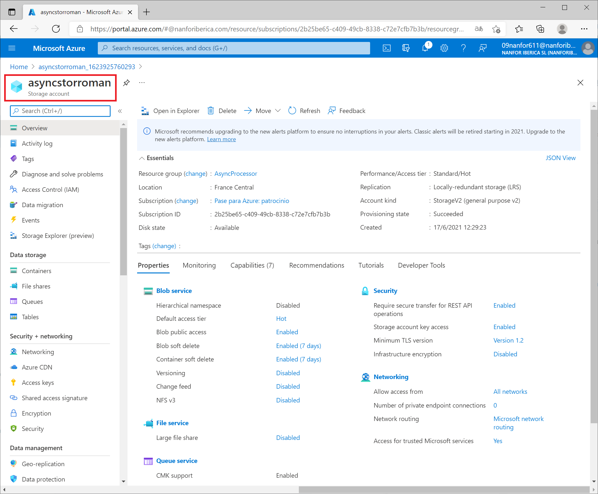

1.	On the **Storage account** blade, find the **Settings** section, and then select **Access keys**.

1.	On the **Access keys** blade, select any one of the keys, and then record the value of either of the **Connection string** boxes. You'll use this value later in this lab.

    > **Note**: It doesn't matter which connection string you choose. They are interchangeable.

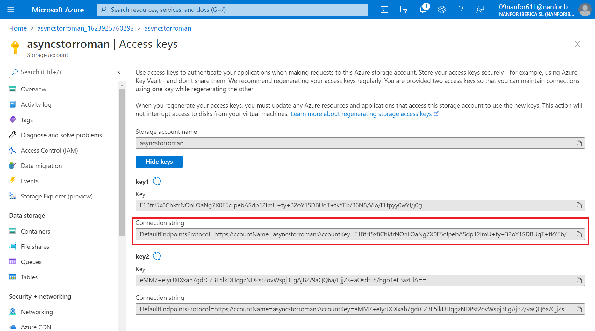

#### Review

In this exercise, you created a new Azure Storage account that you'll use through the remainder of the lab.

### Exercise 2: Configure the Azure Storage SDK in a .NET project 

#### Task 1: Create a .NET project

1.  On the **Start** screen, select the **Visual Studio Code** tile.

1.  On the **File** menu, select **Open Folder**.

1.  In the **File Explorer** window that opens, browse to **Allfiles (F):\\Allfiles\\Labs\\10\\Starter\\MessageProcessor**, and then select **Select Folder**.

1.  In the **Visual Studio Code** window, right-click or activate the shortcut menu for the Explorer pane, and then select **Open in Terminal**.

1.  At the open command prompt, enter the following command, and then select Enter to create a new .NET project named **MessageProcessor** in the current folder:

    ```
    dotnet new console --name MessageProcessor --output .
    ```

    > **Note**: The **dotnet new** command will create a new **console** project in a folder with the same name as the project.

1.  At the command prompt, enter the following command, and then select Enter to import version 12.0.0 of **Azure.Storage.Queues** from NuGet:

    ```
    dotnet add package Azure.Storage.Queues --version 12.0.0
    ```

    > **Note**: The **dotnet add package** command will add the **Azure.Storage.Queues** package from NuGet. For more information, go to [Azure.Storage.Queues](https://www.nuget.org/packages/Azure.Storage.Queues/12.0.0).

1. At the command prompt, enter the following command, and then select Enter to build the .NET web application:

   ```
   dotnet build
   ```

   Primero he creado la carpeta en el sistema de ficheros - he usado otro nombre poniendo el prefijo arbitrario Code - después he abierto el *VisualStudio Code* y desde **File** he abierto la carpeta anterior. Después abro la consola de *VisualStudio Code* con **Ctrl + ñ** y escribo los comandos indicados:

   ```
   dotnet new console --output .
   dotnet add package Azure.Storage.Queues
   dotnet build
   ```

   En el comando `dotnet new console` no indico el nombre del proyecto para que lo coja del propio nombre de la carpeta. Y en el comando `dotnet add package` no informa el número de versión para que coja la más reciente.

   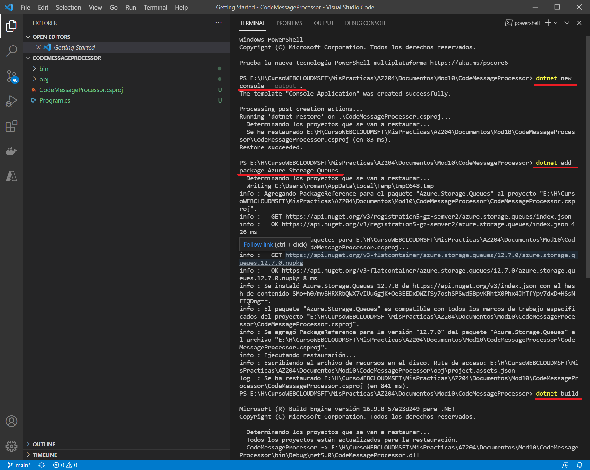

1.  Select **Kill Terminal** or the **Recycle Bin** icon to close the currently open terminal and any associated processes.

#### Task 2: Write code to access Azure Storage

1.  In the Explorer pane of the **Visual Studio Code** window, open the **Program.cs** file.

1.  On the code editor tab for the **Program.cs** file, delete all the code in the existing file.

1.  Add the following line of code to import the **Azure**, **Azure.Storage.Queues**, and **Azure.Storage.Queues.Models** namespaces from the **Azure.Storage.Queues** package imported from NuGet:

    ```
    using Azure;
    using Azure.Storage.Queues;
    using Azure.Storage.Queues.Models;
    ```
    
1.  Add the following lines of code to add **using** directives for the built-in namespaces that will be used in this file:

    ```
    using System;
    using System.Text;
    using System.Threading.Tasks;
    ```

1.  Enter the following code to create a new **Program** class:

    ```
    public class Program
    {
    }
    ```

1.  In the **Program** class, enter the following line of code to create a new string constant named **storageConnectionString**:

    ```
    private const string storageConnectionString = "";
    ```

1.  Update the **storageConnectionString** string constant by setting its value to the **Connection string** of the Storage account that you recorded earlier in this lab.

1.  In the **Program** class, enter the following line of code to create a new string constant named **queueName** with a value of **messagequeue**:

    ```
    private const string queueName = "messagequeue";
    ```

1.  In the **Program** class, enter the following code to create a new asynchronous **Main** method:

    ```
    public static async Task Main(string[] args)
    {
    }
    ```

1.  Observe the **Program.cs** file, which should now include:

    ```
    using Azure;
    using Azure.Storage.Queues;
    using Azure.Storage.Queues.Models;
    using System;
    using System.Text;
    using System.Threading.Tasks;
    
    public class Program
    {
        private const string storageConnectionString = "<storage-connection-string>";
        private const string queueName = "messagequeue";
    
        public static async Task Main(string[] args)
        {
        }
    }
    ```

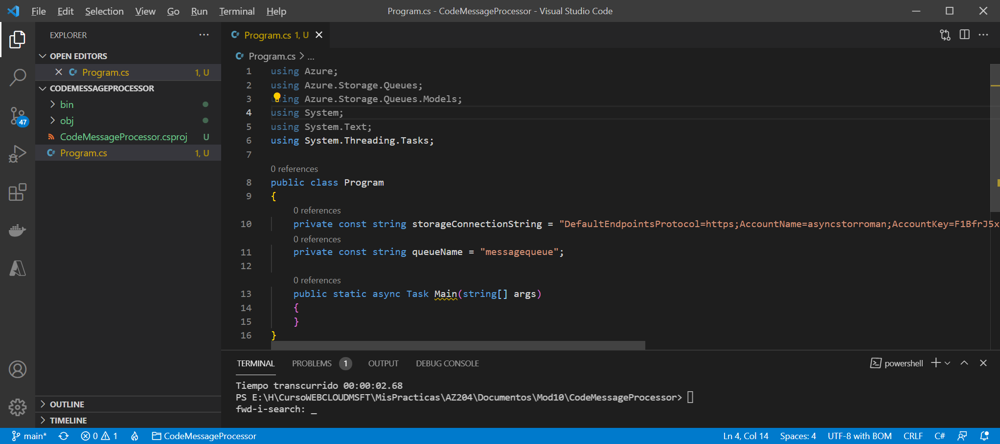

#### Task 3: Validate Azure Storage access

1.  In the **Main** method, add the following line of code to connect to the storage account by creating a new variable named *client* of type **QueueClient**:

    ```
    QueueClient client = new QueueClient(storageConnectionString, queueName);  
    ```

1.  In the **Main** method, add the following line of code to asynchronously create the queue if it doesn't already exist:

    ```        
    await client.CreateAsync();
    ```

1.  In the **Main** method, add the following line of code to render a header for the "Account Metadata" section:

    ```
    Console.WriteLine($"---Account Metadata---");
    ```
    
1.  In the **Main** method, add the following line of code to render the Uniform Resource Identifier (URI) of the queue endpoint:

    ```
    Console.WriteLine($"Account Uri:\t{client.Uri}");
    ```

1.  Observe the **Main** method, which should now include:

    ```
    public static async Task Main(string[] args)
    {
        QueueClient client = new QueueClient(storageConnectionString, queueName);        
        await client.CreateAsync();

        Console.WriteLine($"---Account Metadata---");
        Console.WriteLine($"Account Uri:\t{client.Uri}");
    }
    ```

1.  Save the **Program.cs** file.

1.  In the **Visual Studio Code** window, right-click or activate the shortcut menu for the Explorer pane, and then select **Open in Terminal**.

1.  At the open command prompt, enter the following command, and then select Enter to run the .NET web application:

    ```
    dotnet run
    ```

    > **Note**: If there are any build errors, review the **Program.cs** file in the **Allfiles (F):\\Allfiles\\Labs\\10\\Solution\\MessageProcessor** folder.

1.  Observe the output from the currently running console application. The output contains metadata for the queue endpoint.

1.  Select **Kill Terminal** or the **Recycle Bin** icon to close the currently open terminal and any associated processes.

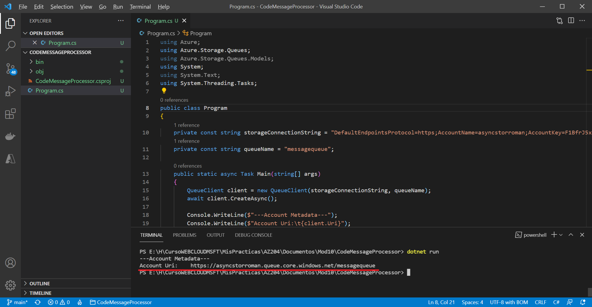

#### Review

In this exercise, you configured your .NET project to access the Storage service and manipulate a queue made available through the service.

### Exercise 3: Read messages from the queue

#### Task 1: Write code to access queue messages

1.  In the **Main** method, add the following line of code to render a header for the "Existing Messages" section:

    ```
    Console.WriteLine($"---Existing Messages---");
    ```

1.  Within the **Main** method, perform the following actions to create variables that will be used when retrieving queue messages:

    1.  Add the following line of code to create a variable of type **int** named *batchSize* with a value of **10**:

        ```
        int batchSize = 10;
        ```

    1.  Add the following line of code to create a variable of type **TimeSpan** named *visibilityTimeout* with a value of **2.5 seconds**:

        ```
        TimeSpan visibilityTimeout = TimeSpan.FromSeconds(2.5d);
        ```

1.  Within the **Main** method, perform the following actions to retrieve a batch of messages asynchronously from the queue service:

    1.  Add the following line of code to invoke the **ReceiveMessagesAsync** asynchronous method of the **QueueClient** class, passing in the *batchSize* and *visibilityTimeout* variables as parameters:

        ```
        client.ReceiveMessagesAsync(batchSize, visibilityTimeout);
        ```

    1.  Update the previous line of code by adding more code to process the expression asynchronously by using the **await** keyword:

        ```
        await client.ReceiveMessagesAsync(batchSize, visibilityTimeout);
        ```

    1.  Update the previous line of code by adding more code to store the result of the expression in a new variable named *messages* of type **[Response<QueueMessage[]>](https://docs.microsoft.com/dotnet/api/azure.response-1)**:

        ```
        Response<QueueMessage[]> messages = await client.ReceiveMessagesAsync(batchSize, visibilityTimeout);
        ```

1.  Within the **Main** method, perform the following actions to iterate over and render the properties of each message:

    1.  Add the following line of code to create a **foreach** loop that iterates over each message that's stored in the **[Value](https://docs.microsoft.com/dotnet/api/azure.response-1.value)** property of the *messages* variable of type **[QueueMessage[]](https://docs.microsoft.com/dotnet/api/azure.storage.queues.models.queuemessage)**:

        ```
        foreach(QueueMessage message in messages?.Value)
        {
        }
        ```

    1.  Within the **foreach** loop, add another line of code to render the **MessageId** and **MessageText** properties of each **QueueMessage** instance:
    
        ```
        Console.WriteLine($"[{message.MessageId}]\t{message.MessageText}");
        ```

1.  Observe the **Main** method, which should now include:

    ```
    public static async Task Main(string[] args)
    {
        // Existing code removed for brevity

        Console.WriteLine($"---Existing Messages---");
        int batchSize = 10;
        TimeSpan visibilityTimeout = TimeSpan.FromSeconds(2.5d);
        
        Response<QueueMessage[]> messages = await client.ReceiveMessagesAsync(batchSize, visibilityTimeout);

        foreach(QueueMessage message in messages?.Value)
        {
            Console.WriteLine($"[{message.MessageId}]\t{message.MessageText}");
        }
    }
    ```

1.  Save the **Program.cs** file.

1.  In the **Visual Studio Code** window, right-click or activate the shortcut menu for the Explorer pane, and then select **Open in Terminal**.

1. At the open command prompt, enter the following command, and then select Enter to build the .NET web application:

   ```
   dotnet build
   ```

   > **Note**: If there are any build errors, review the **Program.cs** file in the **Allfiles (F):\\Allfiles\\Labs\\10\\Solution\\MessageProcessor** folder.

   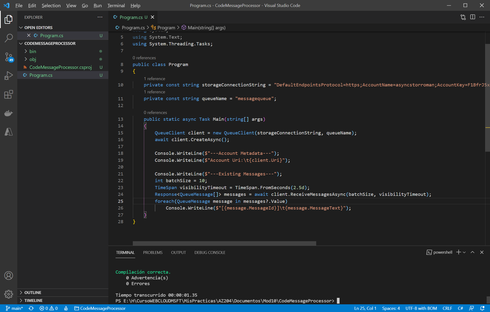

1.  Select **Kill Terminal** or the **Recycle Bin** icon to close the currently open terminal and any associated processes.

#### Task 2: Test message queue access

1.  In the **Visual Studio Code** window, right-click or activate the shortcut menu for the Explorer pane, and then select **Open in Terminal**.

1.  At the open command prompt, enter the following command, and then select Enter to run the .NET web application:

    ```
    dotnet run
    ```

    > **Note**: If there are any build errors, review the **Program.cs** file in the **Allfiles (F):\\Allfiles\\Labs\\10\\Solution\\MessageProcessor** folder.

1. Observe the output from the currently running console application. The output indicates that no messages are in the queue.

   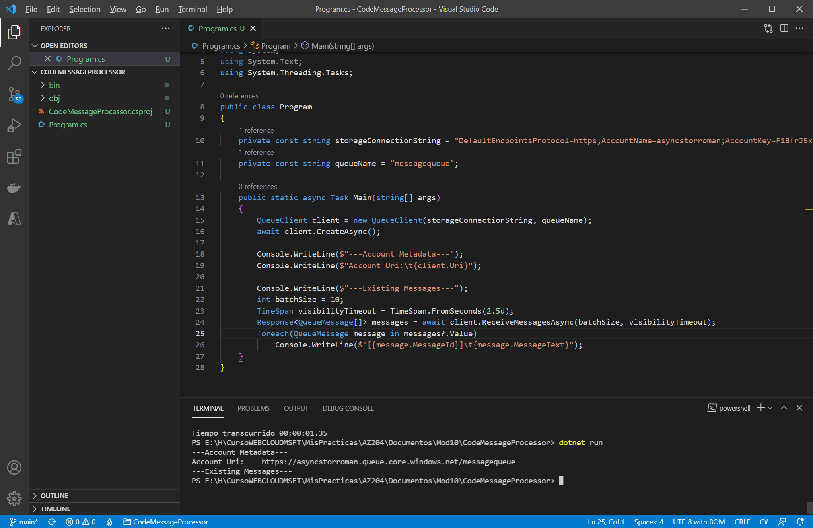

1.  Select **Kill Terminal** or the **Recycle Bin** icon to close the currently open terminal and any associated processes.

1.  In the Azure portal's navigation pane, select the **Resource groups** link.

1.  On the **Resource groups** blade, find and then select the **AsyncProcessor** resource group that you created earlier in this lab.

1.  On the **AsyncProcessor** blade, select the **asyncstor*[yourname]*** storage account that you created earlier in this lab.

1.  On the **Storage account** blade, select **Overview**. 

1.  In the **Overview** section, select **Open in Explorer**.

1.  In the **Azure Storage Explorer** window, select **Open Azure Storage Explorer**.

    > **Note**: If this is your first time opening Storage Explorer by using the portal, you might be prompted to allow the portal to open these types of links in the future. You should accept the prompt.

1.  In the **Azure Storage Explorer** application, you will notice a prompt to sign in to your Azure account. Sign in by performing the following actions:

    1.  In the popup dialog, select **Sign in**.

    1.  In the **Connect to Azure Storage** window, select **Add an Azure Account**, in the **Azure environment** list select **Azure**, and then select **Next**.

    1.  In the **Sign in to your account** popup window, enter the email address for your Microsoft account, and then select **Next**.

    1.  Still within the **Sign in to your account** popup window, enter the password for your Microsoft account, and then select **Sign in**.

    1.  In the **ACCOUNT MANAGEMENT** pane, select **Apply**.

    1.  Observe that you are returned back to the **EXPLORER** pane with your subscription information populated.

1.  From the **Azure Storage Explorer** application, in the **EXPLORER** pane, find and expand the **asyncstor*[yourname]*** storage account that you created earlier in this lab.

1.  Within the **asyncstor*[yourname]*** storage account, find and expand the **Queues** node.

1.  In the **Queues** node, open the **messagequeue** queue that you created earlier in this lab by using .NET code.

1. On the **messagequeue** tab, select **Add Message**.

1. In the **Add Message** pop-up window, perform the following actions:

   1. In the **Message text** text box, enter the value **Hello World**.

   1. In the **Expires in** text box, enter the value **12**.

   1. In the **Expires in** drop-down list, select **Hours**.

   1. Ensure that the **Encode message body in Base 64** check box isn't selected.

      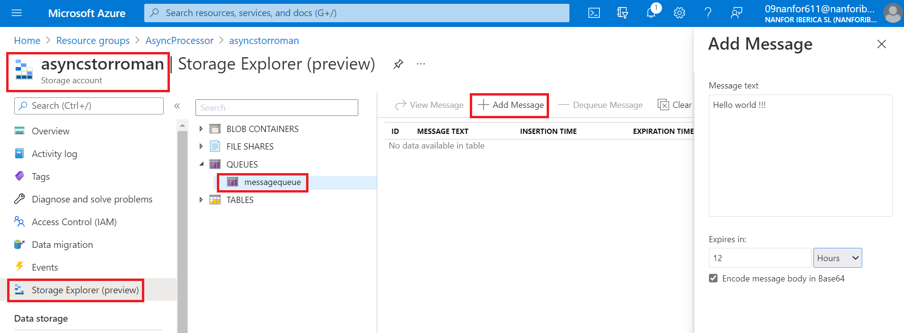

   1.  Select **OK**.

   

1.  Return to the **Visual Studio Code** window, right-click or activate the shortcut menu for the Explorer pane, and then select **Open in Terminal**.

1.  At the open command prompt, enter the following command, and then select Enter to run the .NET web application:

    ```
    dotnet run
    ```

    > **Note**: If there are any build errors, review the **Program.cs** file in the **Allfiles (F):\\Allfiles\\Labs\\10\\Solution\\MessageProcessor** folder.

1. Observe the output from the currently running console application. The output includes the new message that you created.

   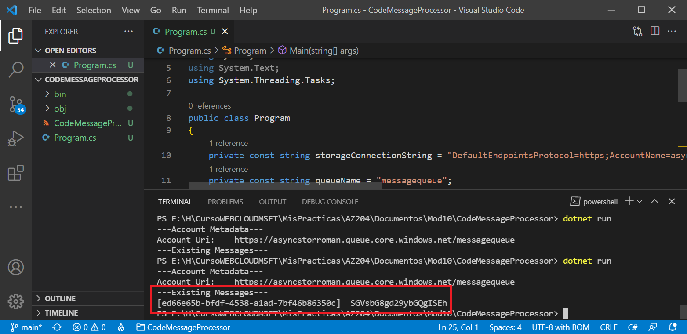

1.  Select **Kill Terminal** or the **Recycle Bin** icon to close the currently open terminal and any associated processes.

#### Task 3: Delete queued messages

1.  In the Explorer pane of the **Visual Studio Code** window, open the **Program.cs** file.

1.  On the code editor tab for the **Program.cs** file, find the existing **foreach** loop within the **Main** method:

    ```
    foreach(QueueMessage message in messages?.Value)
    {
        Console.WriteLine($"[{message.MessageId}]\t{message.MessageText}");
    }
    ```

1.  Within the **foreach** loop, add a new line of code to invoke the **DeleteMessageAsync** method of the **QueueMessage** class, passing in the **MessageId** and **PopReceipt** properties of the *message* variable:

    ```
    await client.DeleteMessageAsync(message.MessageId, message.PopReceipt);
    ```

1.  Observe the **Main** method, which should now include:

    ```
    public static async Task Main(string[] args)
    {
        // Existing code removed for brevity
        
        foreach(QueueMessage message in messages?.Value)
        {
            Console.WriteLine($"[{message.MessageId}]\t{message.MessageText}");
            await client.DeleteMessageAsync(message.MessageId, message.PopReceipt);
        }
    }
    ```

1.  **Save** the **Program.cs** file.

1.  In the **Visual Studio Code** window, right-click or activate the shortcut menu for the Explorer pane, and then select **Open in Terminal**.

1.  At the open command prompt, enter the following command, and then select Enter to run the .NET web application:

    ```
    dotnet run
    ```

    > **Note**: If there are any build errors, review the **Program.cs** file in the **Allfiles (F):\\Allfiles\\Labs\\10\\Solution\\MessageProcessor** folder.

1. Observe the output from the currently running console application. The message that you created earlier in the lab still exists because it hasn't been deleted previously.

   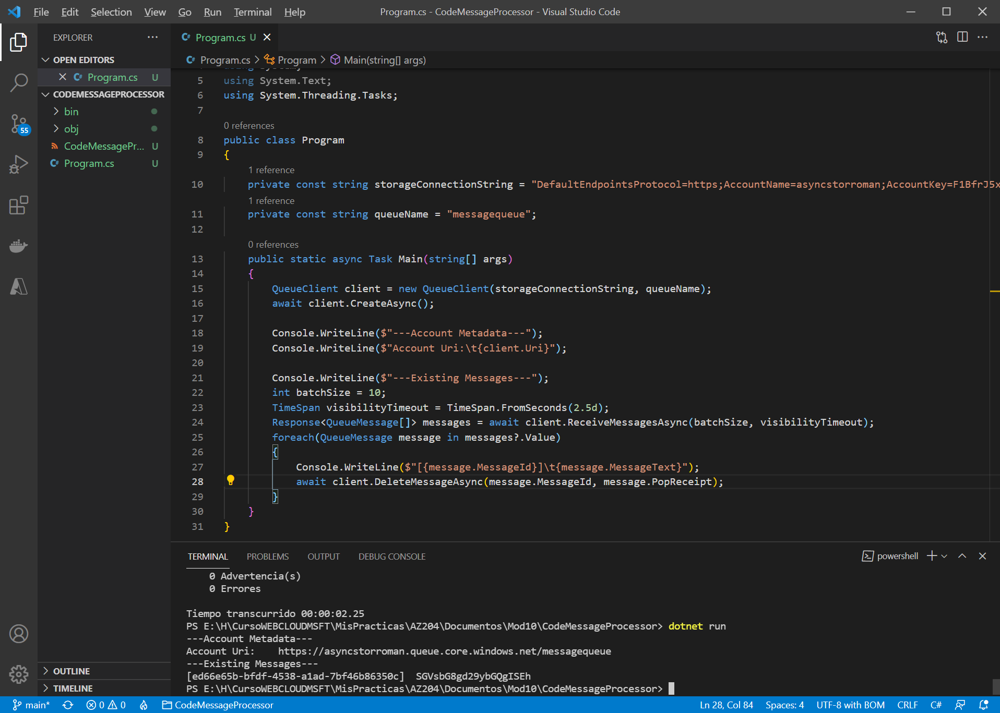

1.  Select **Kill Terminal** or the **Recycle Bin** icon to close the currently open terminal and any associated processes.

1.  Return Storage Explorer, and then find and expand the **asyncstor*[yourname]*** storage account that you created earlier in this lab.

1.  In the **asyncstor*[yourname]*** storage account, find and expand the **Queues** node.

1.  In the **Queues** node, open the **messagequeue** queue that you created earlier in this lab by using .NET code.

1.  Observe the empty list of messages in the queue.

    > **Note**: You might need to refresh the queue.


#### Review

In this exercise, you read and deleted existing messages from the Storage queue by using the .NET library.

### Exercise 4: Queue new messages by using .NET

#### Task 1: Write code to create queue messages

1.  In the Explorer pane of the **Visual Studio Code** window, open the **Program.cs** file.

1.  On the code editor tab for the **Program.cs** file, find the existing **Main** method.

1.  Within the **Main** method, add a new line of code to render a header for the "New Messages" section:

    ```
    Console.WriteLine($"---New Messages---");
    ```

1.  In the **Main** method, perform the following actions to create and send a message asynchronously:

    1.  Add the following line of code to create a new string variable named *greeting* with a value of **Hi, Developer!**:

        ```
        string greeting = "Hi, Developer!";        
        ```

    1.  Add the following line of code to invoke the **SendMessageAsync** method of the **QueueClient** class by using the *greeting* variable as a parameter

        ```
        await client.SendMessageAsync(Convert.ToBase64String(Encoding.UTF8.GetBytes(greeting)));        
        ```

    1.  Add the following line of code to render the content of the message that you sent:

        ```
        Console.WriteLine($"Sent Message:\t{greeting}");        
        ```

1.  Observe the **Main** method, which should now include:

    ```
    public static async Task Main(string[] args)
    {
        // Existing code removed for brevity
        
        Console.WriteLine($"---New Messages---");
        string greeting = "Hi, Developer!";
        await client.SendMessageAsync(Convert.ToBase64String(Encoding.UTF8.GetBytes(greeting)));
        
        Console.WriteLine($"Sent Message:\t{greeting}");
    }
    ```

1.  **Save** the **Program.cs** file.

1.  In the **Visual Studio Code** window, right-click or activate the shortcut menu for the Explorer pane, and then select **Open in Terminal**.

1.  At the open command prompt, enter the following command, and then select Enter to run the .NET web application:

    ```
    dotnet run
    ```

    > **Note**: If there are any build errors, review the **Program.cs** file in the **Allfiles (F):\\Allfiles\\Labs\\10\\Solution\\MessageProcessor** folder.

1. Observe the output from the currently running console application. The content of the new message that you sent should be in the output.

   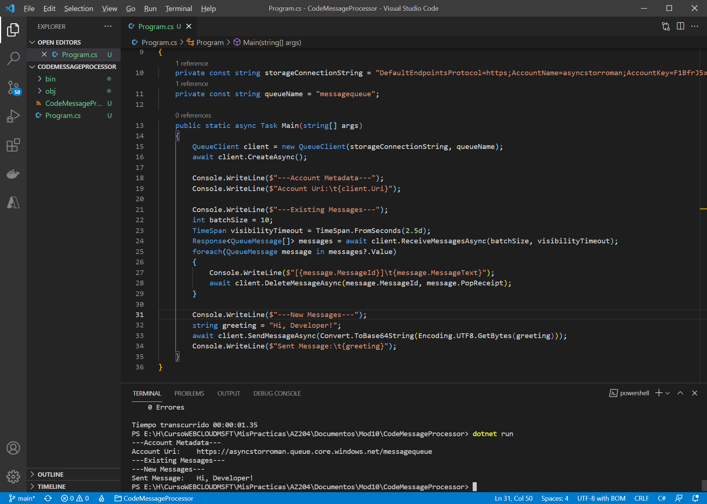

1.  Select **Kill Terminal** or the **Recycle Bin** icon to close the currently open terminal and any associated processes.

#### Task 2: View queued messages by using Storage Explorer

1.  Return to Storage Explorer, and then find and expand the **asyncstor*[yourname]*** storage account that you created earlier in this lab.

1.  In the **asyncstor*[yourname]*** storage account, find and expand the **Queues** node.

1.  In the **Queues** node, open the **messagequeue** queue that you created earlier in this lab by using .NET code.

1.  Observe the single new message in the list of messages in the queue.

    > **Note**: You might need to refresh the queue.


#### Review

In this exercise, you created new messages in the queue by using the .NET library for Storage queues.

### Exercise 5: Clean up your subscription 

#### Task 1: Open Azure Cloud Shell and list resource groups

1.  In the Azure portal's navigation pane, select the **Cloud Shell** icon to open a new shell instance.

    > **Note**: The **Cloud Shell** icon is represented by a greater than sign (\>) and underscore character (\_).

1.  If this is your first time opening Cloud Shell using your subscription, you can use the **Welcome to Azure Cloud Shell Wizard** to configure Cloud Shell for first-time usage. Perform the following actions in the wizard:
    
    -   A dialog box prompts you to configure the shell. Select **Bash**, review the selected subscription, and then select **Create storage**. 

    > **Note**: Wait for Cloud Shell to finish its initial setup procedures before moving forward with the lab. If you don't notice Cloud Shell configuration options, this is most likely because you're using an existing subscription with this course's labs. The labs are written with the presumption that you're using a new subscription.

#### Task 2: Delete a resource group

1.  At the command prompt, enter the following command, and then select Enter to delete the **AsyncProcessor** resource group:

    ```
    az group delete --name AsyncProcessor --no-wait --yes
    ```
    
1. Close the Cloud Shell pane in the portal.

   

#### Task 3: Close the active application

1.  Close the currently running Microsoft Edge application.

1.  Close the currently running Visual Studio Code application.

1.  Close the currently running Azure Storage Explorer application.

#### Review

In this exercise, you cleaned up your subscription by removing the resource group that was used in this lab.
